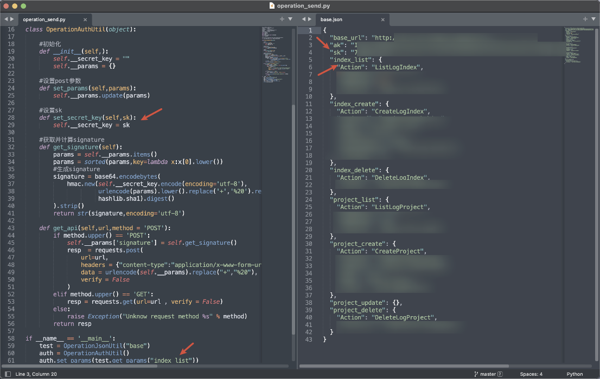
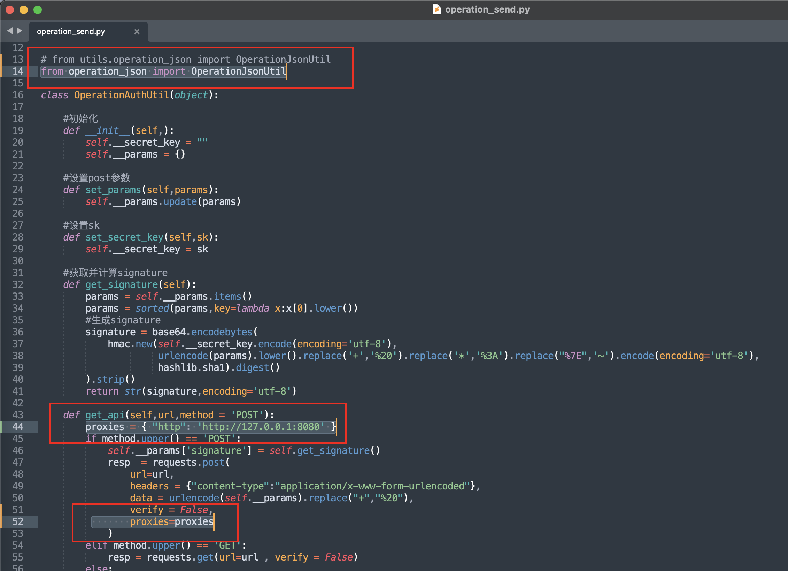
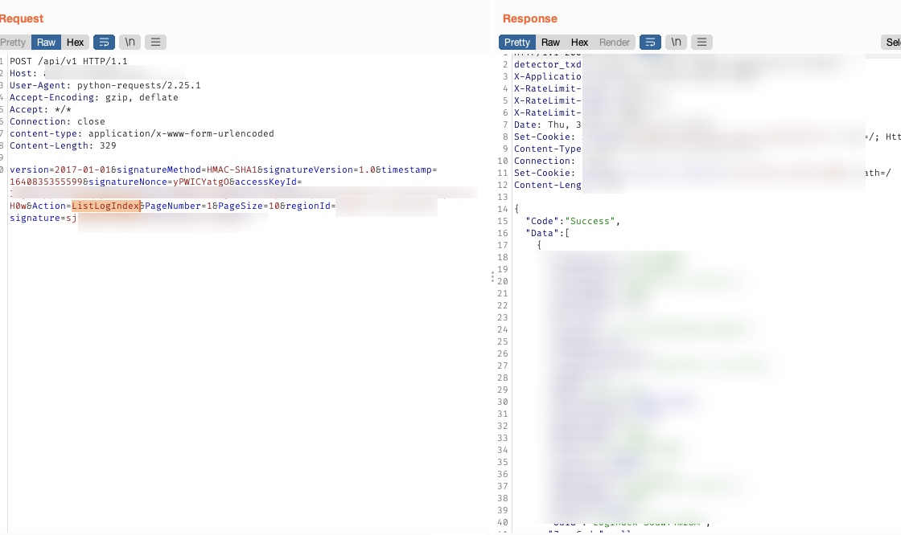
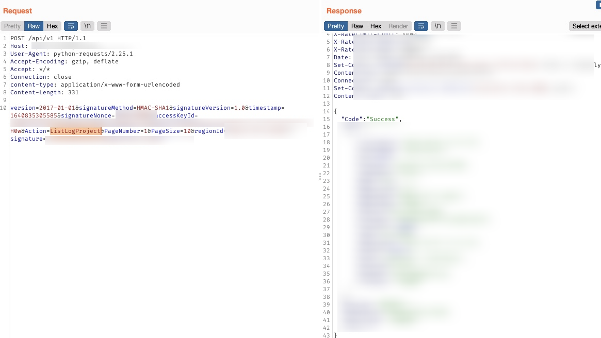

> 某众测项目在 Github 意外发现目标某系统部分源码，通过简单审计发现存在可绕过鉴权并获取敏感信息

## 源码分析

- 首先把源码下载下来，打开其中的`utils/operation_send.py`文件。此处通过`data/base.json`文件获取相关参数，完成鉴权并发起测试请求。关键代码如下：

```python
#获取并计算signature
def get_signature(self):
    params = self.__params.items()
    params = sorted(params,key=lambda x:x[0].lower())
    #生成signature
    signature = base64.encodebytes(
        hmac.new(self.__secret_key.encode(encoding='utf-8'),
                 urlencode(params).lower().replace('+','%20').replace('*','%3A').replace("%7E",'~').encode(encoding='utf-8'),
                 hashlib.sha1).digest()
    ).strip()
    return str(signature,encoding='utf-8')

# ......

if __name__ == '__main__':
    test = OperationJsonUtil("base")
    auth = OperationAuthUtil()
    auth.set_params(test.get_params("index_list"))

# ......
```

- 这里主要调用`get_signature()`函数完成鉴权，而下面的`auth.set_params(test.get_params("xxx"))`则指定要执行的`Action`，对应右侧`data/base.json`文件中的字典名。如这里输入`index_list`即表明调用`Action=ListLogIndex`



## 漏洞利用

- 开启BurpSuite，监听`8080`端口
- 打开`utils/operation_send.py`文件，修改下面代码：

```python
# from utils.operation_json import OperationJsonUtil
from operation_json import OperationJsonUtil

```

- 然后添加2行代码，把流量转发到 BurpSuite



- 运行该脚本，可以在BurpSuite看到响应：



- 将`main`函数中下面这行修改为`project_list`，即可调用`ListLogProject`这个功能

```python
# auth.set_params(test.get_params("index_list"))
auth.set_params(test.get_params("project_list"))
```


- 还有`CreateLogIndex/DeleteLogIndex/CreateProject/DeleteLogProject`等可增加或删除的功能（参考`data/base.json`文件），利用方式相同，但具有一定风险，因此没有进行测试。
