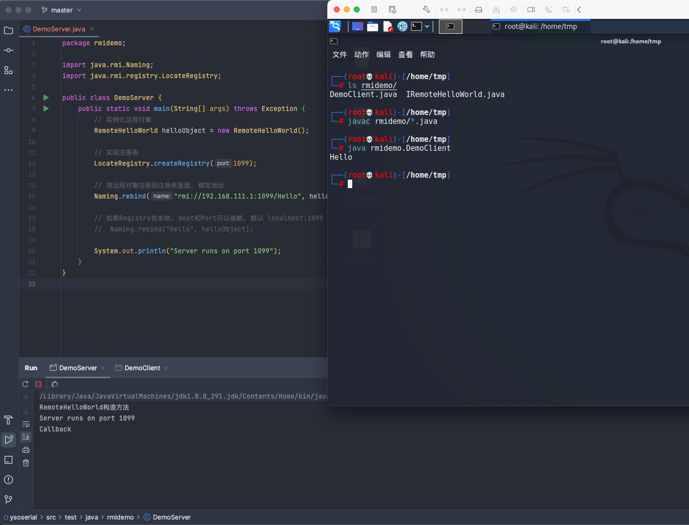
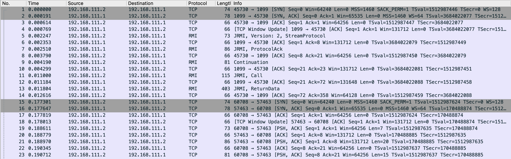
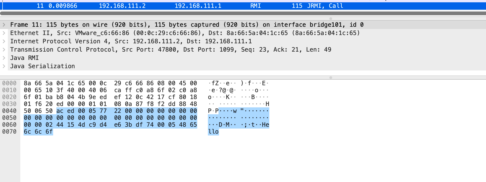
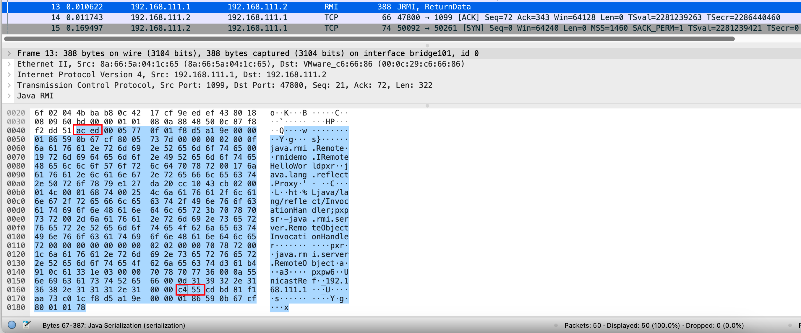
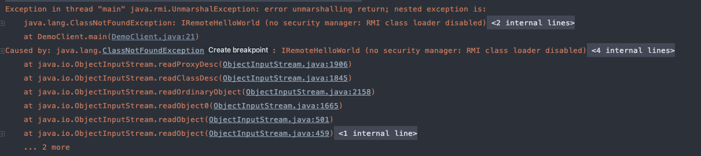
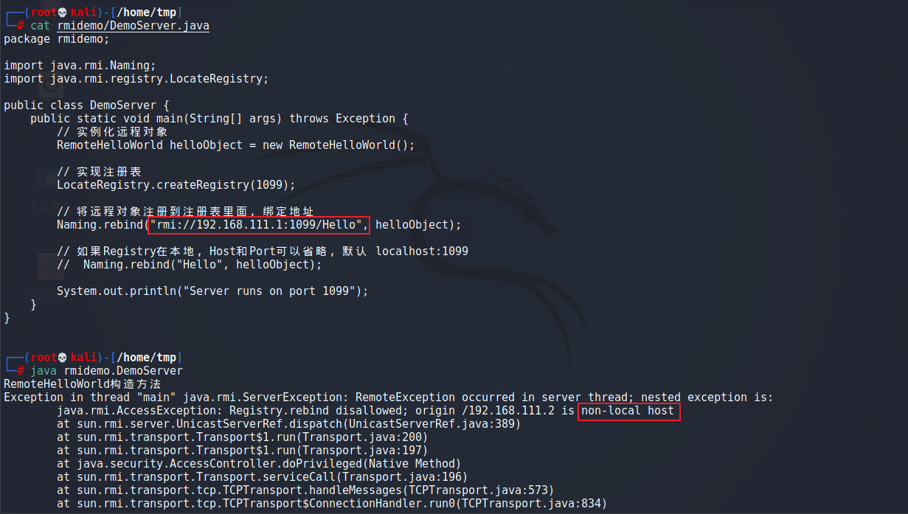
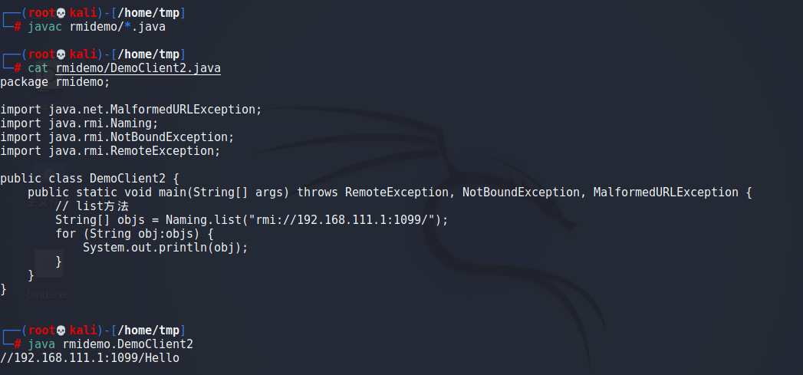

# Java安全漫谈-RMI篇

## 概念
> RMI 的过程，就是用 JRMP 协议去组织数据格式，然后通过 TCP 进行传输，从而达到远程方法调用。

- RMI（Remote Method Invocation）：远程方法调用。即让一个 JVM 中的对象远程调用另一个 JVM 中的对象的某个方法，简单来说就是跨越 JVM，使用 Java 调用远程 Java 程序
   - Server 服务端：提供远程的对象
   - Client 客户端：调用远程的对象
   - Registry 注册表：存放着远程对象的位置，用于客户端查询所调用的远程方法的引用

- JRMP（Java Remote Message Protocol）：Java 远程消息交换协议。运行在 TCP/IP 之上的线路层协议，该协议要求服务端与客户端都为Java编写。
   - Java 本身对 RMI 规范的实现默认使用 JRMP 协议，而在 Weblogic 中使用 T3 协议

- JNDI（Java Naming and Directory Interface）：Java 命名和目录接口。一组在 Java 应用中访问命名和目录服务的接口，Java 中使用最多的基本就是 RMI 和 LDAP 的目录服务系统，客户端可以通过名称访问对象，并将其下载下来。
   - 命名服务：将名称和对象联系起来，客户端可以使用名称访问对象
   - 目录服务：一种命名服务，在命名服务的基础上，增加了属性的概念


## RMI-Server
RMI Server 分为三部分：

- 一个远程接口。继承`java.rmi.Remote`，其中定义要远程调用的函数。
- 远程接口的实现类。继承`java.rmi.server.UnicastRemoteObject`，实现远程调用的函数
- 创建实例和`Registry`注册表，然后在注册表中绑定地址和实例


### 定义远程接口
定义一个远程接口，继承`java.rmi.Remote`接口，抛出`RemoteException`异常，修饰符需要为`public`否则远程调用的时候会报错
```java
package rmidemo;

import java.rmi.Remote;
import java.rmi.RemoteException;

public interface IRemoteHelloWorld extends Remote {
    public String hello() throws RemoteException;
}

```


### 远程接口实现
远程接口的实现类，继承`java.rmi.server.UnicastRemoteObject`，实现远程调用的函数
```java
package rmidemo;

import java.rmi.RemoteException;
import java.rmi.server.UnicastRemoteObject;

public class RemoteHelloWorld extends UnicastRemoteObject implements IRemoteHelloWorld {
    protected RemoteHelloWorld() throws RemoteException {
        super();
        System.out.println("RemoteHelloWorld构造方法");
    }

    @Override
    public String hello() throws RemoteException {
        System.out.println("Callback");
        return "Hello";
    }
}

```


### 创建实例和注册表
`Naming.bind`和`Naming.rebind`的区别：

- `bind`指“绑定”，如果时“绑定”时 Registry 已经存在对应的`Name`，则系统会抛出错误
- `rebind`指“重绑定”，如果“重绑定”时Registry已经存在对应的`Name`，则绑定的远程对象将被替换
- 除非有特别的业务需求，否则建议使用`rebind`方法进行绑定

`Registry.rebind`和`Naming.rebind`的区别：

- `Registry.rebind`是使用RMI注册表绑定，所以不需要完整RMI URL
- `Naming.rebind`是通过Java的名称服务进行绑定，由于名称服务不止为RMI提供查询服务，所以绑定时需要填入完整RMI URL


#### Naming.rebind
实现 Registry 并将上面的类实例化，然后绑定到指定地址
```java
package rmidemo;

import java.rmi.Naming;
import java.rmi.registry.LocateRegistry;

public class DemoServer {
    public static void main(String[] args) throws Exception {
        // 实例化远程对象
        RemoteHelloWorld helloObject = new RemoteHelloWorld();

        // 实现注册表
        LocateRegistry.createRegistry(1099);

        // 将远程对象注册到注册表里面, 绑定地址
        Naming.rebind("rmi://192.168.111.1:1099/Hello", helloObject);

        // 如果Registry在本地, Host和Port可以省略, 默认 localhost:1099
        //  Naming.rebind("Hello", helloObject);

        System.out.println("Server runs on port 1099");
    }
}

```


#### Registry.rebind
```java
// 创建远程对象
RemoteHelloWorld helloObject = new RemoteHelloWorld();

// 创建注册表
Registry registry = LocateRegistry.createRegistry(1099);

// 将远程对象注册到注册表里面,绑定地址
registry.rebind("Hello", helloObject);

```


## RMI-Client
编写 RMIClient 并调用远程对象。需要注意的是，如果远程方法有参数，调用方法时所**传入的参数必须是可序列化的**。在传输中是传输序列化后的数据，服务端会对客户端的输入进行反序列化
```java
package rmidemo;

import java.net.MalformedURLException;
import java.rmi.Naming;
import java.rmi.NotBoundException;
import java.rmi.RemoteException;

public class DemoClient {
    public static void main(String[] args) throws RemoteException, NotBoundException, MalformedURLException {
        // 查询远程对象
        IRemoteHelloWorld helloObject = (IRemoteHelloWorld) Naming.lookup("rmi://192.168.111.1:1099/Hello");

        // 调用远程方法
        String ret = helloObject.hello();
        System.out.println(ret);
    }
}

```

Client也有`Registry.lookup`和`Naming.lookup`，但它们是一样的


## RMI通信过程
> RMI-Server 先在 Registry 上注册一个`Name-对象`的绑定关系，RMI-Client 通过 `Name` 向 Registry 发起查询得到这个绑定关系，然后连接到对应的 RMI-Server 并获取到相应对象，**最终在 RMI-Server 上远程调用该对象某个方法**


### 发起RMI通信
发起一次RMI通信，Server端`192.168.111.1`，Client端`192.168.111.2`


通信过程中会建立2次 TCP 连接


第1次连接是 Client 和 Registry 的连接，连接到`目标IP:1099`

- Client 发送`Call`消息：Client 连接 Registry，寻找`Name=Hello`的对象



- Registry响应`ReturnData`消息：返回`Name=Hello`对象的序列化数据，并包含对象的IP和端口
   - `0xACED0005`常见的Java反序列化16进制特征。所以这里从`\xAC\xED`开始就是序列化的数据，IP和端口这只是这个对象的一部分



- 返回的端口位于IP地址后一个字节，这里是`\x00\x00\xc4\x55`即`50261`，所以后面 Client 将向 Server 的该端口发起第2次请求
```bash
echo $((16#0000e077))

```

第2次连接是 Client 和 Server 的连接。Client 向 Server 的目标端口发起请求，并正式调用远程方法

### 远程调用报错

- Client和Server的`package`路径需要一致




## RMI的安全问题
前面是RMI整个的原理与流程，那么RMI会带来哪些安全问题？

- 如果我们能访问 RMI Registry 服务，如何对其攻击？
- 如果我们控制了目标RMI客户端中`Naming.lookup`的第一个参数（也就是RMI Registry的地址），能不能进行攻击？

### 利用已存在的恶意方法
这里尝试在`192.168.111.2`中调用`192.168.111.1`上的 Registry 进行绑定对象，发现报错如下：


原因是 **Java 对远程访问 RMI Registry 做了限制**，只有来源地址是`localhost`的时候，才能调用`rebind/bind/unbind`等方法，但可以远程调用`list/lookup`方法
`list`方法可以列出目标上所有绑定的对象，如果目标服务器上存在一些危险方法，就可以`lookup`方法对其进行调用，工具 [BaRMIe](https://github.com/NickstaDB/BaRMIe) 中一个功能点就是进行危险方法的探测。
> 官方文档：出于安全原因，应用程序只能绑定或取消绑定到在**同一主机**上运行的注册中心。这样可以防止客户端删除或覆盖服务器的远程注册表中的条目。但是，查找操作是任意主机都可以进行的。

```java
package rmidemo;

import java.net.MalformedURLException;
import java.rmi.Naming;
import java.rmi.NotBoundException;
import java.rmi.RemoteException;

public class DemoClient2 {
    public static void main(String[] args) throws RemoteException, NotBoundException, MalformedURLException {
        // list方法
        String[] objs = Naming.list("rmi://192.168.111.1:1099/");
        for (String obj:objs) {
            System.out.println(obj);
        }
    }
}

```



### 利用Codebase
Codebase 是远程加载类的路径。在 RMI 的流程中，Server 和 Client 之间传递的是一些序列化后的对象，这些对象在反序列化时，就会去寻找类。如果在反序列化时发现某个对象，那么就会去自己的`CLASSPATH`下寻找对应的类；如果在本地没有找到这个类，就会去远程加载 Codebase 中的类。Codebase 参数可以通过如下方式进行设置：
```java
-Djava.rmi.server.codebase=http://xxx.com:8080/
 
```
如果 Codebase 被指定为某个恶意地址，并在该地址放置请求中同名的恶意文件。服务器在接收到这个数据后就会去 CLASSPATH 和指定的 Codebase 寻找类，就很有可能造成危害
显然官方也意识到了这一问题，并采取了一些措施：
官方在 Java 7u21、6u45 版本中将`java.rmi.server.useCodebaseOnly`参数的默认值由`false`改为`true` 。在`true`的情况下，Java 虚拟机**只信任预先配置好的 Codebase，不再支持从 RMI 请求中获取。**
因此只有满足如下条件的 RMI 服务器才能被攻击：

- 安装并配置了`SecurityManager`
- 配置`java.rmi.server.useCodebaseOnly`参数为`false` 
```java
-Djava.rmi.server.useCodebaseOnly=false

```

关于 RMI 的攻击手法远不止于此，但进一步扩展需要对CC链有所了解，这里先告一段落，后面填坑，也可以根据参考文章进一步学习。

- 参考文章：
   - [Java安全漫谈](https://github.com/phith0n/JavaThings)
   - [基于Java反序列化RCE - 搞懂RMI、JRMP、JNDI](https://xz.aliyun.com/t/7079)
   - [Java安全之RMI反序列化](https://www.cnblogs.com/nice0e3/p/13927460.html)
   - [RMI Naming.bind和Registry.bind](https://blog.csdn.net/qq_38376348/article/details/114767587)
