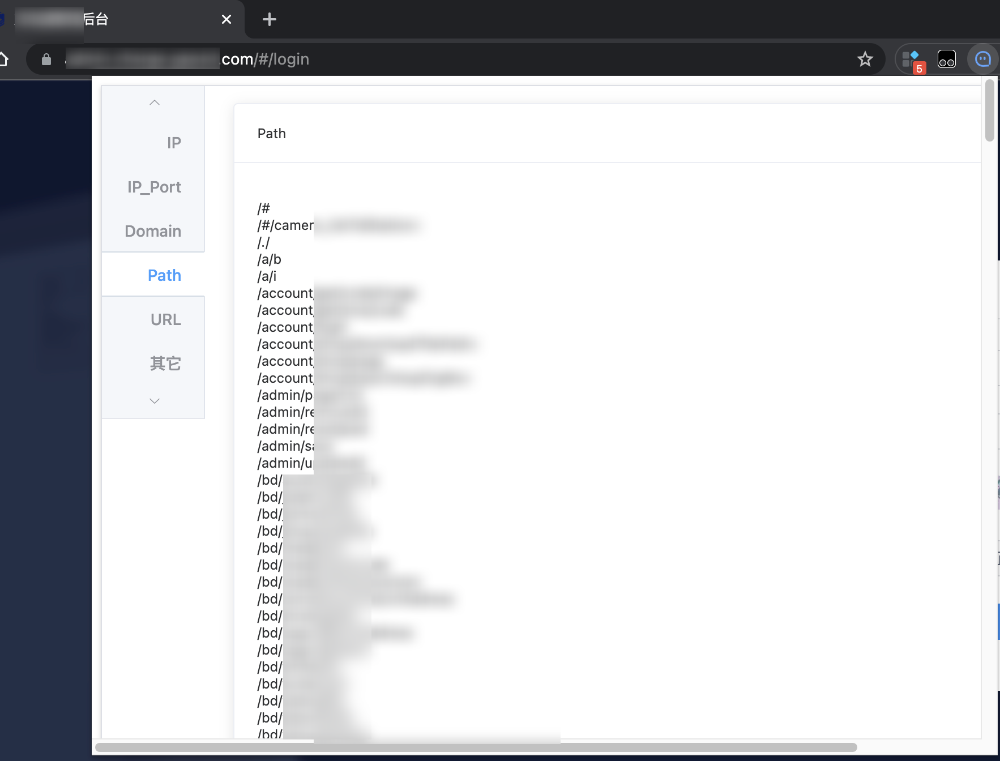
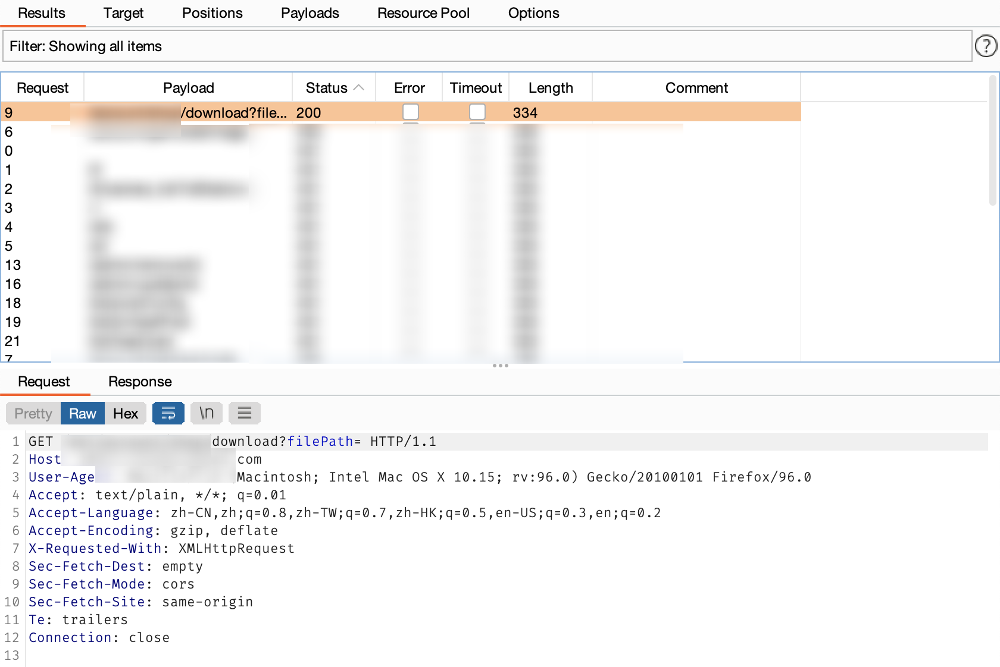
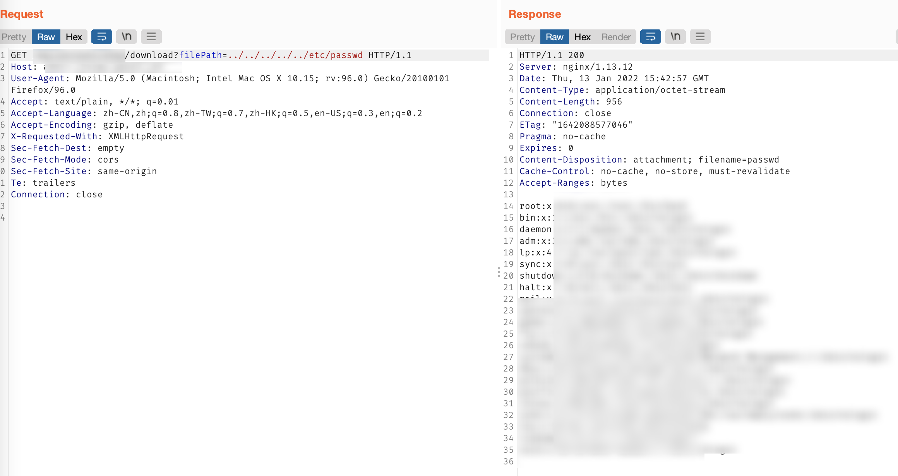
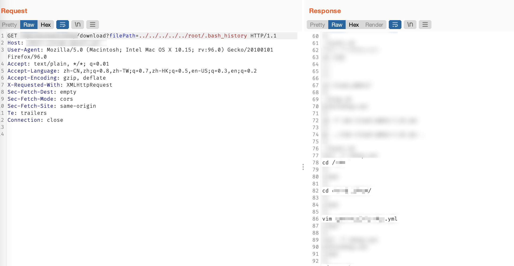
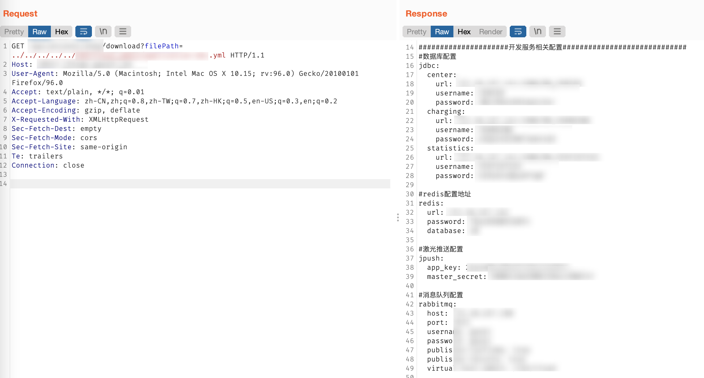
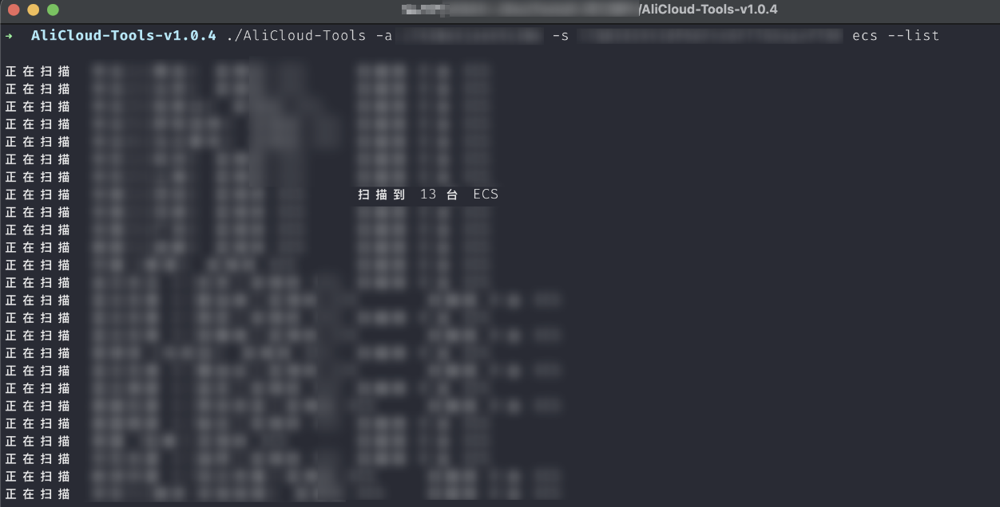

> 攻击路径：接口Fuzz > 任意文件读取 > 历史命令 > 读取配置文件 > 密钥利用

## 接口Fuzz

开局一个管理后台，通过浏览器插件抓到部分接口




将接口保存下来，并导入Burp进行爆破，发现一个下载文件的接口



## 任意文件读取

-  尝试读取`/etc/passwd`，发现可以成功读到信息



-  读取`.bash_history`历史命令，发现存在一个`/aaa/bbb/xxx.xml`配置文件



-  读取该配置文件，得到大量配置信息，以及一个比较关键的`AccessKey`和`SecretKey`




## 密钥利用

尝试使用工具 [alicloud-tools](https://github.com/iiiusky/alicloud-tools) 进行利用。也可以使用Gamma实验室出品的 [aliyun-accesskey-Tools](https://github.com/mrknow001/aliyun-accesskey-Tools)、[行云管家](https://yun.cloudbility.com/)，或者直接使用[官方API调试工具](https://next.api.aliyun.com/api/Ecs/)等工具执行命令

```bash
# 查看所有实例信息（如实例ID）
$ ./AliCloud-Tools -a <AccessKey> -s <SecretKey> ecs --list

# 执行命令
$ ./AliCloud-Tools -a <AccessKey> -s <SecretKey>  exec -I <InstanceId> -c <Command>

```


